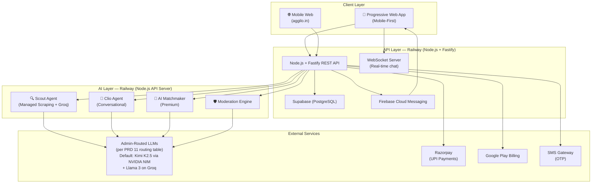

# Aggilo PRD

> Product Requirements Document — AI-Native Social Network

| Detail | Value |
|--------|-------|
| 📅 Version | **1.0** |
| 🎯 Launch | **Hyderabad Colleges** |
| 📱 Platform | **Mobile-First (Progressive Web App)** |
| 🏗️ Stack | **Node.js + Fastify + Supabase (PostgreSQL) + Node.js services VPS + LLMs per [11_llm_admin_routing.md](11_llm_admin_routing.md)** |

---

## Executive Summary

**Aggilo** is a privacy-first, AI-native social network that creates interest-based communities (“clusters”) segmented by the **AGGIL** engine — **A**ge, **G**ender, **G**eography, **I**nterest, **L**anguage. The core promise: ***"Find your people. Start the conversation."***

Users discover clusters through AI suggestions, create clusters through conversation with an AI agent (Clio), and find relevant people through an AI matchmaker (Premium). Privacy by design is the #1 value proposition — users get a deeply personal experience without ever exposing their real-world identity.

| Stat | Value |
|------|-------|
| Workflow Documents | **12** |
| Mermaid Diagrams | **35+** |
| API Endpoints | **65+** |
| Success Probability | **72-80%** |

---

## System Architecture Overview

---

## 📋 Workflow Documents

Click each document to view the detailed workflow with Mermaid diagrams, data tables, edge cases, and API endpoints.

| # | Document | Description | Key Diagrams |
|---|----------|-------------|--------------|
| 01 | 📱 [Registration & Onboarding](01_registration_onboarding.md) | Phone OTP signup → Year of Birth + Gender → Language → Nickname + Interests → Dashboard with AGGIL suggestions | Registration flow, Returning user login, Data model, Edge cases |
| 02 | 🔮 [Cluster Creation](02_cluster_creation.md) | Three paths: Manual 4-step wizard, Clio conversational AI, or Scout auto-creation. All include duplicate detection. | 3-path branching, Manual wizard, Clio conversation, Scout auto-create, Location deep-dive |
| 03 | 🔍 [Discovery & Joining](03_cluster_discovery.md) | 5 discovery channels, qualification engine (privacy gating), search, shared links, join/leave/rejoin lifecycle. | 5 discovery paths, Qualification engine, Shared link flow, State machine |
| 04 | 💬 [In-Cluster Experience](04_in_cluster_experience.md) | Feed (Instagram-style) + Direct Messaging + passive user value design. | Cluster page tabs, Feed creation, DM flow, Passive UX |
| 05 | 💎 [Premium & AI Matchmaker](05_premium_ai_matchmaker.md) | ₹300/mo subscription, AI preference learning, questionnaire matching, private clusters, conversion funnel. | Free vs Premium, Subscription flow, Matchmaker sequence, Preference learning, Conversion triggers |
| 06 | 🤖 [AI Agent System](06_ai_agents.md) | Scout (autonomous web crawling) + Clio (conversational assistant). BullMQ Workers + NVIDIA NIM on Railway. | Scout pipeline, Scout data flow, Clio decision tree, Context injection, Infrastructure |
| 07 | 🛡️ [Moderation, Admin & Notifications](07_moderation_admin.md) | AI moderation (3 severity levels), admin dashboard (8 panels), Firebase push system with frequency rules. | Report flow, Severity levels, Admin dashboard, Notification triggers, User preferences |
| 08 | 📊 [Non-PII Data Strategy](08_data_strategy.md) | Behavioural intelligence strategy for calibrating Scout, Clio, and Matchmaker. Dual-layer data model (Segment vs Personal), Inaction signals, and Compounding Intelligence pipeline. | AGGIL Behaviour Matrix, Dual-layer data model, Clio feedback loop, Scout signal schema |
| 09 | 🖥️ [Admin Platform](09_admin_platform.md) | Unified admin intelligence dashboard: Persona Lab, Clio orchestrator monitoring, Scout controls, Matchmaker ops, persona lifecycle, and cross-system integration map. | Admin integration map, Persona Lab UI, Register effectiveness, Persona lifecycle sequence, Complete API surface |
| 10 | 🗺️ [Atlas Agent](10_atlas_agent.md) | Clio-orchestrated cluster content intelligence. Closes the post-join "now what?" gap by surfacing demographically-filtered news, developments, and discussion starters into the Timeline via Clio. | Clio-Atlas orchestration model, Post-join UX flow, Demographic brief format, Three system prompt variants, Timeline delivery spec, State machine |
| 11 | 🧠 [LLM Admin Routing](11_llm_admin_routing.md) | Multi-LLM routing architecture, response logging with LLM reference, user feedback (ratings & disagreement flags), admin quality review dashboard with A/B testing. | LLM router flow, Response logs schema, User feedback UI, Admin disagreement queue, A/B testing view |
| 12 | 🏠 [Premium Clusters](12_premium_clusters.md) | "Make Your Crowd" — credibility-gated cluster creation for individuals with existing micro-communities. Hard GPS + language gates, Founder admin rights, cold start supply-side strategy. | Credibility evaluation framework, "Make Your Crowd" form, Post-approval flow, Governance model |

---

## Core Product Decisions

| Decision | Chosen | Rationale |
|----------|--------|-----------|
| Signup method | Phone OTP | India-centric, fast, reduces fake accounts |
| Identity | Nickname only (no real names) | Privacy-first, reduces harassment |
| Cluster limits | Unlimited for all users | No friction for engagement |
| Cluster deletion | Not allowed | Clusters persist and grow permanently |
| Connection removal | Not allowed | No gatekeeping by creators |
| Interest tags | Multiple per cluster | Better discoverability |
| In-cluster content | Feed + Discussion model | Content optimized for mobile scrolling |
| DMs | Available | Enables deeper connections |
| Leave & Rejoin | Both allowed, no cooldown | Low friction |
| Premium free users | Can see questionnaires + join private clusters | Natural conversion funnel. **Premium is NOT visible in Phase 1 (≤100k users).** |
| Scout auto-create | ≥90% relevance only | Quality over quantity |
| Duplicate check | Required before all cluster creation | Prevents fragmentation |
| **Premium Clusters** | **Credibility-gated, hard GPS + language, Founder admin rights** | **Cold start supply-side strategy — Founders bring existing communities. Free in Phase 1. See [PRD 12](12_premium_clusters.md).** |
| Moderation | AI flag + human review; auto-ban for high risk | Fast response + safety net |
| Notifications | Firebase Push (₹0/mo) | Free up to 1M/day, industry standard |
| Payments | Razorpay (UPI) + Google Play | Both channels for maximum reach |

---

## Technology Stack

| Layer | Technology | Hosting |
|-------|-----------|---------|
| Mobile App | Progressive Web App (PWA) | Mobile web (Phase 1) |
| Backend API | Node.js + Fastify (TypeScript strict mode) | Railway |
| Database | Supabase (PostgreSQL) | Supabase Cloud |
| Real-time | Supabase Realtime (WebSockets) | Supabase Cloud |
| AI Agents | BullMQ Workers (Node.js) | Railway (Node.js API Server) |
| LLM (all agents) | Per [11_llm_admin_routing.md](11_llm_admin_routing.md) — admin-configurable | External (see routing table) |
| Push Notifications | Firebase Cloud Messaging (FCM) | Google Cloud (free) |
| Payments | Razorpay + Google Play Billing | External |
| OTP | WhatsApp Business API / SMS | External |
| Domain | aggilo.in | Domain registrar |

---

## 🔜 What's Next

> [!IMPORTANT]
> **📱 Mobile UI Design & Features** — The next milestone. This PRD defines WHAT the system does. The mobile UI design phase will define HOW users interact with it — screens, navigation, UI components, animations, and the visual design system.
>
> **Phase 1 = Mobile web only.** No desktop-first development. All Phase 1 surfaces are designed and optimized for mobile web.
