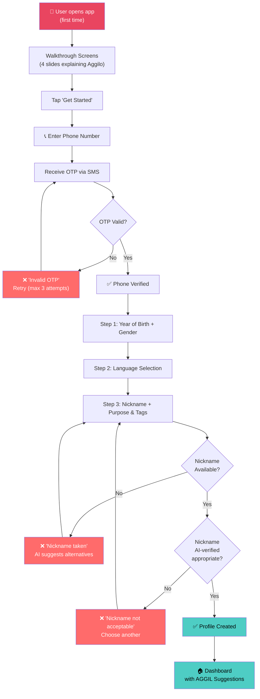
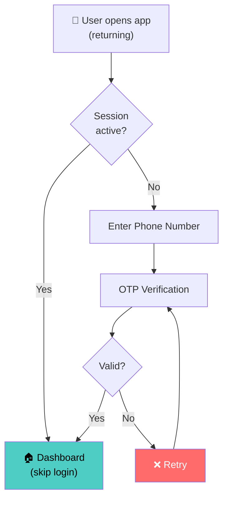

# 📱 Workflow 1: Registration & Onboarding

> How a new user goes from app download to seeing their first cluster suggestions

`PRD — Aggilo Social Network`

---

## Complete Registration Flow

---

## Step-by-Step Details

### Step 0 — Walkthrough Screens
4 swipeable slides introducing Aggilo — **Clio-narrated** following the first 4 beats of her Relationship Arc (First Contact → Curiosity Hook → Empathy → Specificity as Proof). See `clio/SOUL.md` for core character and `clio/personas/*/IDENTITY.md` for demographic-specific voice.
- `First-time only`

### Step 1 — Phone OTP Verification
User enters Indian mobile number (+91) or email address. Receives 6-digit OTP via SMS or email. Max 3 retry attempts. OTP expires in 5 minutes.
- `Required` · `One-time cost: ₹0.50 (SMS) / ₹0 (email)`

### Step 2 — Year of Birth + Gender
- **Year of Birth:** Year selector (scroll wheel). Cannot be changed later. Drives all AGGIL age-based matching.
- **Gender:** Male / Female / Non-Binary. Used for privacy gating on clusters. Cannot be changed later.
- `Required` · `Immutable Year of Birth & Gender`

### Step 3 — Language Selection
Select primary + secondary languages. Pre-populated from phone settings. Multiple languages supported.
- **Clio uses this for matching**: Language is a core AGGIL dimension — Clio prioritizes clusters where Connections share the user's languages and surfaces language-specific insights (e.g., "This cluster speaks mostly Telugu"). English is the default soft match. Language also influences Clio's adaptive register and cultural references.
- **No hard gate at this stage**: Language is a profile-level signal, not a filter. Hard/soft language gating is a per-cluster setting available in a future phase.
- **Engineer's Note #5** (conditional): Shown after this step if the user's topic context suggests it would be useful — see engineer's note audit in implementation plan.
- `Required` · `Auto-detected`

### Step 4 — Nickname + Purpose & Tags
- **Nickname:** AI-verified for uniqueness and appropriateness. Real name never exposed.
- **Purpose & Tags:** Tell Clio what you're looking for (Purpose) and add **Multiple Vibrant Tags** (e.g. #NewCityBlues #SundayMorningHike #TechMentorship). This captures the emotion and specific need for the connection.
- **Clio Commentary (per Character Bible):** Clio accompanies each field with *commentary, not instructions*:
  - At nickname: casual, not corporate — she's not onboarding you, she's meeting you
  - At tags: "Pick everything. Especially the weird ones. Those are usually the best matches."
  - **Zero-State Storytelling Constraint:** The UI must frame data collection as a conversation, not a clinical form. For example, Clio's prompt should be: *"What's the one thing you can talk about for three hours without noticing?"*
  - Clio's voice here should follow the Bible's principles: warm but not sycophantic, specific over generic
- `Required` · `AI-verified nickname`

### Step 5 — Dashboard Landing

> [!IMPORTANT]
> **Phase 1 UX (Launch → ~10k users):** User lands on the **⚡ Explore tab** — active by default. No tutorial, no checklist, no onboarding modal. 3–5 AGGIL-matched cluster cards appear. The Clio FAB is present but does not auto-open. The framing is not "here's what's available" — it is Clio's first delivery on her promise to find the user's connecting frequency. See [`launch/phase_1/README.md`](file:///d:/Aggilo_Social/launch/phase_1/README.md) for the full Phase 1 UX spec.

Before reaching the dashboard, the user goes through the **Clio Welcome Conversation** (Beats 5-7 of the Relationship Arc) — a 30-second, non-skippable first interaction where Clio reflects back the user's data, asks what they're actually looking for, and delivers her first moment of genuine challenge.

**Polite Deflection Rule:** If a user attempts to treat Clio like ChatGPT during onboarding (e.g., asking her to outline an essay or search for general information), she must politely deflect: *"I'm not built to write essays. I'm built to figure out who in your city would want to read yours."*
- `Explore tab active` · `Clio FAB visible` · `Onboarding complete`

---

## Data Captured During Registration

| Field | Type | Mutable? | Used For |
|-------|------|----------|----------|
| Phone Number | String (+91XXXXXXXXXX) | No | Authentication, OTP, unique identifier |
| Email | String (optional) | Yes | Authentication (alternative to phone), notifications |
| Year of Birth | INT (e.g., 2001) | ❌ No (immutable) | AGGIL age calculation, cluster eligibility, content maturation |
| Gender | Enum (M/F/NB) | ❌ No (immutable) | AGGIL gender gating, privacy filtering |
| Languages | Array of strings | Yes | Content discovery, cluster matching |
| Nickname | String (unique) | Yes (limited) | Public identity, DMs, cluster posts |
| Purpose & Tags | Array of tags | Yes | AGGIL matchmaking, Scout topic discovery |
| Device Location | Lat/Lng (if permitted) | Dynamic | AGGIL geography, GPS cluster discovery |

> [!NOTE]
> **📍 Location Note:** Device location is requested but NOT required at registration. Users can set a named location (city/area) instead. GPS sharing is a separate opt-in for proximity-based cluster discovery.

---

## Edge Cases & Error Handling

| Scenario | Handling | Clio Voice |
|----------|---------|-----------|
| User enters age < 18 | Block registration — DPDPA compliance (Phase 1 18+ constraint) | — |
| Phone number already registered | "This number is already registered. Log in instead?" | — |
| OTP not received after 60s | Show "Resend OTP" button (max 3 resends) | — |
| OTP invalid | Show inline retry prompt | *"That code didn't match. Want to try again?"* |
| Offensive nickname detected by AI | Block with suggestion alternatives | *"That one won't work here. Pick something you'd actually want to be called."* |
| Nickname already taken | Show AI-suggested alternatives | *"Someone got there first. Try something that's more you."* |
| No purpose/tags provided | Allow with soft warning | *"No pressure — but the more you tell me, the better I get at finding your people."* |
| App killed during registration | Resume from last completed step on next open | — |
| No internet during OTP | Show offline message, retry when connected | — |

---

## Returning User Login Flow

> [!TIP]
> **✅ Session Duration:** 30-day active session. User stays logged in unless they manually log out or don't open app for 30 days.

---

## API Endpoints (Backend)

| Endpoint | Method | Purpose |
|----------|--------|---------|
| `POST /api/auth/send-otp` | POST | Send OTP to phone number |
| `POST /api/auth/verify-otp` | POST | Verify OTP, create session |
| `POST /api/profile/create` | POST | Create profile (Year of Birth, gender, languages, nickname, interests) |
| `GET /api/nickname/check/{name}` | GET | Check nickname availability + AI appropriateness |
| `GET /api/nickname/suggest` | GET | Get AI-generated nickname alternatives |
| `GET /api/dashboard/suggestions` | GET | Get AGGIL-matched cluster suggestions for dashboard |

---

*← [PRD Index](00_prd_index.md) · [Next: Cluster Creation →](02_cluster_creation.md)*
