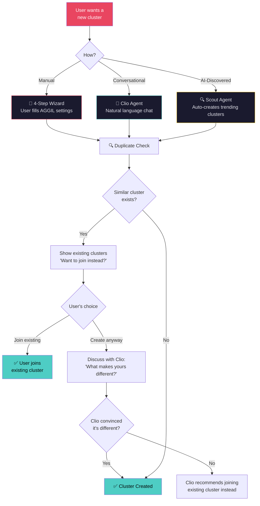
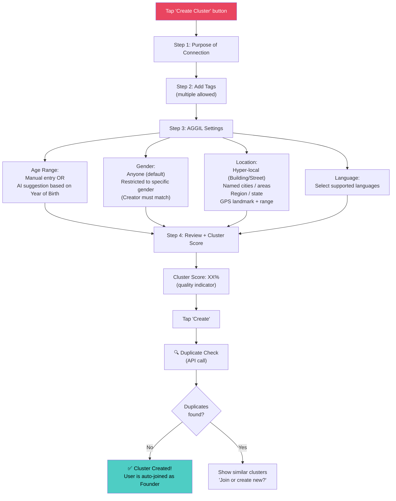
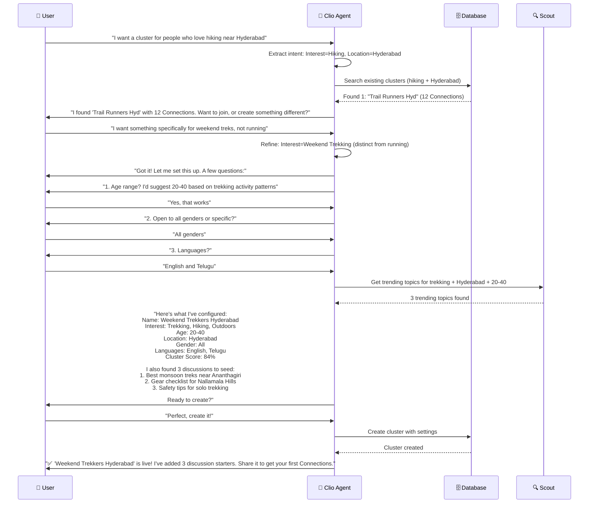
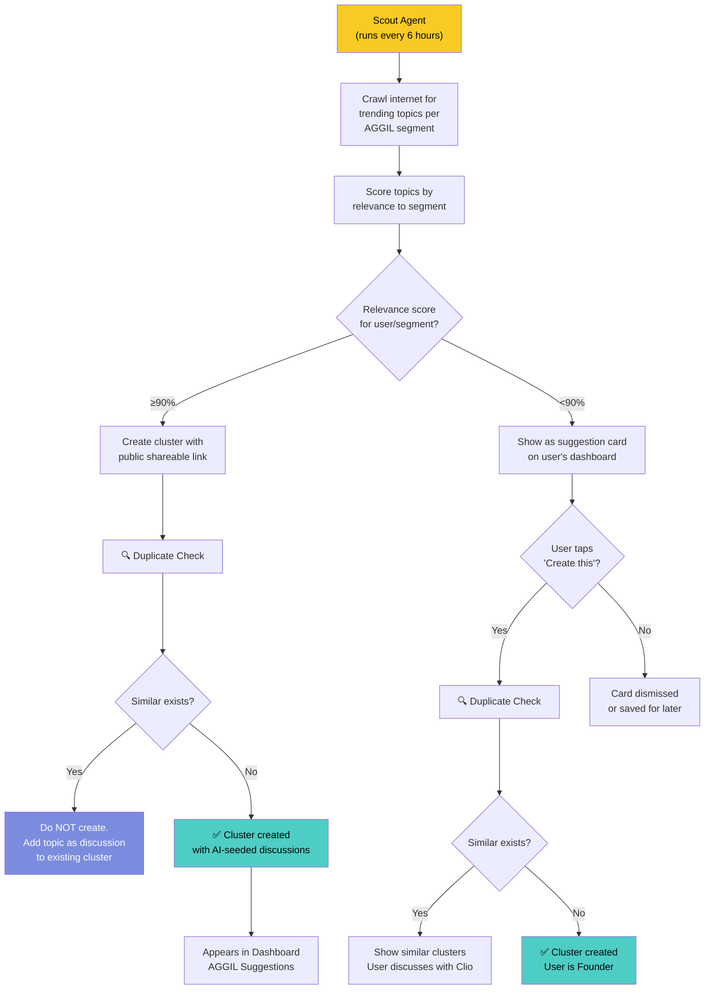
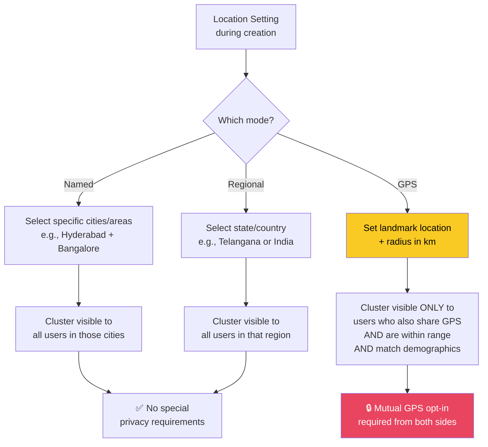

# 🔮 Workflow 2: Cluster Creation

> Three paths to creating a cluster: Manual Wizard, Clio Conversation, or Scout Auto-Creation

`PRD — Aggilo Social Network`

> [!IMPORTANT]
> **Phase 1 Launch (until ~50k platform users):** Only **Path 2 (Clio conversation)** is the active user-facing creation path. The manual wizard (Path 1) is not exposed — no "Create Cluster" button exists in the UI. Clio offers to create a cluster when a user searches and finds nothing, or expresses an unmet need. The cluster form, AGGIL configuration fields, and Cluster Score view are not shown. At ~50k platform users, Path 1 (manual wizard) unlocks. See [`launch/phase_1/README.md`](file:///d:/Aggilo_Social/launch/phase_1/README.md).

---

## Three Paths to Cluster Creation

> [!WARNING]
> **⚡ Critical Rule — Duplicate Prevention:** Before ANY cluster is created (regardless of method), the system MUST check for existing clusters with similar AGGIL settings and topics. This prevents fragmentation and concentrates users into stronger communities.

---

## AGGIL Settings Configuration

Every cluster is defined by these dimensions. **Only Purpose, Name, and Description are required** — all AGGIL filters are available as advanced settings but not mandatory. Clio decides sensible defaults based on the user's demographics, interests, and interaction context.

| Dimension | Icon | Details |
|-----------|------|---------|
| **Purpose** | 💡 | Core reason for connection. Drives Scout discovery. **Required.** |
| **Language** | 🗣️ | 🌟 **Hero Feature.** Multi-language support. Primary + secondary. Soft match signal in Phase 1. |
| **Tags** | # | Multiple vibrant hashtags (Hooks). Captures emotions/needs. |
| **Age** | 🎂 | Year of Birth-based range. Manual or AI-suggested. *Optional — Clio suggests if needed.* |
| **Gender** | 👤 | Default: Anyone. Optional: restricted to specific gender. Privacy-gated. **Creator must match the selected gender if restricted.** *Optional — Clio suggests if needed.* |
| **Geography** | 📍 | Multiple Hyper-local locations (Building/Campus), Regional scope, GPS. *Optional — Clio suggests if needed.* |

---

## `MANUAL` Path 1: 4-Step Wizard

### Cluster Score — U-Shaped Intentionality Model

> [!IMPORTANT]
> **U-Shaped Scoring:** The Cluster Score rewards **intentionality**. Both hyper-narrow AND fully global clusters score HIGH — the muddled middle scores LOW. Clio coaches the creator toward deliberate choices through gamified prompts, never revealing the scoring mechanics.

| Factor | Weight | Description |
|--------|--------|-------------|
| Purpose Clarity & Vibrant Tags | 30% | Clear purpose + 3+ emotional/interest tags that tell a story |
| Intentionality Signal | 25% | U-shaped: hyper-narrow OR fully open = high; vague middle = low |
| Name + Description Quality | 20% | AI-assessed for clarity, uniqueness, and emotional resonance |
| Clio Confidence | 25% | How confidently Clio can serve this cluster — right people AND right content |

**Clio's Score Coaching (what the creator sees):**

| Score Zone | Clio's Response |
|-----------|----------------|
| 🔴 Low (0-40%) | *"This feels like it could be anything. What if you went sharper — or wider? Both work. The middle doesn't."* |
| 🟡 Medium (40-70%) | *"Getting there. Push it further and I'll find exactly the right people."* |
| 🟢 High (70-100%) | *"Now we're talking. I know exactly who to look for."* |
| 🟢🔥 Exceptional (90%+) | *"This is going to be a great cluster. I already have ideas for who should be here."* |

### UX Guidelines — Creation Wizard

> [!NOTE]
> **ℹ️ Progressive Disclosure:** Replace all inline "Note:" helper text throughout the creation flow with **ℹ️ info buttons** that expand on tap. The wizard should feel clean and uncluttered — details are available but not forced.
>
> **✕ Close Icon:** Replace the "Cancel" button with a **✕ icon** in the top corner. Tapping ✕ triggers a confirmation dialog: *"You have unsaved changes. Leave anyway?"* — preventing accidental abandonment of partially completed clusters.

---

## `CLIO` Path 2: Conversational Creation

> [!NOTE]
> **🤖 Collaborative Clio:** Clio extracts AGGIL parameters from natural language and **deduces** the ideal settings. She then presents these for user acceptance or editing before proceeding to creation. The user remains the driver, with Clio providing deep-intelligence suggestions and seeding Scout-discovered topics.
>
> **Voice (per Character Bible):** Clio's conversational creation dialogue must follow `clio/SOUL.md` principles: she has *opinions* about cluster design ("I'd tighten the age range — broader sounds inclusive but it dilutes the signal"), she uses *specificity over warmth* ("Weekend treks, not running — that distinction matters"), and she gently *challenges* when duplicates are near-matches ("What makes yours different?"). She does NOT say "Got it!", "Amazing!", or manufacture urgency. Voice specifics are in the active `clio/personas/*/IDENTITY.md`.
>
> **Polite Deflection Rule (Conversational Path):** If the user asks Clio to do something outside her scope during creation (e.g., "write my cluster description for me" in a way that bypasses her voice), she must stay in character: *"I can draft it — but I'll need you to tell me why this group matters to you first. That's the part I can't guess."*
>
> **Scope constraint:** Clio will never use generic or template-sounding copy in cluster names or descriptions. Every field she fills must feel like it was written with knowledge of this specific group.

---

## `SCOUT` Path 3: AI Auto-Creation

### Scout Auto-Creation Rules

| Rule | Detail |
|------|--------|
| Relevance ≥90% | Create cluster with public link. No user action needed. |
| Relevance <90% | Show as suggestion card. User decides. |
| Duplicate detected | Add the trending topic as a discussion to the existing cluster instead |
| No AI badge | AI-created clusters appear exactly like user-created ones. |
| No creator/founder | First active Connection can claim Founder status |

---

## 📍 Location Configuration — Deep Dive

> [!WARNING]
> **📍 GPS Landmark Rule:** The GPS range is measured from a *fixed landmark* (e.g., "Charminar" or "HITEC City"), NOT from the creator's live GPS position. Both cluster creator AND the visitor must have shared their GPS for the cluster to be visible.

---

## 🗣️ Language Configuration — Future Phase Spec

> [!NOTE]
> **Future Feature — not active in Phase 1.** The following documents the hard/soft language gate for a later release phase, when platform adoption supports the added cognitive complexity. In Phase 1, language is a soft-match signal only — it improves cluster ranking but never blocks visibility.

When this feature ships, each cluster will support a per-language hard/soft toggle:

| Gate Type | Behaviour | Use Case |
|---|---|---|
| **Hard** | Language is an eligibility requirement. User must speak this language to see and join the cluster. English does NOT bypass a hard gate. | Language is core to the cluster's identity — e.g., Telugu poetry circle, Marathi debate group |
| **Soft** | Language is a preference signal. Improves match ranking but does not block. | Most everyday clusters where language context is helpful but not defining |
| **Multiple hard (OR logic)** | User must speak at least one of the hard-gated languages. AND logic is never used — it would shrink eligible pools to near zero. | Broader communities serving any speakers of regional languages |

**Constraints:**
- Up to 2 languages per cluster
- Post-spawn: language gate tightening is blocked — same principle as age/gender (no retroactive harm to existing Connections)
- Engineer's Note #6 (language hard gate) is shown to founders the first time they set a hard language gate

**Phased activation trigger:** When product team judges that the platform's user base is mature enough that an additional gate in cluster creation won't create cognitive overload or reduce cluster formation rates.

---

## Cluster Properties & Rules

| Property | Value | Notes |
|----------|-------|-------|
| Clusters per user | **Unlimited** | No cap for free or premium users |
| Connections per cluster | **Unlimited** | No minimum or maximum |
| Cluster deletion | **Not allowed** | Once created, clusters persist forever |
| Connection removal | **Not allowed** | Creators cannot remove Connections |
| Interest tags | **Multiple** | Clusters can have many interest tags |
| Aging out | **Never** | Creator never ages out of own cluster |
| Age progression | **Dynamic** | Connection ages change as Year of Birth progresses; cluster persists |

---

## Post-Spawn Editing Rules

Once a cluster has Connections, the Founder enters **Window 2 (Post-Spawn)** refinement. The governing principle: **no change may retroactively harm, eject, or disadvantage a Connection who joined in good faith.** Clio enforces these rules automatically and will not process a disallowed change.

| Property | Allowed Post-Spawn? | Constraint |
|----------|--------------------|----|
| Description text & tone | ✅ Yes | No restriction |
| Seed questions | ✅ Yes | Full rewrite allowed |
| Interest tags — add / broaden | ✅ Yes | Can only expand discoverability, not restrict it |
| Cluster name | ✅ Yes | Clio notifies existing Connections of the change |
| Interest tags — narrow / remove | ❌ No | Would disadvantage Connections who joined for those tags |
| Age range — tighten | ❌ No | Would retroactively exclude current Connections |
| Gender filter — add restriction | ❌ No | Cannot apply to a cluster Connections joined as open |
| Core topic pivot | ❌ No | Changes the fundamental identity Connections agreed to |
| Geographic scope — tighten | ❌ No | May exclude Connections in previously valid zones |

> [!NOTE]
> **Clio's enforcement behaviour:** When a Founder requests a disallowed change, Clio explains the Connection-protection principle once, offers alternatives within the allowed scope, and stops. She does not lecture. Pre-spawn (Stages 01–02), all parameters remain fully editable — the constraint only applies after the first Connection joins.

## API Endpoints

| Endpoint | Method | Purpose |
|----------|--------|---------|
| `POST /api/cluster/create` | POST | Create a new cluster with AGGIL settings |
| `POST /api/cluster/check-duplicate` | POST | Check for similar existing clusters |
| `GET /api/cluster/score` | GET | Calculate cluster quality score |
| `POST /api/clio/chat` | POST | Send message to Clio for conversational creation |
| `GET /api/scout/suggestions` | GET | Get Scout-generated cluster suggestions |
| `POST /api/scout/claim-founder` | POST | Claim Founder status on an AI-created cluster |

---

*← [Registration](01_registration_onboarding.md) · [Next: Discovery & Joining →](03_cluster_discovery.md)*
