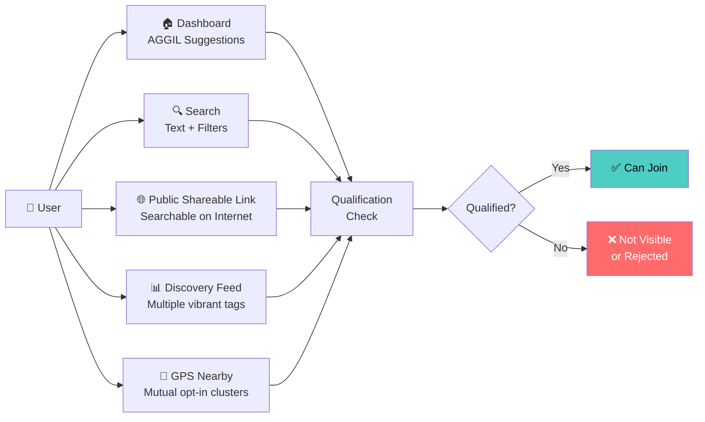
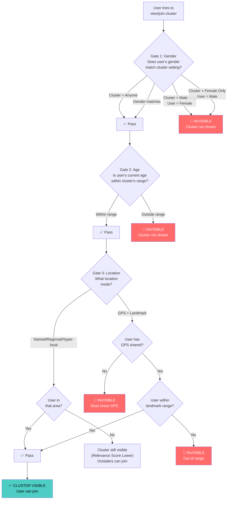
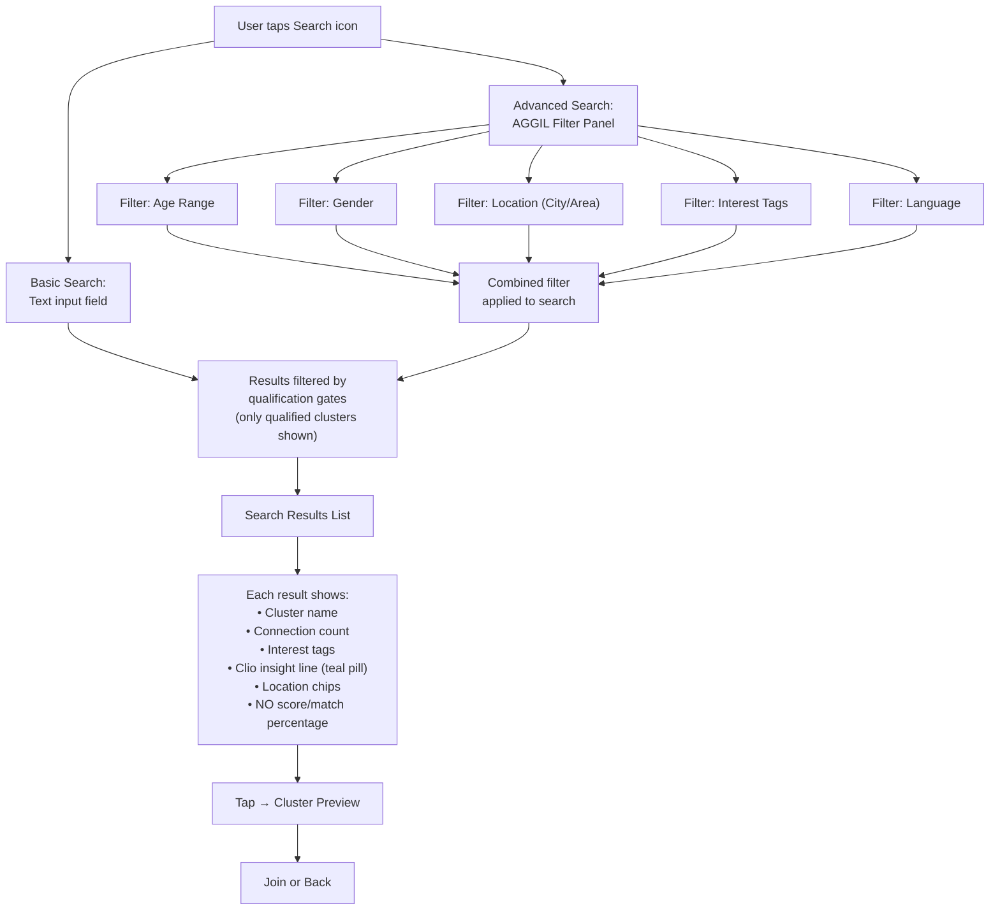
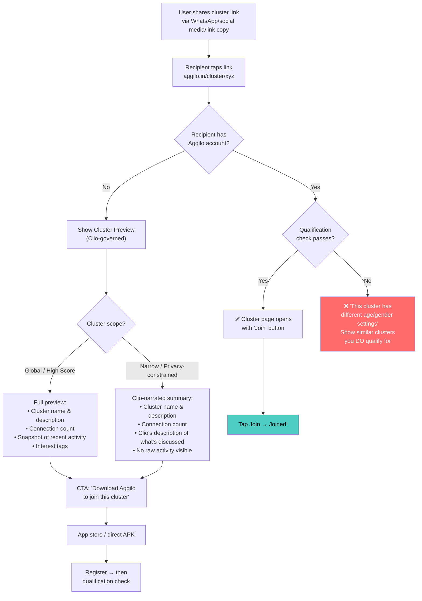
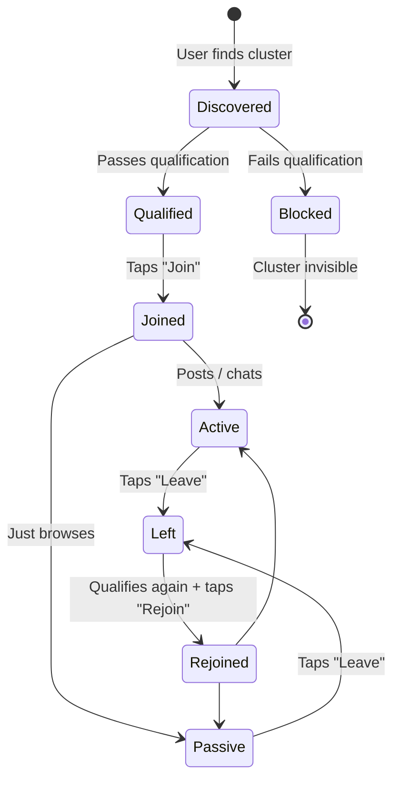
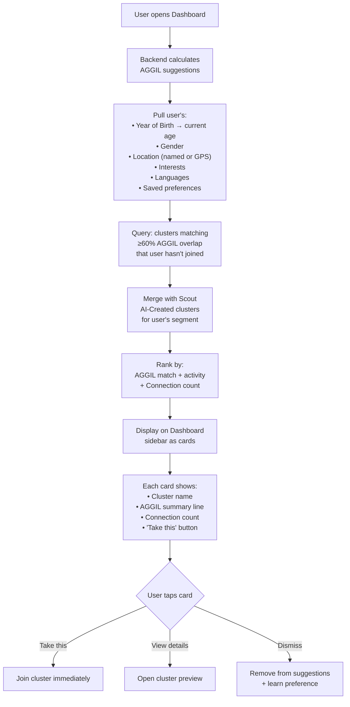

# 🔍 Workflow 3: Cluster Discovery & Joining

> How users find, qualify for, join, leave, and re-join clusters

`PRD — Aggilo Social Network`

---

## 5 Ways to Discover Clusters

---

## 🔒 Qualification Engine (Privacy Gating)

Every cluster has privacy gates. A user must pass ALL gates to see or join a cluster:

> [!IMPORTANT]
> **⚡ Key Rule:** Gender and Age gates make clusters completely INVISIBLE — the user doesn't even know they exist. This is privacy by design, not rejection. The "Oops!" screen only appears when accessing via a direct shared link.

> [!NOTE]
> **🗣️ Clio & Observer Language Suggestion Behaviour (Phase 1):** Language is a soft-match signal — no language gate is active in Phase 1 (except for Premium Clusters). However, the system proactively suggests language-specific clusters via two mechanisms:
> 1. **Clio Intelligence:** Clio may suggest creating/joining language-specific clusters when she detects high gravity of need (e.g., a new arrival from another state). Clio also surfaces the language context of recommended clusters (e.g., *"This cluster mostly speaks Telugu — you listed Telugu, so you'll feel at home."*).
> 2. **Observer Passive Detection (Language Parallels):** Aggilo Observer continuously monitors language distribution. If ≥8 members in a primary cluster share a secondary language (e.g., Telugu), AND ≥3 of them post in that language, Observer automatically queues a recommendation to spawn a Telugu-parallel instance of that cluster. There is no manual 'Request Language' button — discovery and spawning are entirely passive.

---

## 🔍 Search Workflow

> [!NOTE]
> **Search-to-Cluster Conversion (Subtle):** When search yields zero results, there is **no modal popup** or aggressive "Create Cluster" prompt. Instead, Clio subtly offers via the FAB: *"I couldn’t find that. Want me to create a space for it?"* The conversion happens through Clio’s conversation, not through UI prompts.

### Search Result Ranking

| Factor | Weight | Description |
|--------|--------|-------------|
| AGGIL match score | 40% | Hyper-local + Interest overlap |
| Connection activity | 25% | Recent posts + chat activity |
| Connection count | 15% | Larger = more value, but not overwhelming |
| Cluster Score | 10% | Quality indicator |
| Recency | 10% | Newer clusters get a slight boost |

---

## 🌐 Shared Link Flow (Social Sharing — No Email Invite)

> [!IMPORTANT]
> **No email-based invite.** Cluster invitations happen exclusively through social sharing: WhatsApp, link copy, Instagram/Twitter sharing, etc. Email invite flow has been removed.

> [!NOTE]
> **Clio-Governed Preview:** Cluster preview visibility is decided by Clio based on the cluster's scope and score:
> - **Global clusters with high scores** → show full activity snapshot (recent posts, discussions, Connection engagement)
> - **Narrow/privacy-constrained clusters** → Clio narrates what’s discussed or what possible discussions look like, without exposing raw Connection activity. This preserves the privacy constraints of filtered clusters.
> 
> The preview's purpose is to **nudge visitors toward joining**, not to replace the in-cluster experience.

> [!NOTE]
> **🌐 Public Gateway & Blind Qualification:** The public cluster preview page allows internet users to find cluster meta-data via shared links.
> 
> 1. **Demographic Blurring**: The card must *never* explicitly list the demographic parameters (e.g., "18-20, Women"). Instead, Clio writes a description that implies the audience professionally (e.g., "A space for young women navigating early adulthood").
> 2. **Blind Qualification**: Visitors test their qualification by providing their Age and Gender. They are qualified "blindly" — the system checks their input against the hidden constraints.
> 3. **Waitlist Handoff**: If the visitor fails the qualification (e.g., wrong age/gender), they are gracefully redirected to the waitlist form. Crucially, the system *never reveals* which exact parameter they failed on (preventing reverse-engineering), and their inputted Age and Gender (which are immutable properties tied to email/phone) are seamlessly carried over to pre-fill the waitlist form to reduce UX friction.
> 4. **Internal Users**: Existing Aggilo users do not go through this external gate; their native AGGIL profile simply determines if the suggestion card is visible to them or not.

### Leave & Rejoin Rules

| Action | Rules |
|--------|-------|
| **Join** | Instant. No approval needed. User must pass qualification gates. |
| **Leave** | User can leave at any time. Their posts remain in the cluster. Departure is silent (no notification to others). |
| **Rejoin** | Allowed if user still qualifies. Previous posts are still visible. No cooldown period. |
| **Founder leaves** | Founder can leave but retains Founder badge. Cluster continues without them. |

---

## 🏠 Dashboard AGGIL Suggestions (Explore Tab)

> [!IMPORTANT]
> **Phase 1 UX:** The **Explore tab is the default active view** when a user opens the dashboard. It shows 3–5 AGGIL-matched cluster cards. No separate "AI Suggestions" sidebar. No advanced filter panel (unlocks at ~50k platform users).
>
> **Dashboard Tabs:** Explore + Created + Joined. There is **no "All" tab** — the three-tab structure is sufficient for navigation.
>
> See [`launch/phase_1/README.md`](file:///d:/Aggilo_Social/launch/phase_1/README.md).

---

## API Endpoints

| Endpoint | Method | Purpose |
|----------|--------|---------|
| `GET /api/clusters/search?q=&filters=` | GET | Search clusters with text + AGGIL filters |
| `GET /api/clusters/suggestions` | GET | Get AGGIL-matched suggestions for dashboard |
| `GET /api/clusters/nearby?lat=&lng=&range=` | GET | GPS-based nearby cluster discovery |
| `POST /api/clusters/{id}/join` | POST | Join a cluster (includes qualification check) |
| `POST /api/clusters/{id}/leave` | POST | Leave a cluster |
| `GET /api/clusters/{id}/qualify` | GET | Check if user qualifies for a specific cluster |
| `GET /api/clusters/{id}/preview` | GET | Public cluster preview (for shared links) |
| `POST /api/suggestions/dismiss/{id}` | POST | Dismiss a suggestion (feeds preference learning) |

---

*← [Cluster Creation](02_cluster_creation.md) · [Next: In-Cluster Experience →](04_in_cluster_experience.md)*
