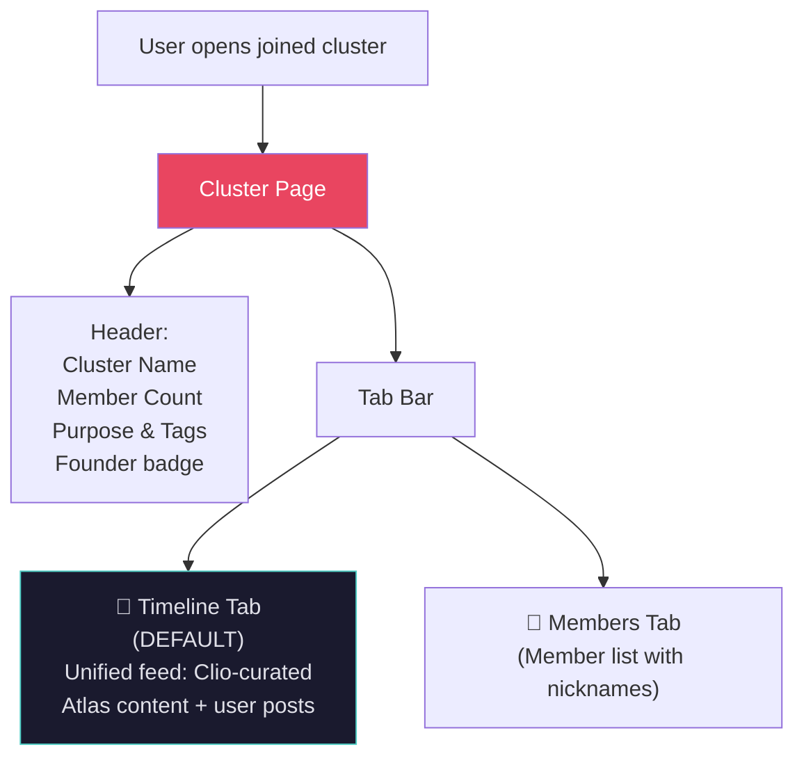
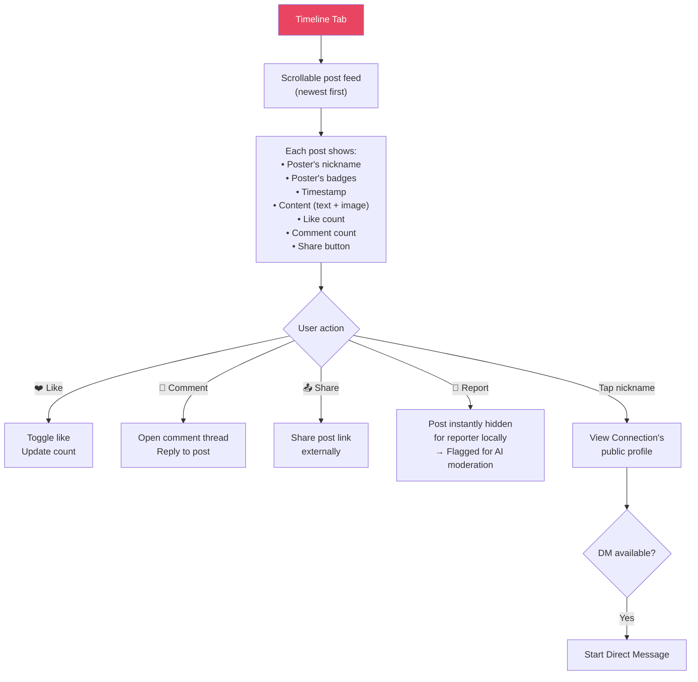
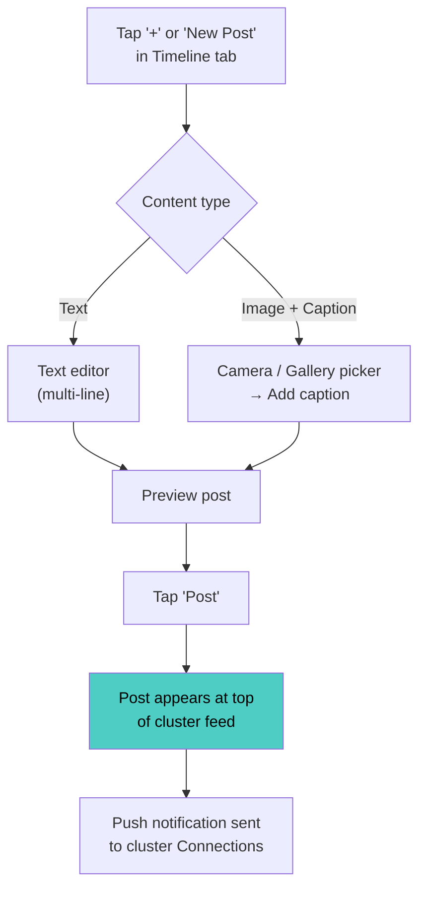
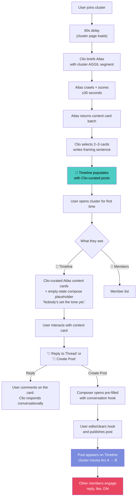
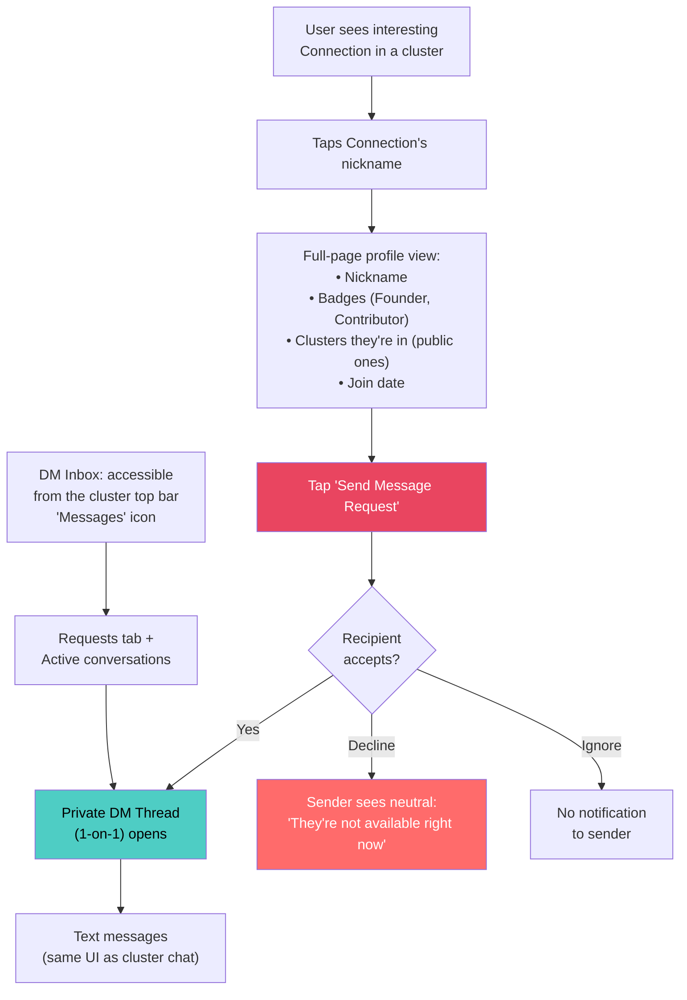
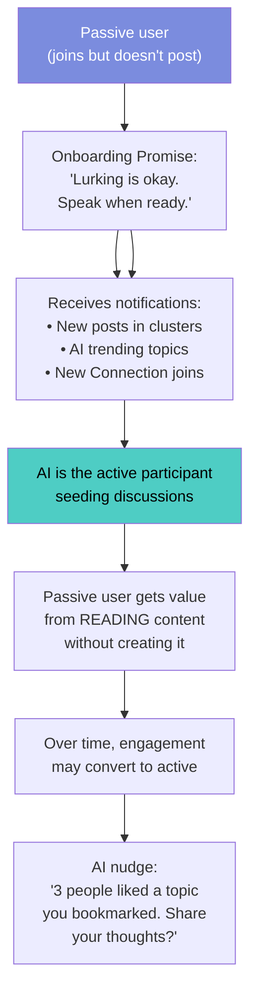

# 💬 Workflow 4: In-Cluster Experience

> Feed (Instagram-style), Chat (future phase), Direct Messages, and content interactions
> 
> **Terminology:** All cluster participants are **"members"**. A member who has accepted a DM/connection request from another member becomes a **"Connection"** of that person within that cluster context.

`PRD — Aggilo Social Network`

---

## Cluster Page Structure

> [!IMPORTANT]
> **Timeline is the single content tab.** Clio's Atlas-curated posts and user-generated posts live together in one unified Timeline feed. There is no separate Pulse tab. Clio posts as a participant in the Timeline, seeding discussions that connect members to each other. See [`launch/phase_1/README.md`](file:///d:/Aggilo_Social/launch/phase_1/README.md).

### How the Timeline Works

1. **Atlas fetches** relevant content from across the internet, filtered by the cluster's interests and AGGIL demographic settings
2. **Clio reviews** Atlas's batch — she may instruct Atlas to go deeper on a specific angle or refine the demographic filter (one refinement cycle)
3. **Clio posts** in the Timeline as a participant — her framing + the content card as a regular post with her avatar, alongside member posts
4. **Members comment** on Clio's post → become visible to each other → connections form
5. **Discuss with Clio:** Users can discuss the topic with Clio in the comments as if she were a human participant
6. **Clio nudges** commenters toward each other: *"Tell me what you think. Others here will want to know."*

---

## 📸 Timeline Tab — Instagram-Style Posts

### Post Creation Flow (MVP Phase 1)

> [!TIP]
> **Experience Rule:** The "Post" action is a **Floating Action Button (FAB)**, never a persistent text input bar. This subtle UI choice reinforces that the timeline is for *reading* first, not *chatting*.

### Content Types by Phase

| Phase | Content Types | Timeline |
|-------|--------------|----------|
| **Phase 1 (MVP)** | Text posts, Image + caption posts | Month 1-2 |
| **Phase 2** | Polls, Events, GIFs, Links with preview | Month 3-4 |
| **Phase 3** | Voice messages, Video posts, Audio rooms | Month 5-8 |
| **Phase 4** | Live streaming, Stories | Month 9-12 |

---

> [!IMPORTANT]
> **💬 Communication Model — Three-Layer Cold-Start Solution:**
>
> **Layer 1 — Scout (Discovery Content):** Scout actively pre-seeds new clusters with relevant external content (trending topics, news, discussion starters) so the feed is never completely blank on day one.
>
> **Layer 2 — Atlas (Timeline Content):** Atlas is the dedicated cluster content intelligence agent. Within 60 seconds of any user joining a cluster, Clio briefs Atlas with the cluster's AGGIL demographic segment. Atlas returns scored, relevant content cards — each with a **conversation hook** — that Clio posts directly into the **📸 Timeline**. See [`PRD/10_atlas_agent.md`](10_atlas_agent.md) for the full spec.
>
> **Layer 3 — Clio (Emotional Hosting):** Scout and Atlas provide content. Clio provides *presence*. When a cluster has 0 posts, Clio enters **Host Mode** — she frames the empty room, sets a **dynamic compose bar placeholder** (never "What's on your mind?") that is specific to the cluster's context.
>
> **The Icebreaker Assist:** Atlas supplies conversation hooks on every content card. Clio additionally offers a private, dismissable icebreaker suggestion to the founder/first member before the first post is made. **Quality constraint:** Clio's icebreaker must pass strict relevance analysis — if confidence is not high, she stays silent rather than suggesting something generic.
>
> **The Division:** Scout = librarian who stocks the shelves. Atlas = the daily specials board with today's relevant content. Clio = the person who makes you want to stay. See `06_ai_agents.md` § *🏠 Clio as Cluster Host* and `10_atlas_agent.md` for the full specs.
>
> **The Mental Model:** Cluster = Subreddit (Async, Threaded). DM = WhatsApp (Sync, Chat). Timeline = Unified feed of Clio-curated Atlas content + user-generated posts.

---

## ⚡ The "Now What?" — Post-Join UX

> **The highest-churn moment in any social platform is the first 10 minutes after joining a community.** This section defines exactly what a Connection experiences to ensure that moment converts rather than churns.

### Why This Works

The post-join gap is a **permission problem**. New Connections don't post because they don't know if their voice is welcome, what the right first post looks like, or how to start. The blank compose bar is paralysing.

The **conversation hook** on each Pulse card removes all three barriers. It's specific, relevant, and tied to real content happening right now in the cluster's world. Connections can edit or delete it entirely — its only job is to break the blank-page paralysis.

| Pulse Card Element | Purpose |
|-------------------|---------|
| **Headline** | Real content happening in the cluster's world |
| **Source + relevance %** | Credibility + signals "chosen specifically for you" |
| **Conversation hook** | One question that makes the first post easy to write |
| **Start discussion CTA** | Opens composer with hook pre-filled |

---

## ✉️ Direct Messaging (DM) — Request/Accept System

> [!IMPORTANT]
> **No cold DMs.** All first-time DMs between Connections who haven’t previously messaged each other require a **request/accept** flow. This prevents unsolicited messaging and gives users control over who enters their inbox.
> 
> **Contextual Inboxes:** DMs occur entirely within the context of the cluster where the connection was made. There is no global DM inbox. This ensures users always understand the purpose, tags, and demographic context of the person they are chatting with.

> [!NOTE]
> **Full-Page Profile:** On mobile, tapping a Connection’s nickname opens a **full-page profile view** (not an overlay or modal). This gives the profile proper screen real estate and a native feel.

### DM Rules

| Rule | Detail |
|------|--------|
| Who can DM | Any Connection (cluster Connection) can send a DM *request* to another Connection they share a cluster with |
| Request/accept | First-time DMs require recipient acceptance. Once accepted, thread stays open permanently. |
| Request context | DM request shows sender’s nickname + shared cluster name — recipient knows why they’re being contacted |
| Decline/ignore | Decline = neutral message to sender. Ignore = silent. Neither reveals rejection reason. |
| Identity | Nicknames only — real names are never exposed to other users |
| Block | Users can block other users permanently via the DM flow. There is NO user-to-user blocking in cluster feeds; violative feed posts are reported to Clio for review and removal. |
| Content | Text only in MVP. Images in Phase 2. |
| Notifications | Push notification + in-cluster Activity feed notification for new DM requests and accepted messages |

---

## 👁️ Passive User Experience

> [!TIP]
> **✅ Design Principle:** The platform must deliver value to passive users. AI fills the content gap — even in a cluster with 90% lurkers, the AI-seeded discussions and trending topic injections keep the cluster feeling alive.

---

## 🗑️ Account Deletion UX (DPDPA Compliance)

> [!IMPORTANT]
> DPDPA requires a clear, accessible process for users to request data deletion.

### User-Facing Flow

1. **Settings → "Delete My Account"** — visible in account settings, never hidden
2. **Confirmation Screen** — explains what happens:
   - All PII (phone, email, year of birth) permanently erased
   - Posts anonymized to "Deleted User" — post content preserved for cluster continuity
   - Cluster memberships removed; clusters created by user continue seamlessly — **Clio is the steward of every cluster** and handles all operational hosting duties regardless of Founder presence. Founder status does not transfer to another member. The cluster becomes Founder-less but functionally unchanged, as Clio manages all hosting, content curation, and arc phase tracking.
   - DM conversations: user's messages retained as "Deleted User" for the other party's conversation integrity
3. **Final Confirmation** — user types their nickname to confirm
4. **7-day grace period** — account enters "scheduled for deletion" state. User can log in and cancel during this period.
5. **Hard delete** — after 7 days, PII is permanently erased. Non-reversible.

### Backend

| Endpoint | Method | Purpose |
|----------|--------|---------|
| `POST /api/account/delete-request` | POST | Initiate account deletion (starts 7-day grace period) |
| `POST /api/account/cancel-deletion` | POST | Cancel pending deletion during grace period |

---

## 🛡️ DM Request Abuse Protection

| Rule | Detail |
|------|--------|
| **Cooldown after decline** | If User A's DM request to User B is declined, User A cannot re-request for **30 days** |
| **Max requests per day** | Any user may send a maximum of **5 new DM requests per day** across all clusters |
| **Pattern escalation** | If a user receives **3+ declines** from the same target (across cooldown cycles), the system permanently blocks that request path and flags for admin review |
| **Ignore ≠ decline** | Ignored requests do not trigger cooldown. They remain pending (max 30 days) then auto-expire silently |
| **Block = permanent** | If a user blocks another, no DM requests are ever possible in either direction |

---

## 📡 Offline / Error Behavior

| Scenario | Behavior |
|----------|----------|
| **Connectivity lost mid-browse** | Show "Connecting..." banner at top. Cached content remains readable. New content loads when reconnected. |
| **Connectivity lost mid-compose** | Post/comment draft saved locally. On reconnect: auto-submit with timestamp of composition, not submission. User sees "Sent" confirmation. |
| **Connectivity lost mid-Clio-conversation** | Last user message saved locally. On reconnect: message sent to Clio, response received normally. No message loss. |
| **Connectivity lost mid-cluster-join** | Join action queued locally. On reconnect: auto-retry. If cluster rules changed during offline (e.g., age range shifted), re-check eligibility and notify user if no longer eligible. |
| **API error (5xx)** | Generic: "Something went wrong. Trying again..." with silent auto-retry (3 attempts, exponential backoff). If still failing → "We're having trouble right now. Try again in a bit." |
| **Rate limited (429)** | Transparent to user for normal usage. If genuinely hit: "Slow down — too many requests." |

> [!TIP]
> **Design principle:** Never lose user-composed content. Every text field should persist locally until successfully submitted.

---

## 🕰️ Cluster Aging Lifecycle Communication

When a cluster's computed age range shifts due to natural aging (e.g., a 25-35 cluster becomes 26-36 after one year):

1. **Clio notifies members** in the Timeline: *"This cluster's community has naturally matured — the age range has shifted to [X-Y]. Everyone here is still welcome."*
2. **Cluster card** updates the displayed age range automatically
3. **No action required** from members — this is informational only
4. **Creator notification** — cluster creator receives a separate notification: *"Your cluster [Name] has aged into the [X-Y] range."*

Frequency: At most once per year per cluster (on the cluster's creation anniversary).

---

## 🔔 Daily Ritual — Significant Happenings

Atlas periodically scans for significant developments relevant to each cluster's interests and AGGIL demographics.

| Rule | Detail |
|------|--------|
| **Significance threshold** | Atlas evaluates incoming content against cluster activity, recency, and demographic relevance. Only genuinely significant items (major news, trending discussion in the interest area, milestone events) qualify. |
| **If significant** | Clio creates a post in the cluster Timeline + pushes notification to members who have cluster notifications enabled |
| **If not significant** | No post, no notification. The system is silent. |
| **Notification control** | Per-cluster notification settings respected. Users can mute individual clusters. |
| **Frequency cap** | Maximum 1 significant-item notification per cluster per day. |
| **Clio's framing** | Clio introduces the content conversationally: *"Something interesting happened that I think matters to this room..."* — not as a system broadcast. |

### Week 2 Retention (Minimal Intervention)

For users showing signs of disengagement, Clio uses the daily ritual mechanism — no separate retention system:

| Day | Condition | Clio Action |
|-----|-----------|-------------|
| **Day 3** | User hasn't opened any cluster | ONE notification about significant activity in a suggested cluster (only if genuinely significant). Silent if nothing noteworthy. |
| **Day 7** | User joined but hasn't engaged | Clio posts a relevant Atlas content piece in their clusters as usual (normal behavior, not a special action). |
| **Day 14** | Fully dormant | ONE final notification: *"Some things happened in [cluster] this week. Just flagging."* If user doesn't return → silence. No further outreach. |

> [!NOTE]
> Aggilo does not nudge or pressure. If a user doesn't return after Day 14, the system respects that. No drip campaigns, no guilt notifications, no "we miss you."

---

## 🌐 Language Cluster Guidance

| Rule | Detail |
|------|--------|
| **Primary language** | Cluster creators can specify the cluster's primary language during Clio-led creation (e.g., Telugu, Hindi, English). Defaults to the creator's primary language. |
| **Cluster card label** | Cluster cards display "Primarily in {Language}" when the primary language is not English |
| **Single-language clusters** | Explicitly supported. A Telugu-only or Hindi-only cluster is valid and encouraged. |
| **Clio suggestion** | Clio suggests language-matched clusters based on user's language preferences: *"I found a Telugu cluster nearby that matches your interests."* |
| **Observer Passive Detection** | If ≥8 members in a primary cluster share a secondary language, AND ≥3 of them post in it, Observer auto-queues a spawn recommendation for a language-parallel instance. |
| **No hard gate** | Language remains a soft match in Phase 1 (except Premium Clusters). Any user can join any cluster regardless of language. The label sets expectations without creating a gate. |

---

## ♿ Accessibility Baseline

| Requirement | Detail |
|-------------|--------|
| **Semantic HTML** | Correct heading hierarchy (`<h1>` through `<h6>`), `<button>` for actions, `<nav>` for navigation, `<main>` for content areas |
| **Color contrast** | Minimum 4.5:1 contrast ratio (WCAG AA) for all text against backgrounds. Critical for cheap phone screens with poor color reproduction. |
| **Touch targets** | Minimum 48×48px for all interactive elements |
| **Image alt-text** | All images (including Clio avatar, cluster images, post images) must have descriptive alt-text |
| **Focus management** | Keyboard/screen-reader focus correctly managed during modal opens, tab switches, and navigation transitions |

---

## API Endpoints

| Endpoint | Method | Purpose |
|----------|--------|---------|
| `GET /api/clusters/{id}/feed` | GET | Get paginated feed posts |
| `POST /api/clusters/{id}/posts` | POST | Create a new post (text or image) |
| `POST /api/posts/{id}/like` | POST | Like/unlike a post |
| `POST /api/posts/{id}/comment` | POST | Add a comment to a post |
| `POST /api/posts/{id}/report` | POST | Report a post |
| `WS /ws/clusters/{id}/chat` | WebSocket | Real-time cluster chat connection |
| `GET /api/clusters/{id}/chat/history` | GET | Get paginated chat history |
| `GET /api/clusters/{id}/members` | GET | Get cluster member list |
| `GET /api/users/{nickname}/profile` | GET | Get public user profile |
| `POST /api/dm/send` | POST | Send a direct message |
| `GET /api/dm/conversations` | GET | List DM conversations |
| `POST /api/users/{nickname}/block` | POST | Block a user |

---

*← [Discovery & Joining](03_cluster_discovery.md) · [Next: Premium & AI Matchmaker →](05_premium_ai_matchmaker.md)*
