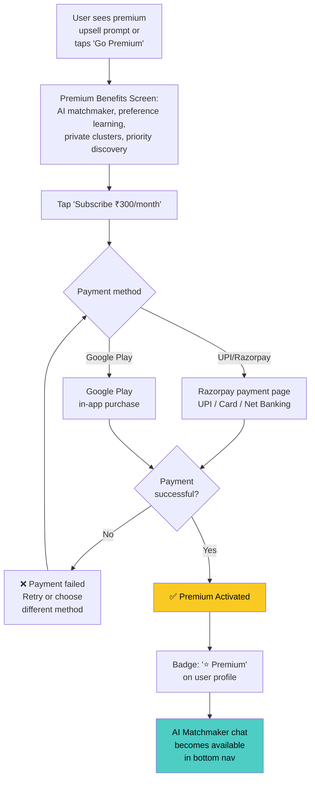
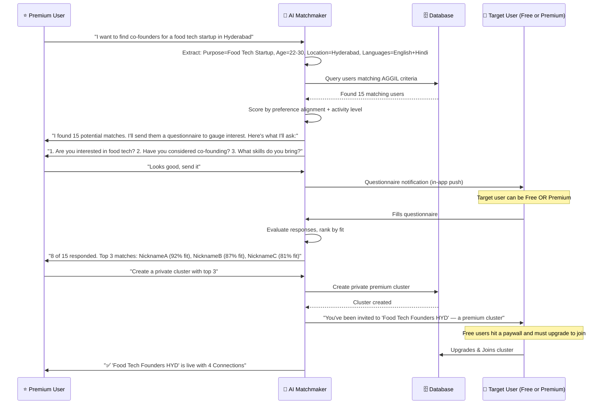
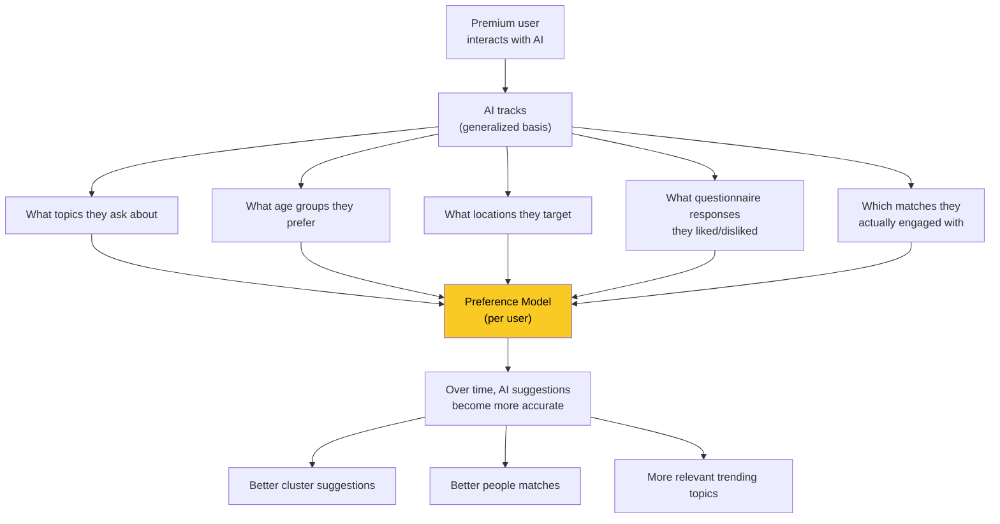

# 💎 Workflow 5: Premium & AI Matchmaker

> Subscription flow, AI-powered people matching, private clusters, and payment integration

> [!WARNING]
> **Phase 1 Constraint:** Premium tier, pricing, and all upsell UI are **NOT visible** to users until significant platform adoption (~100k users). No pricing information appears on the landing page, in the app, or in any Phase 1 marketing material. Premium features are built but not surfaced.

`PRD — Aggilo Social Network — MONETIZATION`

---

## Free vs Premium Comparison

### 🆓 Free — ₹0 forever
- ✅ Unlimited cluster creation
- ✅ Unlimited cluster joining
- ✅ Basic AI cluster suggestions (Scout)
- ✅ Basic Clio conversation for creation
- ✅ Timeline + DMs in all clusters (DM acceptance makes members into Connections)
- ✅ Direct messaging
- ✅ Text + image posts
- ❌ No private AI matchmaker chat
- ❌ No AI preference learning
- ❌ No private premium clusters
- ✅ Can *see* AI matchmaker questionnaires
- ✅ Can *see* AI matchmaker questionnaires
- ❌ Cannot join private premium clusters (Hits paywall)

### ⭐ Premium — ₹300/month
- ✅ Everything in Free
- ⭐ **Private AI matchmaker chat**
- ⭐ **AI learns your preferences** over time
- ⭐ **AI suggests relevant people** to connect with
- ⭐ **Create private premium clusters**
- ⭐ **Questionnaires** sent to potential matches
- ⭐ **Complete control** over AI chat settings
- ⭐ **Priority Scout discovery**
- ⭐ **Connection limits** — optional cap on cluster Connectionship
- ⭐ **Voice/video calling** — in-cluster voice and video calls between Connections
- ⭐ **Cluster templates** — pre-configured templates for common use cases (medical, professional, study groups, etc.)

> [!IMPORTANT]
> **🔑 Key Design Decision:** Free users CAN see questionnaires from premium users, but MUST upgrade to join the resulting private premium cluster. This hard paywall drives the upgrade funnel without letting Free users bypass the Premium value proposition.

---

## Subscription Flow



### Subscription Management

| Event | Handling |
|-------|---------|
| Subscription active | Auto-renews monthly. User gets 24hr reminder notification before renewal. |
| Cancellation | Premium features remain until end of billing period. Private clusters stay accessible. |
| Payment failure | 3-day grace period with retry. After 3 days, downgrade to Free with data preserved. |
| Re-subscription | All premium data (preference learning, private clusters) is restored. |

---

## 🤖 AI Matchmaker — Complete Flow

> [!NOTE]
> **🎭 Identity Clarification:** The AI Matchmaker **is Clio** in premium mode — same character, same voice, same SOUL.md principles. Free users get Clio for cluster creation and platform questions (`cluster_creation` + `platform_qa` skills). Premium users get Clio with the `premium_matchmaker` skill activated: persistent memory, preference learning, person-to-person suggestions, questionnaire dispatch, and private cluster creation. There is **one AI** in Aggilo, not two. The Matchmaker label describes what she can *do* at premium tier, not who she *is*.



---

## 🧠 AI Preference Learning (Premium Only)



> [!NOTE]
> **⚡ Generalized Learning:** AI learns preferences on a *generalized basis* — it doesn't track browsing behavior or external activity. It only learns from interactions WITHIN Aggilo: chats, questionnaire preferences, cluster joins, purpose/topic tags.

---

## 🔒 Private Premium Cluster Rules

| Rule | Detail |
|------|--------|
| Created by | Premium users only (via AI matchmaker) |
| Visible to | Only invited Connections — never appears in search or suggestions |
| Who can join | Premium users only. Free users hit a paywall if invited via match. |
| Content | Same as regular clusters (feed + chat + DM) |
| Deletion | Cannot be deleted (same as regular clusters) |
| Connection removal | Cannot remove Connections (same as regular clusters) |
| If creator downgrades | Cluster remains accessible. No new private clusters can be created. |

---

## 📈 Free → Premium Conversion Triggers

```mermaid
flowchart TD
    A["Free User"] --> B{"Trigger Events"}

    B --> C["Receives questionnaire<br>from premium user"]
    B --> D["Sees premium badge<br>on interesting user"]
    B --> E["Push notification:<br>'You've been active 30 days.<br>Get AI matchmaking for ₹300/mo'"]
    B --> F["Wants to find specific<br>type of person<br>but can't initiate matchmaking"]

    C --> G["Attempts to join private cluster<br>(hits paywall)"]
    G --> H["Experiences FOMO over<br>targeted Premium match"]
    H --> I["Wants to access the specific match<br>and initiate their own"]
    I --> J["💎 Upgrades to Premium"]

    D --> I
    E --> I
    F --> I

> [!NOTE]
> **Conversion Trigger Messaging Rule:** The push notification trigger ("You've been active 30 days. Get AI matchmaking for ₹300/mo") must be rewritten to use Clio's voice:
> - ❌ Not this: *"Upgrade to Premium for AI-powered matchmaking."*
> - ✅ This: *"You've been showing up for 30 days. I've noticed the kind of connections you're after. I can do more — if you want me to."*
> Marketing and push notifications must never name the mechanism (AI matchmaker). They must describe the human outcome (finding the right person / finding your co-founder).

    style J fill:#f9ca24,color:#000
```

---

## API Endpoints

| Endpoint | Method | Purpose |
|----------|--------|---------|
| `POST /api/premium/subscribe` | POST | Initiate premium subscription |
| `POST /api/premium/cancel` | POST | Cancel subscription |
| `GET /api/premium/status` | GET | Check subscription status |
| `POST /api/matchmaker/chat` | POST | Send message to AI matchmaker |
| `POST /api/matchmaker/questionnaire` | POST | Create + send questionnaire to matches |
| `POST /api/matchmaker/questionnaire/{id}/respond` | POST | Submit questionnaire response |
| `POST /api/matchmaker/private-cluster` | POST | Create private cluster from matched users |
| `POST /api/payment/razorpay/create-order` | POST | Create Razorpay payment order |
| `POST /api/payment/razorpay/verify` | POST | Verify Razorpay payment |
| `POST /api/payment/google-play/verify` | POST | Verify Google Play purchase |

---

*← [In-Cluster Experience](04_in_cluster_experience.md) · [Next: AI Agents →](06_ai_agents.md)*
