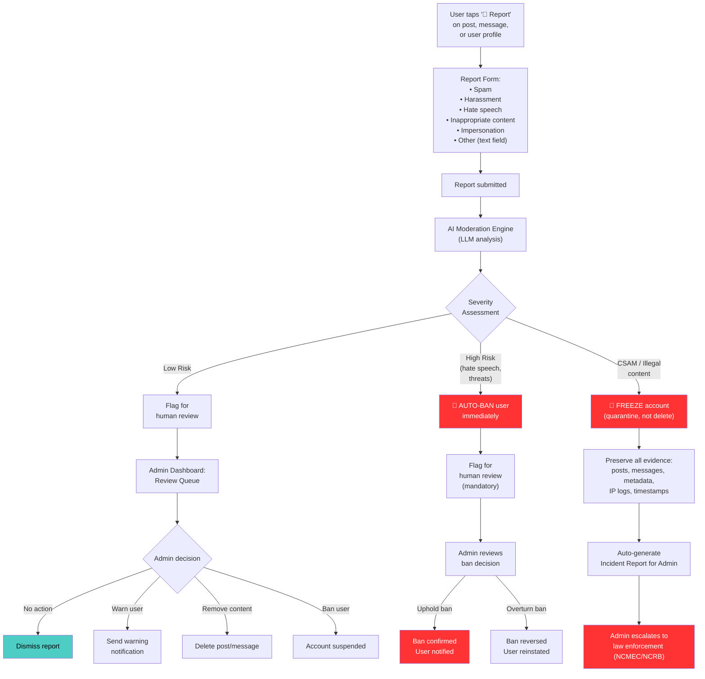
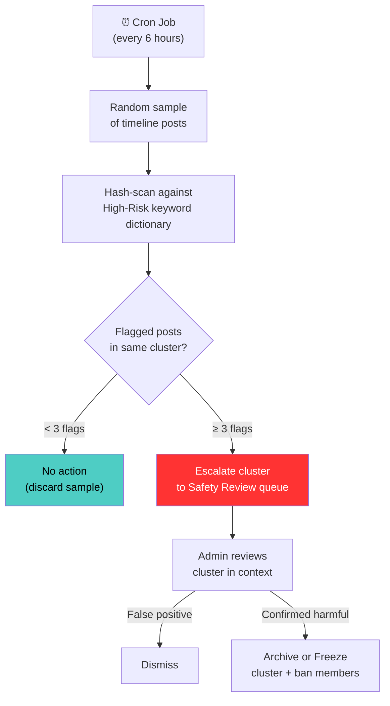
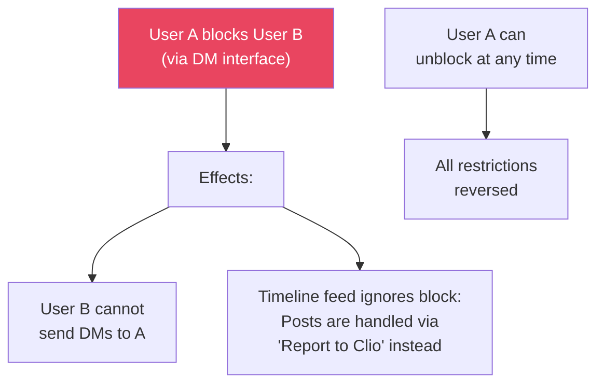
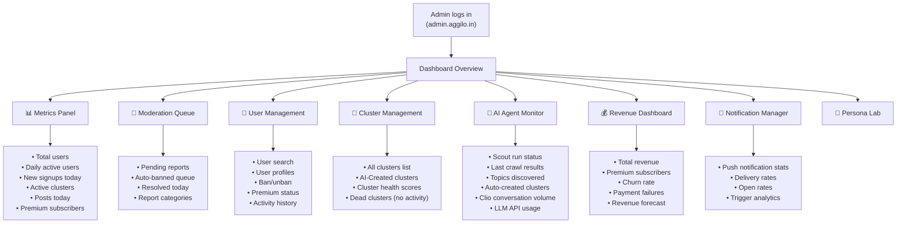
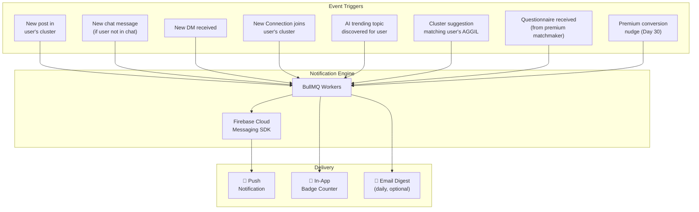
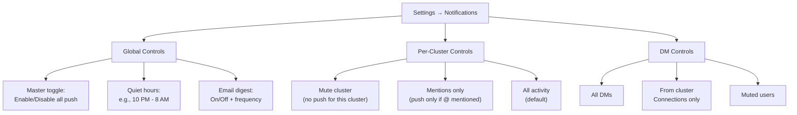

# 🛡️ Workflow 7: Moderation, Admin & Notifications

> Content moderation, admin dashboard, and Firebase push notification system

`PRD — Aggilo Social Network — SAFETY & OPS`

---

## 🚩 Content Report & Moderation Flow

---

## Severity Levels

| Level | Icon | Examples | Action |
|-------|------|----------|--------|
| **Low Risk** | 🟡 | Spam, off-topic content, mild language, self-promotion | Flag for human review only |
| **Medium Risk** | 🟠 | Harassment, bullying, targeted insults, doxxing attempts | Flag for urgent human review + content hidden pending review |
| **High Risk** | 🔴 | Hate speech, threats of violence, impersonation | AUTO-BAN + Flag for mandatory human review |
| **Critical Welfare** | 🏥 | Suicide threats, severe self-harm intent, credible immediate physical danger | **ESCALATE** immediately. Alert Admin on-call via pager. AI moderator shifts to containment/support. **SLA: 5 minutes** for human intervention. |
| **CSAM / Illegal** | ⚫ | Child Sexual Abuse Material, illegal content | **FREEZE** account (quarantine). Preserve ALL evidence (posts, messages, metadata, IP, timestamps). Auto-generate Incident Report. Admin escalates to law enforcement (NCMEC/NCRB). Content is **never deleted** until law enforcement clears it. |

---

## 🤖 AI Content Moderation (Atlas/Clio Feedback)

Because Clio acts as a participant posting Atlas-sourced content to the Timeline, the platform needs a moderation path for AI-generated posts.

| Rule | Detail |
|------|--------|
| **Flagging mechanism** | Members can flag any Clio post via "⋮" → "Not relevant" or "Inappropriate content" |
| **Silent processing** | High-volume clusters may have multiple members flagging the same item. Flags are processed silently without alerting other members. |
| **Immediate hide** | If 3+ independent flags occur on a Clio post, it is immediately hidden from the cluster Timeline pending admin review |
| **Admin queue** | Flagged Clio posts enter a dedicated "AI Quality Review" bucket in the admin dashboard |
| **Feedback loop** | Confirmed "Not relevant" flags are passed back to the Calibration Engine (PRD 08) as negative reinforcement for Atlas's demographic weighting |

---

## 🔬 Passive Safety Sampling Protocol

The report-based moderation flow above only catches abuse that is *reported by a victim*. To prevent echo-chamber clusters (where all members participate in harmful activity and no one reports), a passive safety layer operates independently.

| Rule | Detail |
|------|--------|
| **Trigger** | A BullMQ repeatable job runs every 6 hours |
| **Scope** | Randomly samples a % of cluster timeline posts across the platform (no DMs — privacy boundary) |
| **Method** | Posts are hashed and pattern-matched against a curated High-Risk keyword/phrase dictionary (hate speech, CSAM indicators, extremism, illegal trade). No identity is logged during sampling — only the `cluster_id` and `post_id` are flagged. |
| **Threshold** | If ≥3 flagged posts are found within the same cluster in a single sampling window, the cluster is escalated to a dedicated **"Safety Review"** queue in the Admin Dashboard |
| **Admin action** | Admin reviews the flagged cluster in context. Can Archive, Freeze, or Dismiss. |
| **Privacy guarantee** | Sampling never reads DMs. Sampling never logs `account_id` — only content hashes and cluster context. This is explicitly disclosed in the platform's Terms of Service. |

---

## 🚫 User Blocking (User-Level)

---

## 🖥️ Admin Dashboard

---

## Admin Actions

| Action | Scope | Description |
|--------|-------|-------------|
| **Ban user** | User | Suspend account. User cannot login. Can be reversed. |
| **Unban user** | User | Reverse suspension. All data restored. |
| **Delete content** | Post/Message | Remove specific post or message from cluster. |
| **Archive cluster** | Cluster | Hide cluster from search/suggestions. Connections can still access. |
| **Trigger Scout** | AI | Manually trigger Scout crawl for a specific segment. |
| **Approve/reject Scout topic** | AI | Override auto-creation decision for Scout-discovered clusters. |
| **Vet Persona** | AI | Review/Edit/Approve dynamically generated personas for new cohorts. |
| **Send platform notification** | All/Segment | Send announcement push to all users or specific AGGIL segment. |
| **View analytics** | Platform | Access detailed metrics and growth data. |

---

## 🔔 Notification System (Firebase Push — ₹0/mo)

---

## Notification Frequency Rules

| Trigger | Channel | Frequency Cap | User Can Mute? |
|---------|---------|---------------|----------------|
| New post in cluster | Push + Badge | Batched: max 1 push per cluster per hour | ✅ Per cluster |
| New chat message | Push + Badge | Batched: max 1 push per cluster per 15 min | ✅ Per cluster |
| New DM | Push + Badge | Real-time (every message) | ✅ Per user |
| New member joins | Push | Daily digest: "X people joined your clusters today" | ✅ Global |
| AI trending topic | Push | Max 1 per day | ✅ Global |
| Cluster suggestion | Badge only | When new suggestion available | ❌ Always shown |
| Questionnaire received | Push + Badge | Immediate | ❌ Cannot mute |
| Premium conversion | Push | Once at Day 30, once at Day 60 | ❌ System notification |

> [!TIP]
> **✅ Anti-Spam:** Notification batching ensures users never feel bombarded. A cluster with 50 messages in an hour generates just 1 push notification saying "50 new messages in CSE Study Buddies", not 50 individual pushes.

---

## 👤 User Notification Preferences

---

## API Endpoints

### Moderation

| Endpoint | Method | Purpose |
|----------|--------|---------|
| `POST /api/reports` | POST | Submit a content report |
| `GET /api/admin/reports` | GET | Get moderation queue |
| `POST /api/admin/reports/{id}/action` | POST | Take action on a report (dismiss/warn/delete/ban) |
| `POST /api/users/{id}/ban` | POST | Ban a user |
| `POST /api/users/{id}/unban` | POST | Unban a user |
| `POST /api/users/{nickname}/block` | POST | User-level block |

### Admin

| Endpoint | Method | Purpose |
|----------|--------|---------|
| `GET /api/admin/dashboard` | GET | Dashboard metrics overview |
| `GET /api/admin/users` | GET | User management list |
| `GET /api/admin/clusters` | GET | Cluster management list |
| `GET /api/admin/analytics` | GET | Detailed analytics data |
| `GET /api/admin/personas/queue` | GET | List pending generated personas for review |
| `POST /api/admin/personas/{id}/approve` | POST | Approve/Edit a generated persona |

### Notifications

| Endpoint | Method | Purpose |
|----------|--------|---------|
| `POST /api/devices/register` | POST | Register device for FCM push |
| `PUT /api/notifications/preferences` | PUT | Update notification preferences |
| `PUT /api/clusters/{id}/notifications` | PUT | Update per-cluster notification settings |

---

*← [AI Agents](06_ai_agents.md) · [Next: Data Strategy →](08_data_strategy.md) · [PRD Index](00_prd_index.md)*
