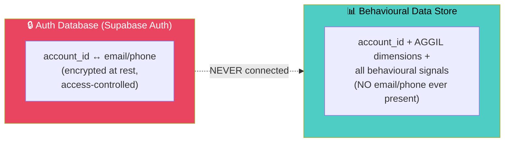
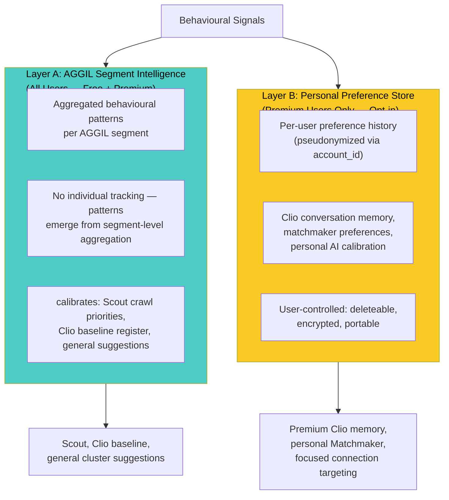
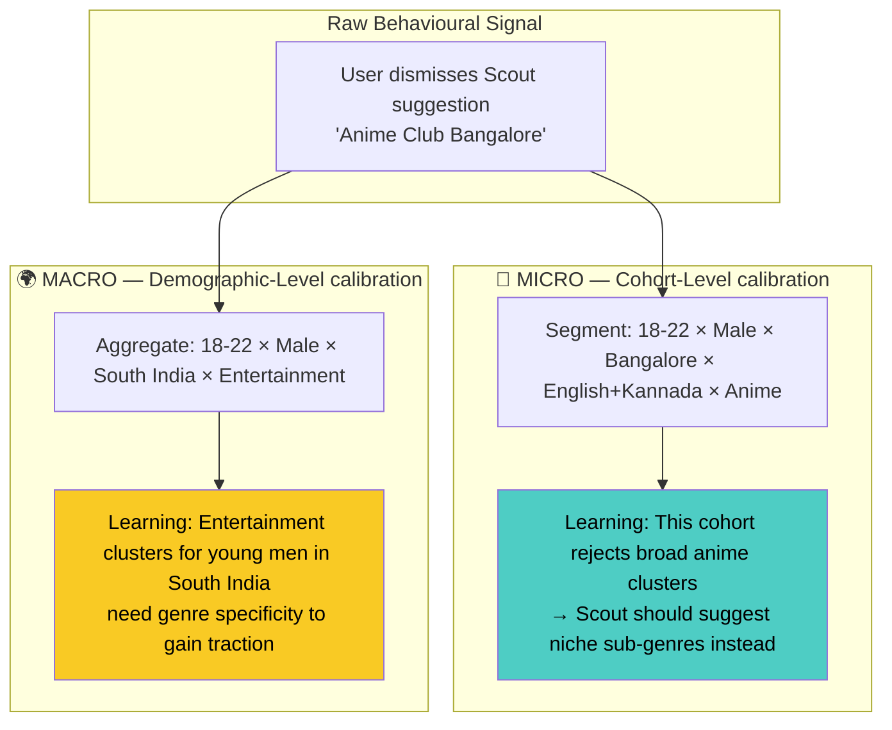
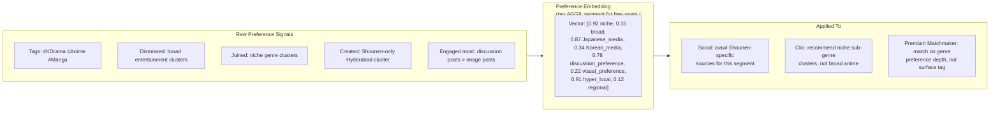
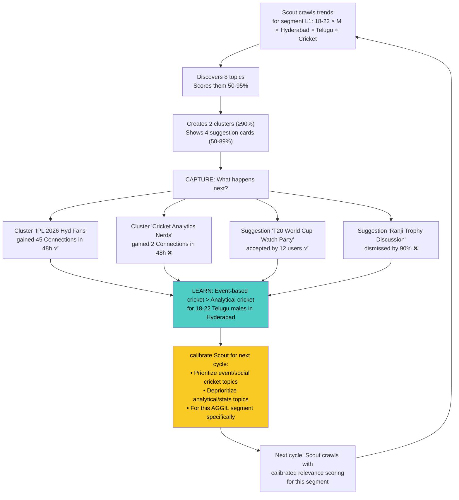
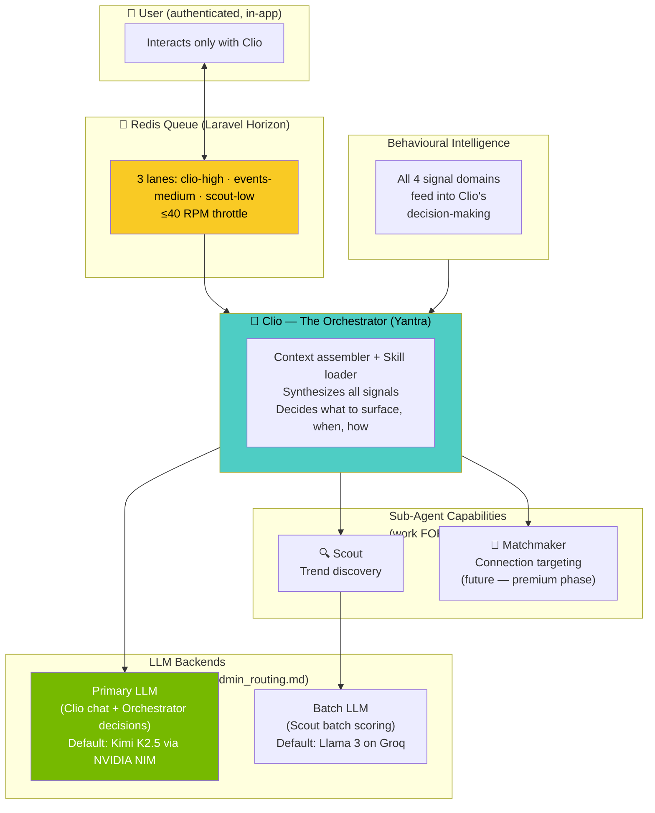
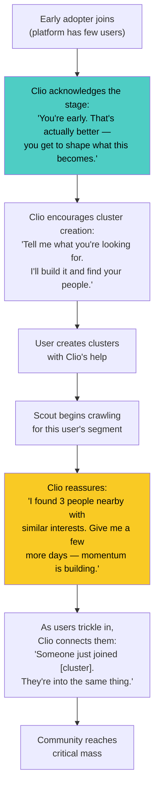
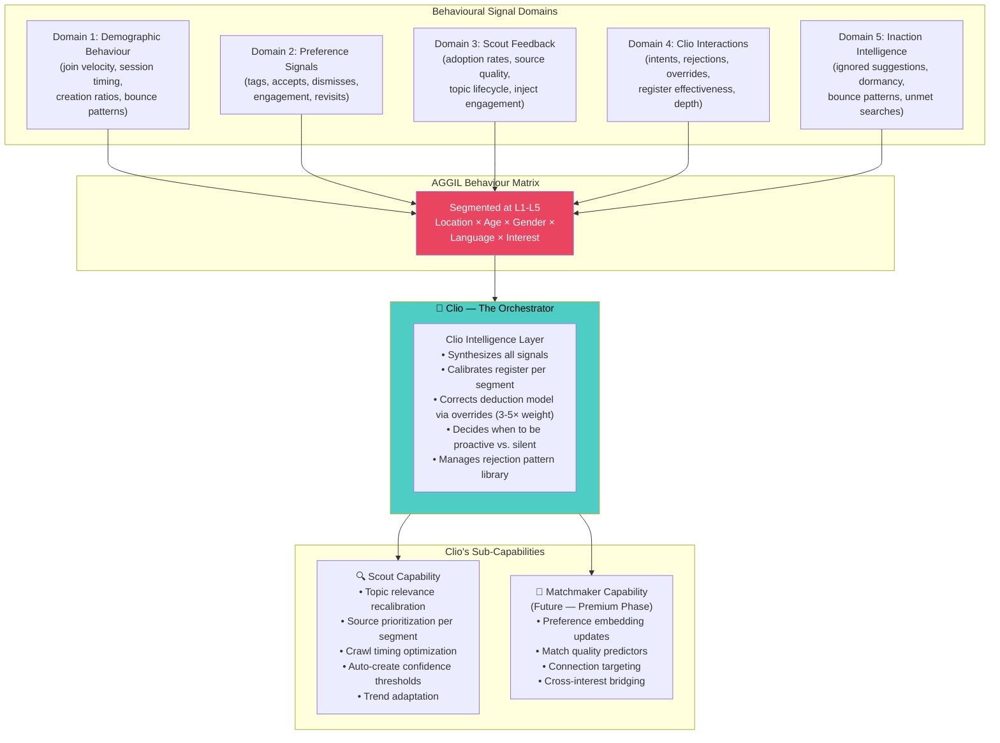
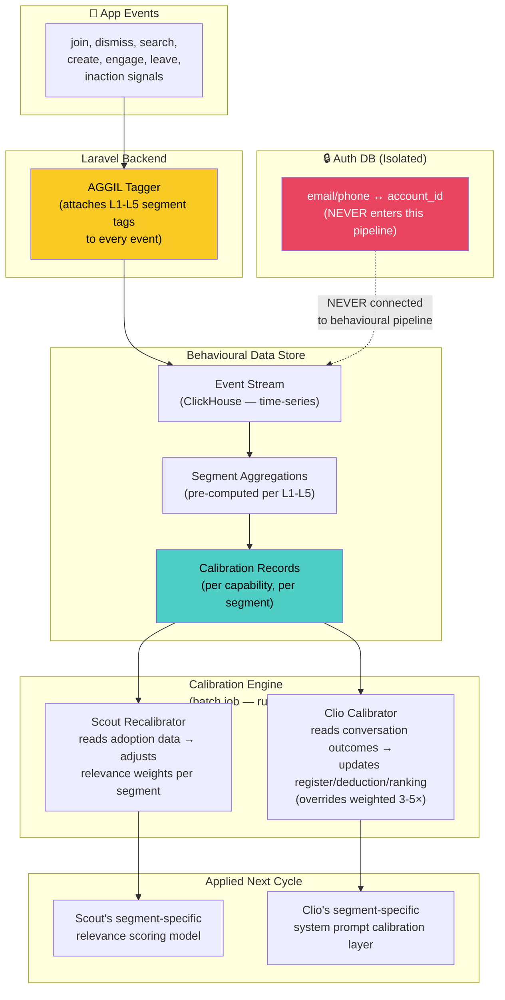
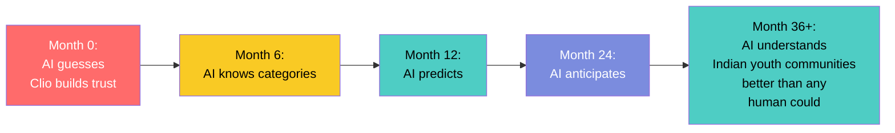

# Aggilo — Behavioural Intelligence & AI Calibration Strategy
## Non-PII Data as the Engine That Makes Scout, Clio & Matchmaker Smarter

> **Core Thesis**: Every user action inside Aggilo generates a *behavioural signal* — what they search for, how they interact with Clio, which Scout suggestions they accept or dismiss, what cluster configs they choose, how they engage inside communities. These signals, segmented by **Location × Age × Gender × Language × Interest**, become the calibration data that makes Aggilo's AI agents progressively smarter at both the **micro level** (individual user cohort) and the **macro level** (national/regional demographic trends). No competitor can replicate this because the data is *earned* through usage, not purchased.

---

## Data Privacy Model — What Is and Isn't PII

### The Simple Truth

Aggilo collects very little PII. The entire AGGIL profile is **inherently non-PII**:

| Data Point | PII? | Why |
|-----------|------|-----|
| Email / Phone | ✅ **YES — the ONLY PII** | Directly identifies a person |
| Year of Birth | ⚠️ Borderline — stored for auth, used as age bracket in analytics | Never exposed in behavioural data |
| Gender (M/F/O) | ❌ No | Not identifying on its own |
| City / Hyper-local Location | ❌ No | Not identifying (Campus, Tech Park, Neighbourhood, Building) |
| Languages | ❌ No | Not identifying |
| Interest Tags | ❌ No | User-chosen, not identifying |
| Nickname | ❌ No | Pseudonymous by design |
| All behavioural signals | ❌ No | Actions, not identity |

> [!IMPORTANT]
> **The ONLY data point requiring PII protection is the email/mobile ↔ account_id link.** This is isolated in the authentication database and **never enters the behavioural data pipeline.** All other data — AGGIL dimensions, cluster interactions, Clio conversations (LLM-classified), engagement patterns — is inherently non-PII and can be captured, aggregated, and used freely for AI calibration.

### Protection Architecture



The two systems share `account_id` for functional purposes (the app needs to track which user is doing what), but the behavioural data store **cannot** resolve `account_id` → real identity because it never receives email/phone. A breach of the behavioural store reveals anonymous behaviour patterns — nothing more.

### Row Level Security (RLS) Database Enforcement
To guarantee the privacy model, **Supabase Row Level Security (RLS)** is strictly enforced across all database tables (especially `messages`, `posts`, and `clusters`). 
*   **Isolation by Default:** No API key or client has default read access to any row.
*   **Membership Gate:** RLS policies explicitly check if the `account_id` exists in the `cluster_members` table before allowing read access to a cluster's chat or timeline.
*   **DM Pseudonymity:** DMs rely entirely on RLS for privacy (they are not End-to-End Encrypted). RLS ensures only the sender and recipient `account_id`s can read the row.
This ensures user data cannot be scraped or accessed outside of their explicit, permitted cluster connections.

### Data Retention & Account Deletion (DPDPA/GDPR Compliance)
When a user initiates the "Delete Account" flow:
1. **PII Hard Delete:** Their email, phone number, and authentication records are permanently erased from the Auth Database.
2. **Profile Anonymization:** Their public Nickname is scrambled/removed, and their profile is deactivated so they no longer appear in search or Connection lists.
3. **Content Preservation (Soft Delete):** Their historical posts inside cluster Timelines and Chat remain intact to preserve community history and context. However, the author tag on all their historical posts changes to a neutral `"Deleted User"`.
This ensures privacy compliance without inadvertently destroying the readable history of active clusters.

---

## Dual-Layer Data Model — Free vs. Premium Intelligence

### Why Two Layers

Aggilo's premium product (₹300/mo) promises *personal* preference learning — "AI learns YOUR preferences." The free tier promises *segment-level* intelligence — "AI understands what people like you want." These require different data approaches:



| Aspect | Layer A (All Users) | Layer B (Premium Only) |
|--------|-------------------|----------------------|
| **Scope** | AGGIL segment-level patterns | Per-user preference history |
| **Identity** | Segment tags only (no user tracking) | Pseudonymized account_id |
| **Purpose** | Refine Scout, Clio, general suggestions based on demographics, requirements, interests, past & prospective engagements | Power personal Clio memory, focused Matchmaker targeting, deeper connection discovery |
| **Retention** | Indefinite (it's aggregate data) | User-controlled; deleted on request or account deletion |
| **DPDPA** | No consent needed (no personal data) | Explicit opt-in at premium activation |

> [!NOTE]
> **No arbitrary cohort minimums.** Layer A aggregates naturally — the more users in a segment, the stronger the signal. Even small segments produce useful directional data. Layer B is fully personal and powers the premium experience with increasingly precise targeting over time.

---

## The AGGIL Behaviour Matrix — Micro & Macro Segmentation

Every behavioural signal is tagged with the user's AGGIL dimensions and analyzed at multiple levels:



### The Segmentation Hierarchy

| Level | Granularity | Example Segment | Used For |
|-------|------------|-----------------|----------|
| **L1 — Hyper-micro** | Age bracket × Gender × **Location (Building/Street/Area)** × Language × Interest | 18-22 × F × **T-Hub Phase 2** × Telugu+English × K-Drama | Per-cohort Clio register tuning, Scout topic selection |
| **L2 — Micro** | Age bracket × Gender × **Neighbourhood/City** × Language family | 18-22 × F × **Hitech City** × Telugu+English | Cluster suggestion ranking |
| **L3 — Meso** | Age bracket × Gender × State/Region × Interest category | 18-22 × F × Telangana × Entertainment | Scout crawl source prioritization |
| **L4 — Macro** | Age bracket × Gender × National | 18-22 × F × India | National trend forecasting, content category strategy |
| **L5 — Cross-cutting** | Language × Interest (age/gender agnostic) | Telugu × Fitness | Language-community formation patterns *(to be expanded based on data)* |

> [!IMPORTANT]
> **The magic is in the combinations.** A 22-year-old Telugu-speaking woman in **T-Hub Phase 2** interested in K-Drama has different behavioural patterns than a 22-year-old Telugu-speaking woman in **Secunderabad** interested in K-Drama. The AGGIL matrix captures these hyper-local differences. Even when the same demographics share similar interests, **location context creates different clusters** — startup founders in Hitech City and startup founders in Jubilee Hills are naturally separated by the hyper-local dimension, ensuring each community gets intelligence calibrated to *their* specific context. Over time, Aggilo knows exactly what each micro-segment wants — down to the building or street level.

---

## Signal Domain 1: Demographic Behaviour Patterns

**What people *do* based on who they are — without knowing who they are.**

### Signals Captured (always tagged with AGGIL segment)

| Behaviour | What It Tells Us | calibrates |
|-----------|-----------------|------------|
| **Cluster join velocity** — time from seeing suggestion to joining | Which segments are decisive vs. exploratory | **Scout**: how aggressively to push vs. gently suggest |
| **Cluster creation vs. joining ratio** — % who create vs. consume | Which segments are community builders vs. Connections | **Scout**: seed more clusters for consumer-heavy segments |
| **Multi-cluster join patterns** — how many clusters, how fast, which combinations | Interest breadth vs. depth by demographic | **Clio**: recommend breadth to deep users, depth to broad users |
| **Session timing patterns** — what hours, what days, session duration | When each segment is active | **Scout**: time cluster suggestions and discussion injections optimally |
| **Platform entry point** — Dashboard vs. Search vs. Shared link vs. Clio | How each segment discovers communities | **Clio**: prioritize the discovery channel each segment prefers |
| **Feature adoption sequence** — first post, first DM, first Clio chat, first creation | What features resonate first by demographic | **Clio**: guide users toward features their cohort loves |
| **Leave-before-engage patterns** — joins then leaves without posting/reading | Which cluster *types* fail for which demographics | **Scout**: stop suggesting cluster types that this segment bounces from |

### calibration Output Example

```
SEGMENT: 23-27 × Male × Hyderabad × English+Hindi × Tech
LEARNED BEHAVIOUR:
  - join_velocity: fast (< 30s) → push Scout suggestions confidently
  - creation_ratio: high (38% create) → suggest "create your own" to this cohort
  - peak_activity: 9pm-12am weekdays → time Scout injections for 8:30pm
  - entry_point: 62% Search → invest in search quality for this segment
  - bounce_clusters: broad "Tech" clusters → suggest niche (DevOps, ML, etc.)
```

---

## Signal Domain 2: Personal Preference Signals

**What people *choose*, *reject*, and *gravitate toward* — the taste profile without the identity.**

### Onboarding Preference Signals

| Signal | Collection Point | calibration Value |
|--------|-----------------|-------------------|
| **Tags selected during registration** | Step 4 (Purpose & Tags) | Initial interest vector — seeds all AI suggestions |
| **Tags viewed but NOT selected** | Step 4 scroll/browse | *Negative* preference signal — what they consciously rejected |
| **Custom tags created** | Step 4 (typed tags) | Unmet demand — interests the platform doesn't yet categorize |
| **Purpose text intent** | LLM-classified from Step 4 purpose field | Primary motivation (find friends, network, learn, belong) |
| **Clio welcome response style** | Welcome conversation turns | Communication style preference (brief vs. chatty, serious vs. playful) |

### Ongoing Preference Signals

| Signal | Collection Point | calibration Value |
|--------|-----------------|-------------------|
| **Suggestion accepts vs. dismisses** | Dashboard suggestion cards | Real-time preference calibration — positive AND negative |
| **Search filter combinations** | Advanced search interactions | Explicit preference declaration (age range, gender, location they want) |
| **AGGIL config choices in creation** | Cluster creation wizard | What they think the *ideal* community looks like |
| **Content engagement patterns** | Likes, comments, time-on-post | Topic-level preference signals (which subjects get deep engagement) |
| **DM initiation context** | Which cluster context → DM | Which community types generate the deepest connections |
| **Cluster revisit frequency** | Return visits per cluster | Which clusters deliver sustained value vs. one-time curiosity |
| **Dismissed suggestion patterns** | What they swipe away | Equally valuable as accepts — the "NOT this" signal |

### Preference Embedding Architecture



---

## Signal Domain 3: Scout Learning Loop

**How the autonomous discovery engine gets smarter with every cycle.**

### Scout's Problem Without Behavioural Feedback
Scout crawls the internet and guesses what's relevant. Without feedback, it's flying blind — a 90% relevance score is an LLM's *prediction*, not a *validated* signal.

### The Feedback Loop That Fixes This



### Scout calibration Signals

| Signal | Measurement | What Scout Learns |
|--------|------------|-------------------|
| **Auto-created cluster adoption rate** | Connections gained in 48h / 7d / 30d | Which topic categories actually resonate (per segment) |
| **Suggestion card accept/dismiss ratio** | Per topic category, per AGGIL segment | Where Scout's relevance scoring is miscalibrated |
| **Discussion injection engagement** | Likes + comments on injected discussions vs. organic | Which injected topics spark conversation vs. get ignored |
| **Cluster time-to-first-organic-post** | Hours after creation until a real user posts | How well Scout seeds a community that users want to contribute to |
| **Topic category → engagement heat map** | Topic type × AGGIL segment → avg engagement score | Master lookup table for Scout prioritization |
| **Source quality by segment** | Which crawl source (Google/Reddit/Twitter/News) produces accepted topics for which segments | Stop wasting crawl cycles on low-yield sources per segment |
| **Trending topic lifecycle by segment** | Days from discovery to peak engagement to decline | Know when a topic is "early" vs. "late" for each demographic |

### Scout calibration Data Schema

```
fine_tuning_record: scout
  segment_l1: "18-22_M_hyderabad_telugu_cricket"
  segment_l2: "18-22_M_hyderabad_telugu"
  segment_l3: "18-22_M_telangana_sports"

  topic_category: "cricket_events"
  source: "twitter"
  relevance_score_predicted: 92
  relevance_score_actual: 87       ← calibrated from adoption data

  cluster_created: true
  members_48h: 45
  members_7d: 112
  organic_posts_48h: 23
  discussion_injection_engagement: 0.72

  suggestion_cards_shown: 4
  suggestion_cards_accepted: 2
  suggestion_cards_dismissed: 2
  dismissed_categories: ["cricket_analytics", "cricket_history"]

  LEARNING_DELTA:
    - increase_weight: "event_cricket" +0.15
    - decrease_weight: "analytical_cricket" -0.22
    - source_quality_adjustment: "twitter" +0.08 for this segment
    - optimal_crawl_time: "18:00-20:00 IST" (pre-match hours)
```

---

## Signal Domain 4: Clio Interaction Intelligence

**How conversational behaviour reveals preferences that explicit choices cannot.**

### Why Clio Data Is the Most Valuable

Users *say* what they want in registration fields. But with Clio, they *show* what they want through:
- How they phrase requests (reveals emotional need)
- What they reject (reveals refined taste)
- How long they engage (reveals trust level)
- What follow-up questions they ask (reveals depth of need)

### Clio as Central Orchestrator

> [!IMPORTANT]
> **Clio is not one agent among peers — Clio is the in-app orchestrator.** Scout and Matchmaker are capabilities that Clio wields. All intelligence flows THROUGH Clio. In the current architecture, Yantra (self-hosted on Hostinger VPS) assembles context from Supabase and routes every user-facing call to **Kimi K2.5 via NVIDIA NIM** (free tier, ≤40 RPM, 256K context). Scout’s batch topic scoring uses **Llama 3 8B on Groq** (separate, low-temperature config). All AI calls pass through a **Redis queue with 3 priority lanes** (managed by Laravel Horizon) to enforce rate limits and ensure Clio chat always takes priority over background Scout work.
>
> **The landing page generates zero AI signals.** The waitlist intake form is a static progressive form — plain HTTP POST to Supabase. No Yantra, no LLM, no WebSocket. Behavioural signal collection begins only after a user authenticates and enters the app.



### Clio Interaction Signals (LLM-classified, never raw text)

| Signal | LLM Classification | calibration Value |
|--------|-------------------|-------------------|
| **Intent category** | find_community / create_new / get_recommendation / ask_question / explore_platform | What each AGGIL segment *actually* uses Clio for |
| **Emotional register** | curious / excited / exploratory / goal-oriented / committed | How Clio should calibrate tone per segment |
| **Specificity level** | vague ("I want friends") → precise ("Telugu-speaking women in tech, Hyderabad, 25-30") | When to probe deeper vs. when to act |
| **Rejection patterns** | What Clio suggested → user said "no" → LLM classifies *why* | What each segment finds irrelevant (critical negative signal) |
| **Conversation depth** | Turns before action, turns before abandon | Trust-building pace per demographic |
| **Arc beat drop-off** | Which relationship arc beat the user reached before acting/leaving | Where Clio's personality calibration needs adjustment |
| **Register effectiveness** | Did Explorer/Campus/Momentum/Anchor match → engagement outcome | Is age-based register assignment correct? |
| **Proactive trigger success** | Which trigger (empty dashboard, idle, zero results) → conversation → action | Optimal Clio intervention strategy per segment |
| **Follow-up question categories** | About cluster details / about Connections / about activity / about privacy | What information drives decisions for each segment |
| **Clio override rate** | How often users change Clio's deduced AGGIL settings | Where Clio's deduction model needs recalibration |

> [!IMPORTANT]
> **Override signals are the highest-fidelity calibration data in the entire system.** When a user explicitly corrects Clio's AGGIL deduction, that's a free training label — you know WHICH dimension was wrong and WHAT the correct answer is. Override signals should be weighted **3-5× higher** than passive signals (accept/dismiss) in the calibration engine.

### Clio calibration Data Schema

```
fine_tuning_record: clio
  segment_l1: "23-27_F_hyderabad_telugu+english_professional_reinvention"
  segment_l2: "23-27_F_hyderabad_telugu+english"

  conversation_context: "cluster_discovery"      ← not raw text
  intent_classified: "find_community"
  emotional_register_detected: "goal_oriented"

  register_used: "momentum"
  register_effectiveness_score: 0.84    ← did user engage productively?
  arc_beat_reached: 7

  conversation_turns: 6
  suggestions_offered: 3
  suggestions_accepted: 1
  suggestions_rejected: 2
  rejection_reasons_classified: ["too_broad", "wrong_age_range"]

  clio_deduced_aggil: {age: "23-30", gender: "F", loc: "Hyderabad", interest: "business"}
  user_modified_aggil: {age: "25-32", interest: "women_in_business"}  ← override (3-5× weight)
  override_dimensions: ["age_range", "interest_specificity"]

  outcome: "cluster_joined"
  outcome_satisfaction_proxy: "revisited_cluster_within_24h"

  proactive_trigger: "user_initiated"

  LEARNING_DELTA:
    - register_adjustment: "momentum" confirmed effective for 23-27 F professional
    - deduction_fix: widen default age range for professional reinvention intent
    - specificity_signal: this segment wants gendered professional clusters → suggest "women in X"
    - rejection_pattern: "too_broad" is dominant rejection → Clio should suggest niche first
```

---

## Signal Domain 5: Inaction Intelligence — The Negative Space

**What people DON'T do is often more revealing than what they do.**

### Why Inaction Matters

Active signals (joins, creates, engages) tell you what works. Inaction signals tell you **what's failing silently** — users who drift away without complaining are the hardest churn to detect and the most important to prevent.

### Inaction Signals & Clio's Proactive Response

| Inaction Signal | What It Reveals | Clio's Proactive Response |
|----------------|-----------------|--------------------------|
| **Suggestion shown but completely ignored** (not dismissed, not accepted) | Suggestion was so irrelevant it didn't even merit a dismiss — stronger negative signal than a reject | Clio notes the non-engagement, adjusts future suggestions silently |
| **Cluster joined but never opened** | Aspiration vs. actual interest gap — they *want* to be that person but don't follow through | Clio reaches out: *"I noticed you joined [cluster]. There's a discussion there right now about [topic] — worth a look?"* |
| **Opened cluster but left within 10 seconds** | Content mismatch — the preview promised something the content doesn't deliver | Clio notes content quality signal; flags cluster for Scout to inject better discussion starters |
| **Clio conversation started but closed within 1 turn** | Clio's opening line failed — register or approach was wrong | Register calibration signal — more important than multi-turn rejection data |
| **Search with 0 results → no cluster creation** | Unmet demand that exists but the user didn't want to build it themselves | Clio proactively follows up: *"I remember you searched for [X]. I'm working on finding the right people for that — give me some time."* |
| **Dormant user — was active, went silent** | Churn precursor | Clio reaches out with genuine care, not urgency: *"It's been a bit. The people in [most-visited cluster] have been posting about [topic]. Just flagging."* |

> [!IMPORTANT]
> **Clio's role with inaction signals is NOT to spam or pressure.** It's to:
> 1. **Interact** — ask the user what they're looking for, what's missing
> 2. **Reassure** — if the right community doesn't exist yet, assure them Clio is working on it
> 3. **Encourage patience** — *"I'm still looking for the right people. When I find them, you'll know."*
> 4. **Encourage creation** — *"If I can't find exactly what you need, you could create it — I'll help you, and my job is to find the right people to join."*
>
> This turns potential churn into a **trust-building moment**. Users who feel that Clio is genuinely working for them will stay — even if the platform doesn't have their ideal community yet.

---

## Early Adopter Strategy — Clio Builds Momentum

When user counts are low (early launch, new cities), the data signals are thin. This is **not a data architecture problem — it's Clio's job.**

### Clio's Role in Building Momentum



### How Thin Data Still Works

| Early Stage | Clio's Approach | Data Still Captured |
|------------|----------------|---------------------|
| **0-500 users** | Clio acts as community concierge — personally engaged, encouraging creation, reassuring patience | Every interaction generates Clio calibration signals. Tags, purposes, and creation patterns seed the AGGIL matrix at L4. |
| **500-2000** | Clio begins referencing segment patterns: *"People in your bracket here are into [X] — I found a cluster for that."* | City-level (L3) patterns emerge. Scout begins source-quality calibration. |
| **2000-10,000** | Clio's suggestions become noticeably better — users feel the AI "getting smarter" | Language × location combinations differentiate. Full L2 segmentation active. |
| **10,000+** | Hyper-micro intelligence kicks in — Clio feels genuinely personal without being personal | Full L1 calibration. The moat is real. |

> The early stage isn't a weakness — **it's an opportunity for Clio to build deep trust with early adopters who become evangelists.**

---

## The Master calibration Architecture

### How All Signal Domains Feed Through Clio



### Micro vs. Macro calibration

| Level | Scope | Example | Update Frequency |
|-------|-------|---------|-----------------|
| **Micro (L1-L2)** | Specific cohort in specific city | "Scout learned that 18-22 Telugu males in Hyderabad reject broad anime clusters but love Shounen-specific ones" | After every Scout cycle with sufficient feedback signals |
| **Meso (L3)** | Regional demographic pattern | "Clio's Momentum register works for 25-35 professionals in South India but underperforms in North India → test a warmer variant" | Weekly aggregation |
| **Macro (L4-L5)** | National or cross-cutting | "Language + Interest combos show that Hindi × Fitness has 3× higher cluster creation rate than Telugu × Fitness → Scout should seed more Telugu × Fitness clusters proactively" | Monthly trend analysis |

---

## calibration Data Flow — Technical Architecture



---

## The Compounding Intelligence Effect

### Month 1: Cold Start — Clio Leads
- Scout guesses relevance from LLM scoring alone
- Clio uses age-bracket register with no segment-specific calibration
- **Clio personally engages early adopters, encouraging creation and building trust**

### Month 3: Early Signal
- Scout knows which topic *categories* work for which L3 segments
- Clio knows which register is effective per L2 segment
- Rejection pattern libraries have 100+ entries

### Month 6: Behavioural Clarity
- Scout has source-quality maps per L1 segment (Reddit works for X, Twitter for Y)
- Clio's deduction model has been corrected by 1000+ override signals
- Preference embeddings differentiate niche interests within broad categories

### Month 12: Deep Intelligence
- Scout can predict cluster adoption rates before creation (validated against 12 months of feedback)
- Clio can infer unstated preferences from 3-4 conversation turns (because it's seen thousands of similar conversations from the same cohort)
- Cross-segment patterns emerge: "Users who join X-type clusters and are in Y segment typically want Z next" — prediction, not just reaction

### Month 24+: The Indefensible Position
- Full AGGIL Behaviour Matrix at L1 granularity for all active Indian cities
- Scout's relevance scoring is real-world validated, not just LLM-predicted
- Clio's personality is per-cohort-calibrated — feels genuinely *personal* without knowing anything *personal*
- **A new competitor starting from zero would need 24 months of usage data from the same demographics to reach parity — by which time, Aggilo has 48 months of data**



---

## What Makes This Fundamentally Different from "Analytics"

| Traditional Analytics | Aggilo's Behavioural Intelligence |
|----------------------|----------------------------------|
| Dashboards for humans to read | **Data that directly calibrates AI agents** |
| Measures what happened | **Predicts what should happen next** |
| Same suggestions for everyone | **Per-cohort-calibrated at L1 granularity** |
| Improves when a PM reads a report | **Improves autonomously every cycle** |
| Copied if code is copied | **Cannot be copied — it's earned data** |
| Insight → human decision → code change | **Signal → automatic recalibration → smarter Clio** |

---

## Deferred Items — Future Phases

| Item | Phase | Rationale |
|------|-------|-----------|
| **Signal Domain 6: Matchmaker Intelligence** | Premium feature launch | Requires premium users and matchmaker interactions to generate signals |
| **Content format preference signals** | Post-MVP (Phase 2+) | Need sufficient content volume across formats |
| **Seasonal Behaviour Calendar** | 12+ months of data | Need a full year of behavioural data to detect seasonality |
| **Data quality / noise mitigation** | Scale phase | Relevant when signal volume is high enough for noise to matter |
| **L5 cross-cutting segment expansion** | Data-driven | Will expand based on actual usage patterns observed |
| **Clio sub-agent decomposition** | Architecture maturity | Clio handles everything at first; sub-agents emerge as complexity grows |

---

*← [Moderation & Admin](07_moderation_admin.md) · [Next: Admin Platform →](09_admin_platform.md) · [PRD Index](00_prd_index.md)*

