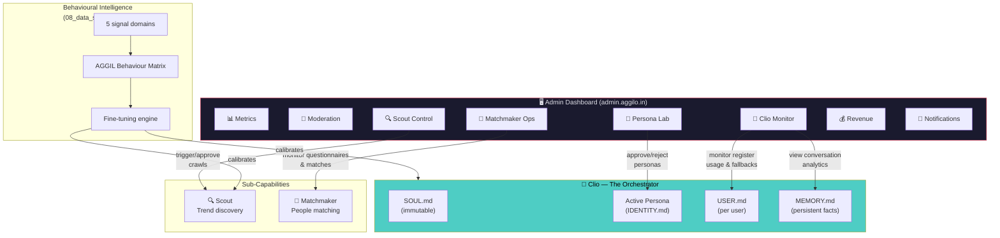
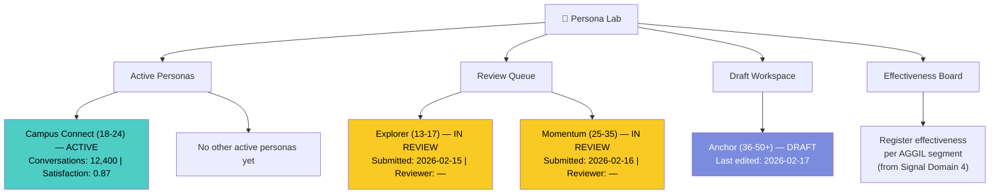
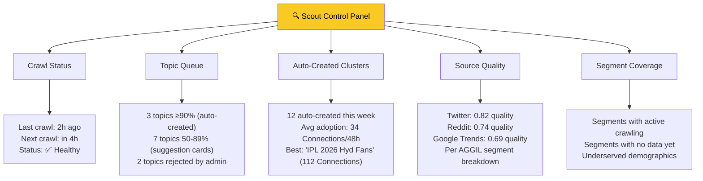
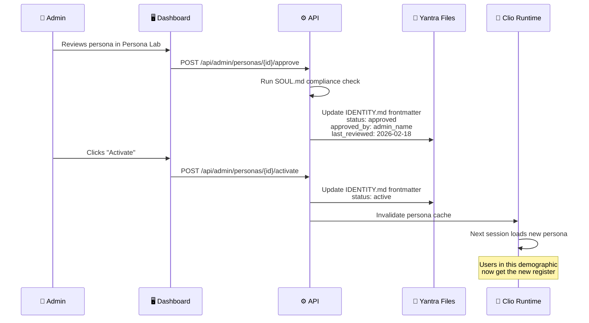

# 🖥️ Workflow 9: Admin Platform — Unified Intelligence Dashboard

> Persona governance, Clio orchestrator monitoring, Scout controls, and cross-system admin capabilities

`PRD — Aggilo Social Network — ADMIN & INTELLIGENCE OPS`

> [!NOTE]
> This document extends [07_moderation_admin.md](07_moderation_admin.md) (content moderation, user management, notifications) with **AI intelligence management** — the tools admins use to govern Clio's persona system, monitor orchestrator behaviour, tune Scout, and track platform-wide AI effectiveness.

---

## Admin Integration Map

> **How the Admin Dashboard connects to every system.**



---

## 🧬 Persona Lab — Deep Dive

> The admin's workspace for managing Clio's demographic voice layer.

### What Admin Sees



### Persona Card — Admin View

Each persona in the Persona Lab shows:

| Field | Source | Admin Can Edit? |
|:---|:---|:---|
| **Name** | `persona_name` in YAML frontmatter | ✅ Yes |
| **Demographic** | `demographic` in YAML frontmatter | ✅ Yes |
| **Status** | `status` in YAML frontmatter | ✅ Yes (controls lifecycle) |
| **Tone summary** | Extracted from IDENTITY.md `## Tone Specification` | ✅ Yes |
| **Example lines** | From `## Relationship Arc — Dialogue Examples` | ✅ Yes |
| **Emoji rules** | From `## Vocabulary & Language` | ✅ Yes |
| **SOUL.md compliance** | Auto-checked: anti-patterns, no urgency, no sycophancy | 🤖 Automated |
| **Effectiveness score** | From data strategy register effectiveness signal | 📊 Read-only |
| **Conversation volume** | Total Clio conversations using this register | 📊 Read-only |
| **Fallback frequency** | How often this persona is used as fallback | 📊 Read-only |

### Admin Actions in Persona Lab

| Action | Effect | Validation |
|:---|:---|:---|
| **Submit for review** | `draft` → `review` | Must have all required sections filled |
| **Approve** | `review` → `approved` | SOUL.md compliance check must pass |
| **Activate** | `approved` → `active` | Only 1 active persona per demographic |
| **Revoke** | `active` → `review` | Affected users fall back to Anchor |
| **Reject** | `review` → `draft` + notes | Admin writes rejection reason |
| **Edit inline** | Modify any IDENTITY.md section | Changes require re-review if status ≥ `review` |
| **Clone** | Duplicate persona as new draft | For creating variants or A/B tests |
| **Preview** | See Clio's responses as if this persona is active | Uses sandbox conversation with test user |

### SOUL.md Compliance Checker

Before approval, the system automatically validates:

```
✅ No "Got it!", "Amazing!", "Great choice!" (sycophantic phrases)
✅ No "only X spots left", "don't miss out" (urgency/scarcity)
✅ No "We found great matches!" (algorithmic language)
✅ All 10 relationship arc phases have dialogue examples
✅ Emoji usage is ≤1 per message in examples
✅ Generic vs. Clio comparison table is present
✅ Vocabulary section defines words-never-used
❌ FAIL: Line 47 contains "You're doing great!" → sycophantic
```

---

## 🤖 Clio Orchestrator Monitor

> Live visibility into how Clio is performing and how the AI queue is handling load.

### Overview Dashboard

| Metric | Description | Update Frequency |
|:---|:---|:---|
| **Active register distribution** | Pie chart: what % of users are on each persona | Real-time |
| **Fallback frequency** | How often Anchor is loaded because no active persona matches | Real-time |
| **Conversation volume** | Total Clio conversations / day, broken by register | Hourly |
| **Arc phase distribution** | Histogram: how many users are at each phase (1-10) | Daily |
| **Average arc velocity** | Mean time to advance from phase 1 → 5 | Daily |
| **1-turn abandonment rate** | Conversations closed after Clio's first message | Real-time |
| **Proactive trigger success** | Which triggers (dormant, empty dashboard) lead to engagement | Daily |
| **Premium vs free usage** | Conversation depth comparison between tiers | Daily |
| **Queue depth (Horizon)** | Jobs pending in each lane: `clio-high` / `events-medium` / `scout-low` | Real-time |
| **NVIDIA NIM RPM usage** | Current requests/minute vs. 40 RPM free tier cap | Real-time |
| **Queue wait time (p95)** | 95th-percentile wait time for Clio chat jobs | Hourly |
| **Failed/retried jobs** | Jobs that hit rate limit or timeout and were retried | Real-time |

### Register Effectiveness View

> Sourced from [Signal Domain 4](08_data_strategy.md) — `register_effectiveness` signal.

| Register | Segment | Conversations | Engagement Score | 1-Turn Abandon | Recommendation |
|:---|:---|:---|:---|:---|:---|
| Campus | 18-24, Hyderabad | 4,200 | 0.87 | 8% | ✅ Performing well |
| Campus | 18-24, Bangalore | 3,100 | 0.71 | 15% | ⚠️ Consider regional variant |
| Anchor (fallback) | 25-35, all cities | 1,800 | 0.62 | 22% | 🔴 Prioritize Momentum activation |
| Anchor (fallback) | 36-50+, all cities | 400 | 0.78 | 11% | ✅ Anchor fits this demographic |

> [!IMPORTANT]
> When fallback frequency for a demographic exceeds **30%** of that segment's total conversations, the system alerts the admin to prioritize persona development for that bracket.

### Conversation Audit

Admins can browse **LLM-classified summaries** of Clio conversations (never raw text):

| Field | What Admin Sees |
|:---|:---|
| Conversation ID | Pseudonymized |
| Register used | e.g. "Campus Connect" |
| Intent classified | e.g. "find_community" |
| Emotional register | e.g. "curious" |
| Arc beat reached | e.g. Phase 5 |
| Outcome | e.g. "cluster_joined" |
| Override? | If user corrected Clio's AGGIL deduction |

> [!WARNING]
> Raw conversation text is **never shown** to admins. All audit data is LLM-classified into structured signals per [08_data_strategy.md](08_data_strategy.md) Signal Domain 4.

---

## 🔍 Scout Admin Controls

> Extends the Scout controls referenced in [06_ai_agents.md](06_ai_agents.md) and [07_moderation_admin.md](07_moderation_admin.md).

### Scout Dashboard



### Admin Scout Actions

| Action | Description |
|:---|:---|
| **Manual trigger** | Force Scout crawl for a specific AGGIL segment |
| **Approve/reject topic** | Override auto-creation decision for pending topics |
| **Adjust relevance threshold** | Change the ≥90% auto-create threshold per segment |
| **Pause crawl source** | Temporarily disable a low-quality source for a segment |
| **View adoption analytics** | See which auto-created clusters gained traction |

> [!NOTE]
> All Scout actions flow **through Clio** — results are surfaced to users as Clio's suggestions, not as "Scout found this". Admin controls Scout's inputs; Clio owns the user-facing output.

---

## 💎 Matchmaker Ops (Premium Phase)

> Admin controls for the premium matchmaker capability. Deferred until premium launch but specified here for completeness.

| Capability | Description |
|:---|:---|
| **Questionnaire review** | Browse active questionnaires, flag inappropriate ones |
| **Match quality monitoring** | Track match acceptance rates per AGGIL segment |
| **Private cluster oversight** | View private premium clusters (admin-only visibility) |
| **Premium conversion funnel** | Free → premium conversion tracking by trigger type |
| **Churn risk alerts** | Premium users approaching cancellation signals |

---

## 🔔 Notification Intelligence

> Extends [07_moderation_admin.md](07_moderation_admin.md) notification system with AI-specific triggers.

### Clio-Triggered Notifications

| Trigger | Source | Admin Control |
|:---|:---|:---|
| Proactive outreach (dormant user) | `AGENTS.md` proactive triggers | Set cooldown period, max frequency |
| Scout suggestion surfaced through Clio | `AGENTS.md` orchestrator coordination | Enable/disable per segment |
| Connection introduction (premium) | `connection_intro` skill | Review templates per persona |
| Persona fallback alert | Anchor loaded for unserved demographic | Set threshold for admin notification |

---

## Persona Lifecycle — Technical Implementation

### How `IDENTITY.md` Frontmatter Changes



### Storage Model

| Question | Answer |
|:---|:---|
| Where do personas live? | `clio/personas/<demographic>/IDENTITY.md` — version-controlled |
| How does admin edit them? | Admin Dashboard provides a rich editor; changes are written via API to the file system |
| Is there Git version control? | Yes — every frontmatter change is committed with admin name and timestamp |
| Can changes be rolled back? | Yes — via Git history. Admin can revert to any previous version |
| How does Clio pick up changes? | Yantra runtime watches for file changes or receives cache invalidation signal |

---

## Complete Admin API Endpoints

### Existing (from 06 & 07)

| Endpoint | Method | Purpose | Source |
|:---|:---|:---|:---|
| `GET /api/admin/reports` | GET | Moderation queue | 07 |
| `POST /api/admin/reports/{id}/action` | POST | Take action on report | 07 |
| `POST /api/users/{id}/ban` | POST | Ban user | 07 |
| `GET /api/admin/dashboard` | GET | Metrics overview | 07 |
| `POST /api/scout/trigger` | POST | Manual Scout crawl | 06 |
| `GET /api/scout/status` | GET | Scout crawl status | 06 |
| `POST /api/scout/approve/{topic}` | POST | Approve/reject Scout topic | 06 |

### New (this document)

| Endpoint | Method | Purpose |
|:---|:---|:---|
| **Persona Management** | | |
| `GET /api/admin/personas` | GET | List all personas with status, effectiveness scores |
| `GET /api/admin/personas/{id}` | GET | Full persona detail including IDENTITY.md content |
| `PUT /api/admin/personas/{id}` | PUT | Edit persona content (inline editing) |
| `POST /api/admin/personas/{id}/submit` | POST | Submit for review (`draft` → `review`) |
| `POST /api/admin/personas/{id}/approve` | POST | Approve persona (`review` → `approved`) |
| `POST /api/admin/personas/{id}/activate` | POST | Activate persona (`approved` → `active`) |
| `POST /api/admin/personas/{id}/revoke` | POST | Revoke persona (`active` → `review`) |
| `POST /api/admin/personas/{id}/reject` | POST | Reject with notes (`review` → `draft`) |
| `POST /api/admin/personas/{id}/clone` | POST | Clone persona as new draft |
| `POST /api/admin/personas/{id}/preview` | POST | Preview Clio responses with this persona |
| `GET /api/admin/personas/{id}/compliance` | GET | Run SOUL.md compliance check |
| **Clio Monitoring** | | |
| `GET /api/admin/clio/stats` | GET | Register distribution, fallback frequency, volumes |
| `GET /api/admin/clio/arc-distribution` | GET | Users per arc phase histogram |
| `GET /api/admin/clio/register-effectiveness` | GET | Per-register per-segment effectiveness scores |
| `GET /api/admin/clio/conversations` | GET | LLM-classified conversation audit log |
| `GET /api/admin/clio/proactive-triggers` | GET | Proactive trigger success rates |
| **Scout Analytics** | | |
| `GET /api/admin/scout/sources` | GET | Source quality scores per segment |
| `GET /api/admin/scout/adoption` | GET | Auto-created cluster adoption metrics |
| `PUT /api/admin/scout/threshold` | PUT | Adjust auto-create relevance threshold |
| `PUT /api/admin/scout/sources/{id}/pause` | PUT | Pause a crawl source for a segment |
| **Notifications** | | |
| `GET /api/admin/notifications/clio-triggers` | GET | Clio-triggered notification analytics |
| `PUT /api/admin/notifications/clio-triggers/{id}` | PUT | Configure trigger cooldowns and frequency |

---

## Cross-Reference Index

| This document section | Related PRD | Related Yantra file |
|:---|:---|:---|
| Persona Lab | [06_ai_agents.md](06_ai_agents.md) §Dynamic Persona Engine | `clio/AGENTS.md` §Persona Selection, `clio/personas/README.md` |
| Clio Monitor | [08_data_strategy.md](08_data_strategy.md) §Signal Domain 4 | `clio/AGENTS.md` §Orchestrator Coordination |
| Scout Controls | [06_ai_agents.md](06_ai_agents.md) §Scout Agent | `clio/AGENTS.md` §Orchestrator Coordination |
| Register Effectiveness | [08_data_strategy.md](08_data_strategy.md) §Register effectiveness signal | `clio/personas/*/IDENTITY.md` |
| Fallback Logic | [06_ai_agents.md](06_ai_agents.md) §Persona Generation Rules | `clio/AGENTS.md` §Fallback Logic |
| Proactive Triggers | [08_data_strategy.md](08_data_strategy.md) §Signal Domain 5 | `clio/AGENTS.md` §Proactive triggers |
| Notification Triggers | [07_moderation_admin.md](07_moderation_admin.md) §Notification System | `clio/skills/connection_intro/SKILL.md` |
| Moderation & User Mgmt | [07_moderation_admin.md](07_moderation_admin.md) (full) | — |
| Premium Matchmaker | [05_premium_ai_matchmaker.md](05_premium_ai_matchmaker.md) (full) | `clio/AGENTS.md` §Premium vs Free Tier |

---

*← [Data Strategy](08_data_strategy.md) · [PRD Index](00_prd_index.md)*
