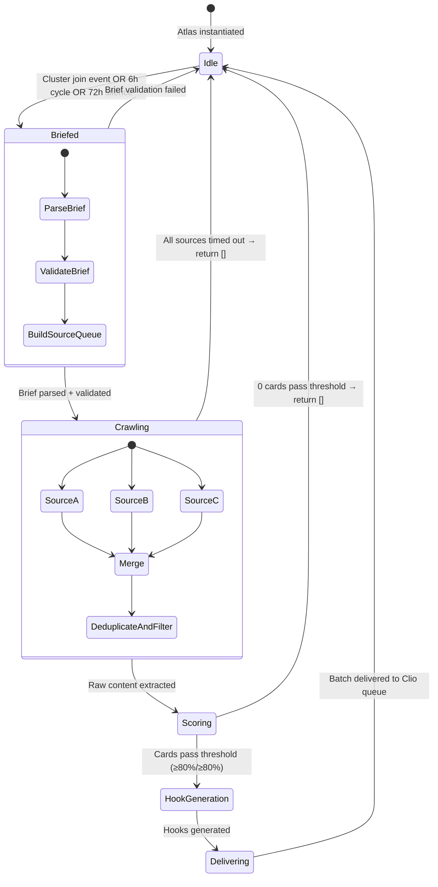

# 🤖 Workflow 10: Atlas Agent

> Clio-Orchestrated Cluster Content Intelligence · Closing the Post-Join Gap

`PRD — Aggilo Social Network — ATLAS AGENT`

---

## The Problem Atlas Solves

A user joins a cluster. They arrive to a feed that might have three posts — or zero. There's an implicit "now what?" They don't know anyone yet. They haven't established a voice yet. The blank compose bar stares back.

This is the **post-join gap**: the moment between joining a community and actually participating in it. It is the highest-churn moment in any social platform.

**Atlas closes the gap by making every cluster feel alive with relevant, timely, specific content — from the moment anyone joins.**

---

## What Atlas Is

Atlas is a **cluster content intelligence agent**. It runs in the background, briefed by Clio, with one function: bring the outside world into every cluster, calibrated precisely to the demographics inside it.

Atlas is not a persona. Users never see "Atlas." They see Clio-surfaced content that feels like it was chosen specifically for them. Because it was.

| Agent | Role | User-Facing |
|-------|------|------------|
| **Scout** | Discovers clusters from trending topics | Indirect — creates auto-clusters |
| **Clio** | Conversational orchestrator + cluster host | Direct — real-time conversation + cluster presence |
| **Atlas** | Content intelligence for existing clusters | Indirect — output curated by Clio before reaching users |

> [!IMPORTANT]
> **The Chain of Command:** Clio instructs Atlas. Atlas returns content cards. Clio edits and curates. Only Clio's selections reach the cluster. Atlas never bypasses Clio.

---

## The Clio-Atlas Orchestration Model

```mermaid
flowchart LR
    subgraph Cluster["Cluster Event"]
        A1["User joins cluster"]
        A2["6h Scout cycle completes"]
        A3["72h silence detected"]
    end

    subgraph Clio["Clio — Orchestrator"]
        B["Build demographic brief<br>(AGGIL segment + cluster purpose)"]
        C["Dispatch brief to Atlas"]
        F["Receive card batch"]
        G["Apply editorial filter<br>(arc phase gate + coherence select)"]
        H["Write one framing sentence<br>(active IDENTITY.md voice)"]
        I["Approve 1 item for Timeline Post"]
    end

    subgraph Atlas["Atlas — Content Intelligence"]
        D["Crawl sources<br>(Google News, Reddit, Twitter, etc.)"]
        D2["Score relevance + demographic<br>confidence (≥80% threshold)"]
        D3["Safety check"]
        D4["Generate conversational brief<br>per item for Clio"]
        E["Return top 1-3 items"]
    end

    subgraph Output["Cluster Output"]
        J["Clio posts directly to main Timeline"]
        K["Connection taps card → composer<br>opens with hook pre-filled"]
        L["Post created → Timeline"]
        M["Other Connections engage"]
    end

    A1 --> B
    A2 --> B
    A3 --> B
    B --> C
    C --> D
    D --> D2
    D2 --> D3
    D3 --> D4
    D4 --> E
    E --> F
    F --> G
    G --> H
    H --> I
    I --> J
    J --> K
    K --> L
    L --> M

    style B fill:#e94560,color:#fff
    style I fill:#4ecdc4,color:#000
    style L fill:#7b8cde,color:#fff
```



---

## The "Now What?" — Post-Join Experience

### The Moment

```
User joins cluster
  → Immediate UI update: Clio posts a shim message in Timeline: "I'm checking what people are saying online about this right now..." (Micro-animation / shimmer loading)
  → 60 seconds later: Atlas dispatched with cluster's AGGIL brief
  → ≤30 seconds: Atlas returns content intelligence
  → Clio selects top item, drops it as a natural Timeline Post
  
User UX
  → Tab bar: 📸 Timeline  |  👥 Connections
  → Wait, where is the Pulse Tab? **There is no Pulse Tab.** All interaction happens natively in the Timeline.
  → Clio’s Post appears in Timeline: "I just saw this article about UX in India... does this match your experience? [Link]"
  → Users reply directly to Clio's post in the chat thread.

Feedback Loop
  → If users reply to Clio's post, engage with the link, or initiate discussion, Atlas flags the item genre as "Helpful" / high-resonance.
  → If the post is ignored, Atlas degrades that source/topic weight for future crawls. There are no explicit "Rate this" buttons on the timeline—engagement is the metric.
```

### Why This Works

The post-join gap is not primarily a content problem — it's a **permission problem**. New Connections don't post because they don't know if their contribution would be welcome or appropriate.

The conversation hook solves this. It's not "what's on your mind?" (which is impossibly open). It's a specific, relevant question tied to real content happening in the cluster's world right now. The hook removes the blank-page paralysis.

> [!TIP]
> **Design Principle:** The conversation hook is a suggestion, not a template. Users can delete it entirely. Its job is to remove the friction of the first post — not to script the community.

---

## Demographic Brief Format

Clio sends Atlas a structured brief before every crawl:

```json
{
  "cluster_id": "uuid",
  "aggil_segment": {
    "age_range": [18, 24],
    "gender": "mixed",
    "geography": { "city": "Hyderabad", "area": "Gachibowli" },
    "interests": ["machine learning", "startup culture", "side projects"],
    "languages": ["English", "Telugu"]
  },
  "cluster_purpose": "Find co-founders for ML side projects in Hyderabad",
  "cluster_arc_phase": "A",
  "existing_content_topics": ["already shown headlines"],
  "existing_post_titles": ["recent post titles for warm/reengagement context"],
  "freshness_threshold_hours": 48,
  "content_count_requested": 10,
  "variant": "cold"
}
```

### Why Demographic-First Matters

The same topic can be right or wrong depending on who's in the cluster:

| Topic | Cluster A (20yr students, Pune) | Cluster B (38yr CTOs, Bangalore) |
|-------|--------------------------------|----------------------------------|
| "VC funding slows in India" | Relevance: 87% — affects their career choices | Relevance: 94% — directly relevant to their role |
| "Campus startup incubators open applications" | **Relevance: 96%** — directly actionable | Relevance: 21% — too junior |
| "Remote work policy changes at big tech" | Relevance: 65% — somewhat relevant | **Relevance: 91%** — core to their decisions |

**Nothing below 80% relevance AND 80% demographic confidence reaches Clio.** Atlas would rather return 0 cards than surface irrelevant content.

---

## Atlas System Prompts — Three Variants

### Variant A — Cold Cluster (`post_count = 0`)

Used when Atlas is seeding a brand-new cluster. Content must be intellectually safe enough to invite a first post with no existing community to reference.

**Guidance injected:** Topics should be widely accessible within the demographic, strong on the interests axis, low on controversy. Hooks should be easy to respond to — remove barriers to the first post.

**Example cluster:** ML students, Hyderabad, Arc Phase A

| Card | Headline | Conversation Hook |
|------|----------|-------------------|
| 1 | IIT Hyderabad students raise ₹2.5Cr seed for AI logistics startup | "If you were pitching to angels next month, what problem in your city would you actually solve?" |
| 2 | GitHub Copilot adds new agentic coding features | "Is AI pair programming making you better at fundamentals or making you skip them? Genuinely curious." |
| 3 | Startup India launches co-founder matching program | "Co-founder matching programs vs. finding one organically — anyone have a strong view on this?" |

---

### Variant B — Warming Cluster (`post_count 1–5`)

Builds on the cluster's existing discussion. Atlas receives `existing_post_titles` and uses them to create thematically connected content.

**Guidance injected:** Find content that continues or complements what the cluster has already discussed. The hook should reference the thread, not start fresh.

**Example:** A cluster has posted about "finding the right co-founder." Atlas surfaces a piece about equity splits. Hook: *"Everyone debates the right idea — this suggests the split conversation matters just as much. Curious where your cluster lands on this."*

---

### Variant C — Reengagement (72h silence)

One high-precision item ONLY IF highly relevant. Atlas evaluates the environment.
**Guidance injected:** One item only. The hook must reference something the cluster has previously engaged with. IF nothing clears an exceptional threshold (≥90%), Atlas returns nothing, and Clio remains silent. Artificial re-engagement is banned.

## Intelligence Item Schema (Internal use only, not a card)

```json
{
  "card_id": "uuid",
  "headline": "string",
  "source_name": "string",
  "source_url": "string",
  "published_at": "ISO8601",
  "relevance_score": 0.94,
  "demographic_confidence": 0.91,
  "conversation_hook": "string (30–80 words)",
  "category": "startup | career | tech | culture | local | wellness | finance | education",
  "tags": ["array", "of", "strings"],
  "arc_variant": "cold | warm | reengagement",
  "safe_for_arc": ["cold", "warm"],
  "status": "pending | approved | shown | archived",
  "shown_at": "ISO8601 | null",
  "interaction_count": 0
}
```

---

## Clio Timeline Delivery — UX Specification

There is no separate Pulse Tab. All Atlas content is delivered by Clio directly into the Timeline.

```
┌─────────────────────────────────────────────┐
│ 📸 Timeline                                 │
│ ─────────────────────────────────────────── │
│ 👤 System: Clio                       1m ago│
│                                             │
│ I was just looking at what's trending around│
│ this space. IIT Hyderabad students just     │
│ raised ₹2.5Cr for an AI logistics startup.  │
│                                             │
│ If you were pitching to angels next month,  │
│ what problem in your city would you         │
│ actually solve?                             │
│                                             │
│ 🔗 techinasia.com/article-link              │
│                                             │
│   [💬 Reply to Thread]                      │
└─────────────────────────────────────────────┘
```

## State Machine — When Atlas Activates



---

## Queue Jobs

| Job | Trigger | Priority Lane | Action |
|-----|---------|--------------|--------|
| `AtlasBriefOnJoin` | User joins cluster (event) | **medium** | Brief Atlas 60s after join |
| `AtlasCrawlJob` | Every Scout cycle (6h cron) | **low** | Refresh all active clusters |
| `AtlasReengagementCheck` | Every 6h cron | **medium** | Target 72h-silent clusters for reengagement variant |

---

## Database Fields

### New fields on `clusters`

| Field | Type | Purpose |
|-------|------|---------|
| `atlas_last_briefed_at` | TIMESTAMP | When Clio last briefed Atlas for this cluster |
| `atlas_last_crawled_at` | TIMESTAMP | When Atlas last checked for content |

### New table: `atlas_discoveries` (Internal Queue)

| Field | Type | Purpose |
|-------|------|---------|
| `id` | UUID PK | Card identifier |
| `cluster_id` | FK → clusters | Parent cluster |
| `headline` | TEXT | Content headline |
| `source_name` | VARCHAR(128) | Source publication name |
| `source_url` | TEXT | Full URL |
| `published_at` | TIMESTAMP | Original publication date |
| `relevance_score` | DECIMAL(3,2) | Atlas relevance score (0–1) |
| `demographic_confidence` | DECIMAL(3,2) | Atlas demographic confidence (0–1) |
| `conversation_hook` | TEXT | Atlas-generated discussion prompt |
| `category` | VARCHAR(64) | Content category |
| `tags` | JSONB | Tag array |
| `arc_variant` | ENUM | `cold`, `warm`, `reengagement` |
| `safe_for_arc` | JSONB | Arc phase restriction flags |
| `status` | ENUM | `pending`, `approved`, `shown`, `archived` |
| `shown_at` | TIMESTAMP | When first surfaced to cluster |
| `interaction_count` | INT | Posts/taps generated from card |
| `created_at` | TIMESTAMP | When Atlas generated this card |

---

## API Endpoints

| Endpoint | Method | Purpose |
|----------|--------|---------|
| `GET /api/admin/atlas/{cluster_id}/queue` | GET | Get pending Atlas discoveries for review |
| `POST /api/atlas/brief` | POST | Internal: Clio → Atlas dispatch |
| `GET /api/atlas/results/{cluster_id}` | GET | Internal: Clio polls Atlas results |
| `POST /api/atlas/feedback` | POST | Log Connection interaction for ranking calibration |
| `POST /api/atlas/approve/{discovery_id}` | POST | Admin: manually approve/reject an Atlas discovery |

---

## Guardrails

### Atlas must never:
- Surface content below 80% relevance + 80% demographic confidence
- Repeat a topic already shown in the past 72 hours
- Surface politically polarizing content
- Generate hooks with manufactured urgency
- Post directly to the cluster — Clio is the only voice
- Return more than 10 cards per batch

### Clio must never (when using Atlas output):
- Approve more than 3 discoveries per Atlas session
- Use Atlas content in the Posts feed if the 2-message daily limit is already reached
- Present Atlas content as coming from "Atlas" — it appears as a Clio Timeline Post
- Approve cards for Arc Phase A clusters that are rated `safe_for_arc: ["warm", "reengagement"]` only

---

## Integration with Existing Systems

### Scout vs Atlas — What's the Difference?

| | Scout | Atlas |
|--|-------|-------|
| **Purpose** | Discovers new cluster topics → creates/seeds clusters | Brings real-world content into existing clusters |
| **Trigger** | Every 6h bulk crawl | Cluster join + 6h cycle + 72h silence |
| **Output** | New clusters, discussion injections | Timeline Drafts (Invisible) |
| **User-facing** | Indirect — creates the cluster | Indirect — Clio surfaces the content |
| **Demographic scope** | Broad segment-level | Specific cluster AGGIL |

> **Mental model:** Scout = the person who decides which restaurants to open in a neighbourhood. Atlas = the daily specials board inside each restaurant.

### Clio-as-Cluster-Host — Division of Labour

| Responsibility | Clio (cluster_host skill) | Atlas (cluster_intel skill) |
|---------------|--------------------------|----------------------------|
| First post moment acknowledgement | ✅ Clio | ❌ Not Atlas |
| Compose bar placeholder | ✅ Clio | ❌ Not Atlas |
| Timeline Intelligence | ❌ Not directly | ✅ Atlas → Clio posts |
| Reengagement after 72h silence | ✅ Clio (1 message) | ✅ Atlas (1 card, if budget used) |
| 2-message daily limit | ✅ Applies to Clio's proactive Posts (including Atlas deliveries) | ✅ Atlas must respect Clio's limit |
| Connection DMs and replies | ✅ Clio | ❌ Not Atlas |

---

*← [Moderation & Admin](07_moderation_admin.md) · Part of the [AI Agent System →](06_ai_agents.md)*
