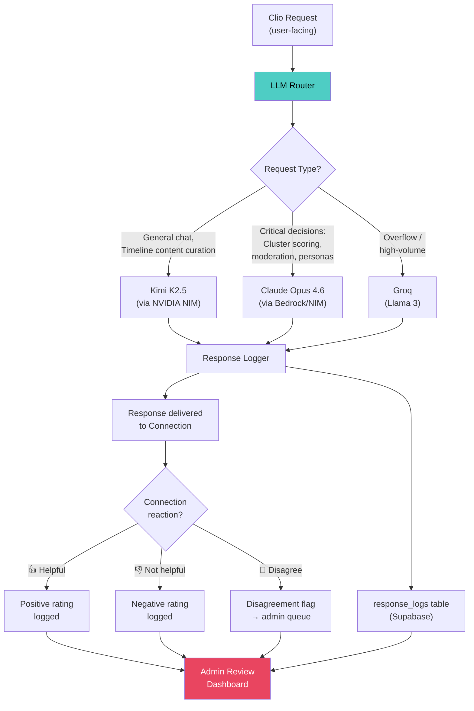
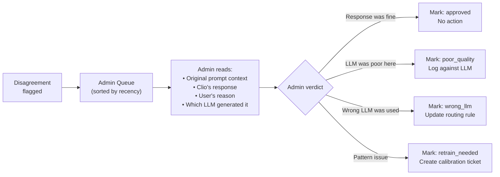

# 🧠 PRD 11: LLM Admin Routing & Quality Architecture

> Multi-LLM routing, response logging, user feedback, and admin quality review
>
> **Terminology:** cluster Connections are referred to as **"Connections"** throughout the platform.

`PRD — Aggilo Social Network`

---

## Overview

Aggilo uses multiple LLM providers (Kimi K2.5, Claude Opus 4.6, Groq, etc.) for different functions. This spec defines the **admin-side architecture** for:

1. **Dynamic LLM routing** — selecting the right LLM per request type
2. **Response logging** — every AI response stored with its LLM source
3. **User feedback** — Connections can rate and dispute Clio's responses
4. **Admin quality review** — dashboard to evaluate which LLMs perform best

---

## Architecture



---

## 1. LLM Router — Admin-Configurable

The LLM Router is a backend service that routes each AI operation to the LLM assigned by the admin. **The admin controls which LLM handles which task** — there are no hardcoded defaults. The routing config is a live, editable table in the admin dashboard.

> [!IMPORTANT]
> **Admin-first routing.** The admin selects which LLM handles each operation. The system ships with sensible initial assignments (table below), but the admin can reassign any operation to any available LLM at any time. This is how the platform learns which LLMs serve best for which tasks.

### Operations & Initial Routing

| # | Operation | Agent | Initial LLM | Fallback | Latency Target | Why |
|---|-----------|-------|-------------|----------|----------------|-----|
| 1 | **Cluster creation & suggestions** | Clio | Claude Opus 4.6 | Kimi K2.5 | < 5s | High-stakes — determines group quality |
| 2 | **Cluster scoring** (AGGIL score, U-shaped model) | Clio | Claude Opus 4.6 | Kimi K2.5 | < 5s | Math-heavy, accuracy-critical |
| 3 | **Clio basic conversation** (greetings, Q&A, hosting) | Clio | Kimi K2.5 | Groq (Llama 3) | < 2s | High volume, cost-efficient |
| 4 | **Scout macro-discovery (scoring)** | Scout | Llama 3 (Groq) | Kimi K2.5 | < 4s | Batch processing, massive token volume |
| 5 | **Atlas content intelligence (scoring)** | Atlas | Llama 3 (Groq) | Kimi K2.5 | < 4s | High volume content pipeline |
| 6 | **Cluster framing & invite generation** | Scout/Atlas | Kimi K2.5 | Claude Opus 4.6 | < 3s | Creative, orchestration tasks |
| 7 | **Moderation decisions** (content review, reports) | Clio | Claude Opus 4.6 | Kimi K2.5 | < 3s | Safety-critical, can't afford errors |
| 8 | **Dynamic persona generation** | Clio | Claude Opus 4.6 | — (queue, no fallback) | < 10s | Requires nuance and cultural awareness |
| 9 | **Matchmaker** (Premium people-matching) | Matchmaker | Claude Opus 4.6 | Kimi K2.5 | < 5s | High-value users, quality paramount |
| 10 | **DM request context** ("why this person?") | Clio | Kimi K2.5 | Groq | < 2s | Low-stakes, fast |
| 11 | **Nickname verification** (appropriateness check) | Clio | Kimi K2.5 | Groq | < 1s | Simple validation, high volume |
| 12 | **Icebreaker generation** | Clio | Kimi K2.5 | Groq | < 3s | Creative but not critical |

### `llm_routing_config` Table (Supabase)

This is the live routing config that the admin edits:

| Column | Type | Description |
|--------|------|-------------|
| `operation_key` | TEXT (PK) | One of the 12 operation keys (e.g., `cluster_creation`, `scout_crawl`, `clio_basic_chat`) |
| `operation_label` | TEXT | Human-readable name shown in admin dashboard |
| `agent` | TEXT | Which agent owns this operation (`clio`, `scout`, `atlas`, `matchmaker`) |
| `primary_llm` | TEXT | Currently assigned LLM (`kimi_k25`, `claude_opus_46`, `groq_llama3`) |
| `fallback_llm` | TEXT | Fallback if primary fails or hits ceiling (nullable) |
| `latency_target_ms` | INT | Expected response time in milliseconds |
| `cost_ceiling_usd` | DECIMAL(8,2) | Daily spend limit for this operation (auto-switches to fallback when reached) |
| `ab_test_active` | BOOLEAN | Whether an A/B test is running on this operation |
| `ab_test_llm` | TEXT | The second LLM in the A/B test (nullable) |
| `ab_test_split` | INT | % of traffic to the test LLM (default 50) |
| `updated_by` | TEXT | Admin who last changed this config |
| `updated_at` | TIMESTAMPTZ | When the config was last changed |

---

## 2. Response Logging

Every AI response is logged with full metadata for quality analysis.

### `response_logs` Table (Supabase)

| Column | Type | Description |
|--------|------|-------------|
| `id` | UUID | Primary key |
| `timestamp` | TIMESTAMPTZ | When the response was generated |
| `llm_provider` | TEXT | Which LLM generated this (`kimi_k25`, `claude_opus_46`, `groq_llama3`) |
| `llm_model_version` | TEXT | Specific model version string |
| `request_type` | TEXT | Operation key from routing config (`cluster_creation`, `cluster_scoring`, `clio_basic_chat`, `scout_crawl`, `atlas_curation`, `timeline_hooks`, `moderation`, `persona_gen`, `matchmaker`, `dm_context`, `nickname_check`, `icebreaker`) |
| `cluster_id` | UUID | FK → clusters table (nullable for non-cluster requests) |
| `user_id` | UUID | FK → users table (the Connection who received the response) |
| `prompt_hash` | TEXT | SHA-256 hash of the prompt (for dedup analysis, not the full prompt) |
| `response_text` | TEXT | The full response delivered to the user |
| `latency_ms` | INT | Time from request to response |
| `token_count_prompt` | INT | Input tokens consumed |
| `token_count_response` | INT | Output tokens consumed |
| `cost_usd` | DECIMAL(8,6) | Estimated cost of this response |
| `user_rating` | SMALLINT | User feedback: `1` (helpful), `-1` (not helpful), `NULL` (no feedback) |
| `user_disagreement` | BOOLEAN | Whether the user flagged this as a disagreement |
| `admin_reviewed` | BOOLEAN | Whether an admin has reviewed this response |
| `admin_verdict` | TEXT | Admin's assessment: `approved`, `poor_quality`, `wrong_llm`, `retrain_needed` |

---

## 3. User Feedback System

### In-App Feedback (Clio Responses)

When Clio responds in a cluster or DM, each response can receive user feedback:

```
┌─────────────────────────────────────────┐
│ CLIO                                     │
│ I noticed 3 of you are into the same    │
│ podcast series. Want me to start a       │
│ thread about it?                         │
│                                          │
│            👍 Helpful  ·  👎 Not helpful │
└─────────────────────────────────────────┘
```

**Rules:**
- Feedback buttons appear **only after Clio's substantive responses** (not greetings or system messages)
- Buttons are subtle (low-contrast text, not loud icons) — never disruptive
- Tapping **👎 Not helpful** shows a follow-up: *"What went wrong?"* with options:
  - "Not relevant to me"
  - "Felt generic"
  - "Tone was off"
  - "I disagree with this"
- Selecting **"I disagree with this"** → flags the response for admin review
- Feedback is anonymous — other Connections cannot see who rated what

### Feedback API

| Endpoint | Method | Body |
|----------|--------|------|
| `POST /api/ai/feedback` | POST | `{ response_log_id, rating: 1/-1, reason?: string, disagree: bool }` |

---

## 4. Admin Quality Review Dashboard

### Dashboard Views

#### 4a. LLM Performance Overview

| Metric | View |
|--------|------|
| **Rating by LLM** | Bar chart: avg rating per LLM over time |
| **Disagreement rate** | % of responses flagged per LLM |
| **Cost per 1K responses** | Cost comparison across LLMs |
| **Latency P50/P95** | Response time distribution per LLM |
| **Volume** | Requests routed per LLM per day |

#### 4b. Disagreement Queue



#### 4c. A/B Testing View

Admins can split traffic for a specific request type across two LLMs and compare:
- **Rating delta** — which LLM gets better user ratings?
- **Disagreement delta** — which LLM triggers fewer flags?
- **Cost delta** — is the better LLM worth the cost difference?

### Admin Actions

| Action | Effect |
|--------|--------|
| **Approve response** | Clears from queue, logged as `approved` |
| **Flag LLM** | Increments poor_quality counter for that LLM + request type |
| **Update routing** | Changes the primary/fallback LLM for a request type |
| **Start A/B test** | Splits traffic for a request type across two LLMs |
| **End A/B test** | Locks in the winner as the primary LLM |
| **Set cost ceiling** | Daily spend limit per LLM, auto-fallback when reached |

---

## 5. API Endpoints

| Endpoint | Method | Purpose |
|----------|--------|---------|
| `POST /api/ai/feedback` | POST | Submit user feedback on a Clio response |
| `GET /api/admin/llm/performance` | GET | LLM performance metrics (admin only) |
| `GET /api/admin/llm/disagreements` | GET | Paginated disagreement queue (admin only) |
| `POST /api/admin/llm/disagreements/{id}/verdict` | POST | Admin verdict on a flagged response |
| `GET /api/admin/llm/routing` | GET | Current routing rules |
| `PUT /api/admin/llm/routing` | PUT | Update routing rules |
| `POST /api/admin/llm/ab-test` | POST | Start an A/B test |
| `DELETE /api/admin/llm/ab-test/{id}` | DELETE | End an A/B test |
| `GET /api/admin/llm/costs` | GET | Cost breakdown per LLM per day |

---

*← [Atlas Agent](10_atlas_agent.md) · [Back to Index →](00_prd_index.md)*
