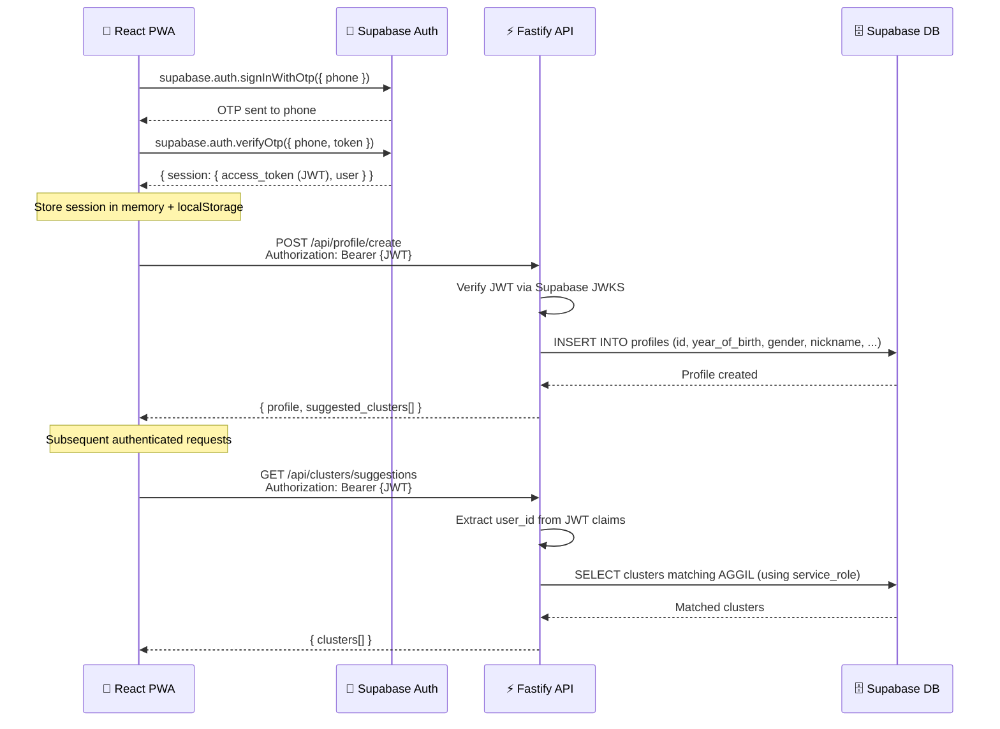
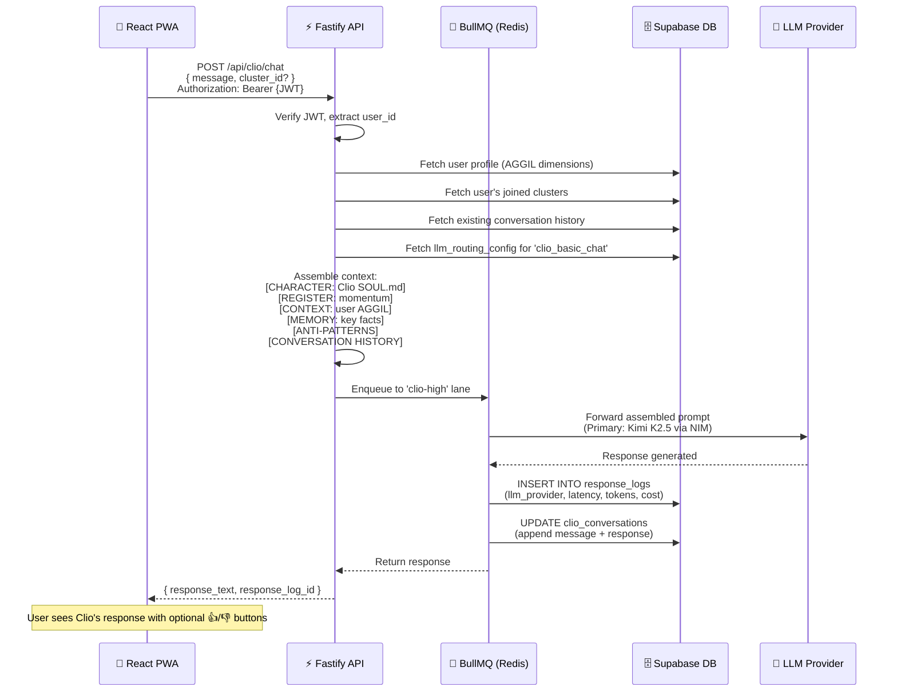
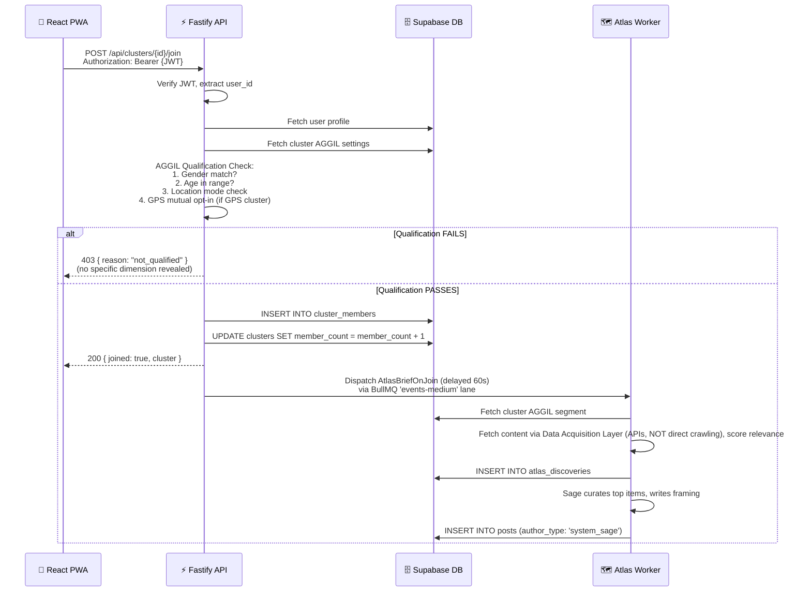
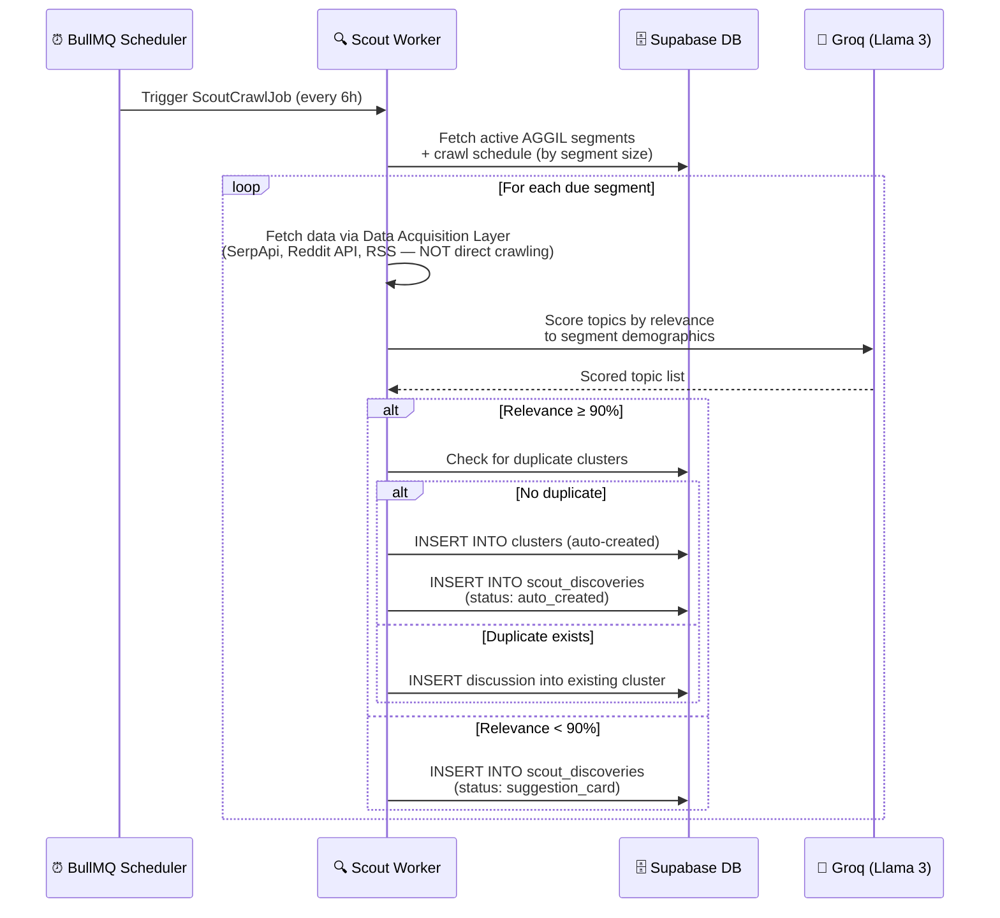

# Aggilo — System Implementation Prompt
## Part 2: Database Schema, ER Diagram & Sequence Diagrams

---

> **Phase 1 architecture additions (read these alongside this Part):**
> - [`architecture/PLATFORM_AGENCY.md`](PLATFORM_AGENCY.md) — three-layer platform agency model
> - [`observer/OBSERVER_STEWARDSHIP.md`](../observer/OBSERVER_STEWARDSHIP.md) — full DDL for the seven Phase 1 stewardship tables (canonical source)
> - [`observer/OBSERVER_INTROSPECTION_ENGINE.md`](../observer/OBSERVER_INTROSPECTION_ENGINE.md) — introspection prompt + priority queue
>
> The Phase 1 schema additions are summarised in §5.1.3 (below) and
> the ER diagram in §5; the full DDL with constraints lives in
> `OBSERVER_STEWARDSHIP.md`. See Part 6 §41 for supersession rules.

---

## 5. Database Schema & ER Diagram

> **Schema additions from operational documents (v2.1):**
> The following tables were added from four operational documents incorporated after the initial schema design.
> See: `CLIO_CLUSTER_HOST_CONTEXT.md`, `CLUSTER_SKILL_DISCOVERY_PROTOCOL.md`, `CLIO_PRIVATE_EPHEMERAL_CHAT.md`.
> These documents are the authoritative spec for the behaviour these tables support.

### 5.1 Entity-Relationship Diagram

```mermaid
erDiagram
    %% === Supabase native auth ===
    auth_users {
        uuid id PK
        string email
        string phone
        jsonb raw_user_meta_data
        timestamptz created_at
    }

    %% === Core user profile (extends auth.users) ===
    profiles {
        uuid id PK "FK → auth.users.id"
        int year_of_birth "Immutable"
        enum gender "M | F | NB — Immutable"
        string nickname "Unique, AI-verified"
        text[] languages "Primary + secondary"
        text[] interest_tags
        text purpose
        jsonb location_data "Optional lat/lng or named city"
        boolean gps_shared "Default false"
        enum premium_status "free | active | grace | cancelled"
        timestamptz premium_expires_at
        boolean is_admin "Default false"
        boolean sage_introduced "Default false — one-time Clio intro of Sage"
        enum deletion_status "null | scheduled | deleted"
        timestamptz deletion_scheduled_at
        timestamptz created_at
        timestamptz updated_at
    }

    %% === Clusters ===
    clusters {
        uuid id PK
        uuid created_by "FK → profiles.id, nullable for Scout-created"
        string name
        text description
        text purpose "Required"
        text[] interest_tags
        int age_min "Nullable"
        int age_max "Nullable"
        enum gender_filter "anyone | male | female | nb | male_nb | female_nb"
        jsonb geography "Named locations, regional, or GPS landmark+radius"
        text[] languages "Cluster language preferences"
        text[] hard_language_gate "Nullable — Premium Clusters only in Phase 1"
        float cluster_score "0-100, U-shaped model"
        boolean is_premium "Default false"
        float credibility_score "Internal only, nullable"
        enum hard_location_type "building | street | neighborhood | city | gps_radius | null"
        jsonb hard_location_data "Coordinates/boundary, nullable"
        enum arc_phase "A | B | C | D | E"
        timestamptz arc_phase_updated_at
        int sage_posts_today "Default 0"
        timestamptz sage_posts_reset_at
        timestamptz last_post_at
        timestamptz atlas_last_briefed_at
        timestamptz atlas_last_crawled_at
        int member_count "Denormalized counter"
        int post_count "Denormalized counter"
        timestamptz created_at
    }

    %% === Cluster membership ===
    cluster_members {
        uuid id PK
        uuid cluster_id "FK → clusters.id"
        uuid user_id "FK → profiles.id"
        boolean is_founder "Default false"
        boolean is_manager "Premium clusters, max 3"
        timestamptz joined_at
        timestamptz left_at "Nullable — null if active"
    }

    %% === Posts (Timeline) ===
    posts {
        uuid id PK
        uuid cluster_id "FK → clusters.id"
        uuid author_id "FK → profiles.id, nullable for system:clio"
        string author_type "user | system_sage"
        text content
        string image_url "Nullable"
        string source_url "For Atlas-sourced posts"
        string conversation_hook "Atlas hook text, nullable"
        int like_count "Denormalized"
        int comment_count "Denormalized"
        boolean is_pinned "Premium clusters only, max 3"
        boolean is_hidden "Moderation flag"
        timestamptz created_at
    }

    %% === Comments ===
    comments {
        uuid id PK
        uuid post_id "FK → posts.id"
        uuid author_id "FK → profiles.id, nullable for clio"
        string author_type "user | system_sage"
        text content
        boolean is_hidden
        timestamptz created_at
    }

    %% === Post likes ===
    post_likes {
        uuid id PK
        uuid post_id "FK → posts.id"
        uuid user_id "FK → profiles.id"
        timestamptz created_at
    }

    %% === Direct Messages ===
    dm_threads {
        uuid id PK
        uuid user_a "FK → profiles.id"
        uuid user_b "FK → profiles.id"
        uuid cluster_context "FK → clusters.id"
        enum status "pending | accepted | declined | expired"
        timestamptz requested_at
        timestamptz responded_at
        timestamptz last_message_at
    }

    dm_messages {
        uuid id PK
        uuid thread_id "FK → dm_threads.id"
        uuid sender_id "FK → profiles.id"
        text content
        timestamptz created_at
    }

    %% === User blocks ===
    user_blocks {
        uuid id PK
        uuid blocker_id "FK → profiles.id"
        uuid blocked_id "FK → profiles.id"
        timestamptz created_at
    }

    %% === Content reports ===
    reports {
        uuid id PK
        uuid reporter_id "FK → profiles.id"
        uuid target_post_id "Nullable"
        uuid target_message_id "Nullable"
        uuid target_user_id "Nullable"
        enum category "spam | harassment | hate_speech | inappropriate | impersonation | other"
        text description
        enum severity "low | medium | high | critical_welfare | csam"
        enum status "pending | reviewed | dismissed | actioned"
        string admin_verdict "Nullable"
        uuid reviewed_by "FK → profiles.id, nullable"
        timestamptz created_at
        timestamptz reviewed_at
    }

    %% === User bans ===
    user_bans {
        uuid id PK
        uuid user_id "FK → profiles.id"
        enum ban_type "temporary | permanent | frozen"
        text reason
        uuid banned_by "FK → profiles.id (admin)"
        timestamptz banned_at
        timestamptz expires_at "Nullable"
        timestamptz unbanned_at "Nullable"
    }

    %% === Clio conversation history ===
    clio_conversations {
        uuid id PK
        uuid user_id "FK → profiles.id"
        uuid cluster_id "Nullable — context cluster"
        enum context "onboarding | cluster_creation | discovery | platform_qa | premium_matchmaker | cluster_host"
        jsonb messages "Array of role/content pairs"
        string register_used "campus | momentum | anchor | explorer"
        int arc_beat_reached
        enum outcome "cluster_joined | cluster_created | question_answered | abandoned | null"
        timestamptz created_at
        timestamptz updated_at
    }

    %% === Scout discoveries ===
    scout_discoveries {
        uuid id PK
        string segment_key "L1-L5 segment identifier"
        string topic
        text description
        string source "google | reddit | twitter | news"
        float relevance_score
        enum status "pending | approved | rejected | auto_created | suggestion_card"
        uuid created_cluster_id "FK → clusters.id, nullable"
        jsonb crawl_metadata
        timestamptz discovered_at
    }

    %% === Atlas discoveries ===
    atlas_discoveries {
        uuid id PK
        uuid cluster_id "FK → clusters.id"
        text headline
        string source_name
        string source_url
        timestamptz published_at
        float relevance_score "0-1"
        float demographic_confidence "0-1"
        text conversation_hook
        string category
        text[] tags
        enum arc_variant "cold | warm | reengagement"
        text[] safe_for_arc
        enum status "pending | approved | shown | archived"
        timestamptz shown_at
        int interaction_count
        timestamptz created_at
    }

    %% === LLM routing config ===
    llm_routing_config {
        string operation_key PK
        string operation_label
        string agent "clio | scout | atlas | matchmaker"
        string primary_llm
        string fallback_llm
        int latency_target_ms
        float cost_ceiling_usd
        boolean ab_test_active
        string ab_test_llm
        int ab_test_split
        string updated_by
        timestamptz updated_at
    }

    %% === LLM response logs ===
    response_logs {
        uuid id PK
        timestamptz timestamp
        string llm_provider
        string llm_model_version
        string request_type
        uuid cluster_id "Nullable"
        uuid user_id "FK → profiles.id"
        string prompt_hash
        text response_text
        int latency_ms
        int token_count_prompt
        int token_count_response
        float cost_usd
        int user_rating "1 or -1 or null"
        boolean user_disagreement
        boolean admin_reviewed
        string admin_verdict
    }

    %% === Premium applications ===
    premium_applications {
        uuid id PK
        string applicant_name
        string applicant_email
        string applicant_phone "Nullable"
        text activity_description
        int community_size
        text[] current_platforms
        text pain_point
        jsonb location_data
        text[] languages
        int age_min
        int age_max
        string gender_mix
        text[] invite_methods
        string timeline
        float credibility_score
        enum status "pending | approved | needs_clarification | redirected"
        uuid reviewed_by "Nullable"
        text review_notes
        uuid created_cluster_id "Nullable"
        timestamptz created_at
        timestamptz reviewed_at
    }

    %% === Cluster admin actions (Premium only) ===
    cluster_admin_actions {
        uuid id PK
        uuid cluster_id "FK → clusters.id"
        uuid admin_id "FK → profiles.id (founder)"
        enum action_type "remove_member | delete_post | delete_comment | pin | unpin | mute | unmute"
        uuid target_user_id "Nullable"
        uuid target_post_id "Nullable"
        text reason "Nullable"
        timestamptz created_at
    }

    %% === FCM device tokens ===
    device_tokens {
        uuid id PK
        uuid user_id "FK → profiles.id"
        string token
        string platform "web | android | ios"
        timestamptz created_at
    }

    %% === Notification preferences ===
    notification_preferences {
        uuid id PK
        uuid user_id "FK → profiles.id"
        boolean push_enabled "Default true"
        string quiet_hours_start "Nullable, e.g. 23:00"
        string quiet_hours_end "Nullable, e.g. 07:00"
        boolean email_digest "Default false"
        enum email_frequency "daily | weekly | off"
    }

    %% === Per-cluster notification settings ===
    cluster_notification_settings {
        uuid id PK
        uuid user_id "FK → profiles.id"
        uuid cluster_id "FK → clusters.id"
        enum level "all | mentions_only | muted"
    }

    %% === Suggestion dismissals ===
    suggestion_dismissals {
        uuid id PK
        uuid user_id "FK → profiles.id"
        uuid cluster_id "FK → clusters.id"
        timestamptz dismissed_at
    }

    %% === Behavioural signals (Layer A) ===
    behavioural_events {
        uuid id PK
        uuid user_id "FK → profiles.id — pseudonymized in aggregations"
        string event_type "join | leave | dismiss | search | create | post | like | comment | clio_chat | dm_request"
        uuid cluster_id "Nullable"
        jsonb event_data
        string segment_l1
        string segment_l2
        string segment_l3
        timestamptz created_at
    }

    %% === Sage personas (per-cluster) ===
    sage_personas {
        uuid id PK
        uuid cluster_id "FK → clusters.id — one per cluster"
        string register "academic | casual | professional | community | neutral"
        float formality "0.0-1.0"
        float interjection_frequency "0.0-1.0"
        string resolved_from "cluster_purpose | member_tone | observation"
        timestamptz created_at
        timestamptz updated_at
    }

    %% === Sage description proposals ===
    sage_description_proposals {
        uuid id PK
        uuid cluster_id "FK → clusters.id"
        text proposed_text
        text rationale
        enum status "pending | approved | rejected"
        uuid reviewed_by "FK → profiles.id, nullable (founder)"
        timestamptz created_at
        timestamptz reviewed_at
    }

    %% === Cluster description history ===
    cluster_description_history {
        uuid id PK
        uuid cluster_id "FK → clusters.id"
        text previous_description
        text new_description
        string change_source "sage_refinement | founder_edit"
        uuid changed_by "FK → profiles.id, nullable"
        timestamptz created_at
    }

    %% === Cluster tools (active tools per cluster) ===
    cluster_tools {
        uuid id PK
        uuid cluster_id "FK → clusters.id"
        string agent "atlas | sage | scout | clio"
        string tool_name
        text tool_spec "Full tool specification markdown"
        enum status "active | paused | retired"
        uuid approved_by "FK → profiles.id (admin)"
        timestamptz activated_at
        timestamptz retired_at
    }

    %% === Tool proposals ===
    tool_proposals {
        uuid id PK
        uuid cluster_id "FK → clusters.id, nullable (platform-wide tools)"
        string proposing_agent "observer | clio | sage"
        string target_agent "clio | sage | scout | atlas"
        string tool_name
        text proposal_body "Markdown proposal"
        enum status "pending | approved | rejected | retired"
        uuid reviewed_by "FK → profiles.id (admin), nullable"
        text review_notes
        timestamptz created_at
        timestamptz reviewed_at
    }

    %% === Observer findings ===
    observer_findings {
        uuid id PK
        int domain "1-10"
        string domain_label
        uuid cluster_id "FK → clusters.id, nullable"
        enum severity "info | warning | critical"
        text finding_summary
        jsonb finding_data
        string finding_signature "Hash for dedup"
        int occurrence_count "Default 1"
        enum status "pending | acknowledged | actioned | dismissed"
        uuid actioned_by "FK → profiles.id, nullable"
        timestamptz created_at
        timestamptz actioned_at
    }

    %% === Observer Stewardship (Phase 1) ===
    %% Full DDL: observer/OBSERVER_STEWARDSHIP.md
    observer_prompt_updates {
        uuid id PK
        string target_agent "sage | clio | atlas | scout"
        smallint target_layer "2 | 3 | 4"
        string cluster_id "FK → clusters.cluster_id, nullable for Layer 2"
        string update_type "persona_register | cluster_context_fragment | etc"
        jsonb previous_value
        jsonb proposed_value
        text rationale "Observer reasoning, ≤500 tokens"
        jsonb cluster_context_snapshot
        uuid observer_finding_id "FK → observer_findings.id, nullable"
        smallint autonomy_tier "1 | 2 | 3"
        int veto_window_minutes
        timestamptz veto_deadline_at
        enum status "pending | committed | vetoed | rolled_back"
        timestamptz admin_notified_at
        timestamptz admin_action_at
        uuid admin_action_by "FK → profiles.id"
        text admin_veto_reason
        timestamptz committed_at
        timestamptz rolled_back_at
        jsonb outcome_signal "7-day post-commit signal"
        timestamptz created_at
    }
    clio_observer_signals {
        uuid id PK
        string cluster_id "FK → clusters.cluster_id, nullable for platform-wide"
        string signal_type "engagement_context | arc_phase_note | etc"
        jsonb signal_content
        uuid observer_prompt_update_id "FK → observer_prompt_updates.id"
        uuid observer_finding_id "FK → observer_findings.id, nullable"
        boolean active "Default TRUE"
        timestamptz expires_at "TTL — signals are ephemeral"
        timestamptz created_at
        timestamptz deactivated_at
        string deactivated_reason "expired | vetoed | superseded | admin_removed"
    }
    observer_cluster_context {
        string cluster_id PK "FK → clusters.cluster_id"
        jsonb last_finding_per_domain
        jsonb pattern_flags
        timestamptz last_introspection_at
        numeric last_introspection_priority_score
        timestamptz last_updated_at
    }
    cluster_prompt_versions {
        uuid id PK
        string cluster_id "FK → clusters.cluster_id"
        string target_agent
        smallint target_layer
        int version
        jsonb content
        string changed_by "observer | admin | system"
        uuid change_source_id "observer_prompt_updates.id or cluster_admin_actions.id"
        timestamptz created_at
    }
    observer_rejected_proposals {
        uuid id PK
        string cluster_id "FK → clusters.cluster_id, nullable"
        string target_agent
        string update_type
        jsonb proposed_value
        text rejection_reason
        string violated_rule "LAYER_1_IMMUTABLE | WELFARE_IMMUTABLE | etc"
        timestamptz created_at
    }
    observer_learnings {
        uuid id PK
        string cluster_type "faith | professional | academic | etc"
        string arc_phase "A | B | C | D | E"
        string action_type
        jsonb action_pattern
        numeric outcome_delta
        int sample_size "Default 1"
        numeric confidence
        timestamptz created_at
        timestamptz updated_at
    }
    clio_cluster_intelligence {
        uuid id PK
        string cluster_id "FK → clusters.cluster_id"
        text_array session_themes
        text_array unmet_needs
        text_array friction_signals
        text_array positive_signals
        int session_count "Default 1"
        timestamptz covers_period_start
        timestamptz covers_period_end
        timestamptz created_at
    }

    %% === Cluster polls (Atlas content feedback) ===
    cluster_polls {
        uuid id PK
        uuid cluster_id "FK → clusters.id"
        uuid atlas_discovery_id "FK → atlas_discoveries.id"
        text question
        jsonb options
        jsonb results "Vote counts per option"
        timestamptz created_at
        timestamptz closed_at
    }

    %% === Persona files (stored in DB, no filesystem) ===
    persona_files {
        uuid id PK
        string persona_name "campus | momentum | anchor | explorer"
        string demographic "18-24 | 25-35 | 36-50 | 13-17"
        string file_type "soul | identity | agents"
        text content "Full markdown content"
        enum status "draft | review | approved | active"
        string approved_by
        int version "Default 1"
        timestamptz created_at
        timestamptz updated_at
    }

    %% === Relationships ===
    auth_users ||--|| profiles : "1:1 extends"
    profiles ||--o{ cluster_members : "joins many"
    profiles ||--o{ posts : "authors"
    profiles ||--o{ comments : "authors"
    profiles ||--o{ dm_threads : "participates"
    profiles ||--o{ clio_conversations : "has"
    profiles ||--o{ device_tokens : "registers"
    profiles ||--|| notification_preferences : "has"
    clusters ||--o{ cluster_members : "has many"
    clusters ||--o{ posts : "contains"
    clusters ||--o{ atlas_discoveries : "receives"
    clusters ||--o{ cluster_admin_actions : "logs"
    posts ||--o{ comments : "has many"
    posts ||--o{ post_likes : "receives"
    dm_threads ||--o{ dm_messages : "contains"
    profiles ||--o{ reports : "submits"
    profiles ||--o{ user_blocks : "blocks"
    profiles ||--o{ behavioural_events : "generates"
    profiles ||--o{ cluster_notification_settings : "configures"
    profiles ||--o{ suggestion_dismissals : "records"
    clusters ||--o{ sage_personas : "has one"
    clusters ||--o{ sage_description_proposals : "receives"
    clusters ||--o{ cluster_description_history : "tracks"
    clusters ||--o{ cluster_tools : "has"
    clusters ||--o{ cluster_polls : "has"
    clusters ||--o{ observer_findings : "generates"
    clusters ||--o{ observer_prompt_updates : "stewarded by"
    clusters ||--o{ clio_observer_signals : "active signals"
    clusters ||--|| observer_cluster_context : "rolling memory"
    clusters ||--o{ cluster_prompt_versions : "versioned prompts"
    clusters ||--o{ clio_cluster_intelligence : "session summaries"
    observer_findings ||--o{ observer_prompt_updates : "may trigger"
    observer_prompt_updates ||--o{ clio_observer_signals : "creates signal"
    clusters ||--o{ skill_dialogue_posts : "tracks"
    clusters ||--o{ cluster_skill_tab : "displays"
    profiles ||--o{ clio_ephemeral_sessions : "creates"
    profiles ||--o{ clio_tip_log : "receives tips"
    clusters ||--o{ clio_tip_log : "generates tips"
    cluster_skill_tab ||--o{ skill_tab_member_signals : "receives"
```

### 5.1.1 Schema Additions (v2.1) — Operational Documents

**New tables:**

```sql
-- Skill dialogue posts tracking (from CLUSTER_SKILL_DISCOVERY_PROTOCOL.md)
CREATE TABLE skill_dialogue_posts (
  id UUID PRIMARY KEY DEFAULT gen_random_uuid(),
  cluster_id UUID NOT NULL REFERENCES clusters(id),
  post_id UUID NOT NULL REFERENCES posts(id),
  initiating_agent VARCHAR(16) NOT NULL,     -- 'sage' | 'clio'
  dialogue_type VARCHAR(32) NOT NULL,        -- 'skill_dialogue' | 'skill_dialogue_response' | 'skill_dialogue_initiation'
  skill_candidate VARCHAR(128),
  skill_category VARCHAR(64),
  created_at TIMESTAMPTZ DEFAULT NOW()
);

-- Skills tab (member-visible) (from CLUSTER_SKILL_DISCOVERY_PROTOCOL.md)
CREATE TABLE cluster_skill_tab (
  id UUID PRIMARY KEY DEFAULT gen_random_uuid(),
  cluster_id UUID NOT NULL REFERENCES clusters(id),
  skill_id UUID REFERENCES sage_skills(id),
  display_name VARCHAR(128) NOT NULL,
  display_description TEXT,
  status VARCHAR(32) DEFAULT 'proposed',     -- proposed | active | suspended | removed
  source_description VARCHAR(64),            -- 'Noticed by Sage' | 'Raised by members' | 'Suggested by Clio'
  activated_at TIMESTAMPTZ,
  created_at TIMESTAMPTZ DEFAULT NOW()
);

-- Member signals on proposed skills (from CLUSTER_SKILL_DISCOVERY_PROTOCOL.md)
CREATE TABLE skill_tab_member_signals (
  id UUID PRIMARY KEY DEFAULT gen_random_uuid(),
  cluster_skill_tab_id UUID NOT NULL REFERENCES cluster_skill_tab(id),
  user_id UUID NOT NULL REFERENCES profiles(id),
  signal_type VARCHAR(16) NOT NULL,         -- 'upvote' | 'comment'
  content TEXT,                              -- null for upvotes
  created_at TIMESTAMPTZ DEFAULT NOW()
);

-- Ephemeral chat session metadata (from CLIO_PRIVATE_EPHEMERAL_CHAT.md)
-- Content stored in Redis ONLY — not in Supabase
CREATE TABLE clio_ephemeral_sessions (
  session_id UUID PRIMARY KEY DEFAULT gen_random_uuid(),
  user_id UUID NOT NULL REFERENCES profiles(id),
  started_at TIMESTAMPTZ DEFAULT NOW(),
  expires_at TIMESTAMPTZ NOT NULL,          -- started_at + interval '12 hours'
  message_count INT DEFAULT 0,
  welfare_flagged BOOLEAN DEFAULT FALSE,
  welfare_escalated_at TIMESTAMPTZ,
  deleted_at TIMESTAMPTZ                    -- set at TTL expiry; row kept 7 days for audit
);

-- Sage → Clio soft handoff greetings (from CLIO_UNIFIED_CLUSTER_PRESENCE.md v1.1 §6)
-- Queued when Sage chooses public silence on a tender disclosure and Clio
-- should reach out privately. Member chooses whether to engage.
CREATE TABLE clio_handoff_greetings (
  id UUID PRIMARY KEY DEFAULT gen_random_uuid(),
  triggering_post_id UUID REFERENCES posts(id) ON DELETE CASCADE,
  user_id UUID NOT NULL REFERENCES profiles(id) ON DELETE CASCADE,
  handoff_reason VARCHAR(32) NOT NULL,       -- 'welfare' | 'personal_disclosure' | 'fiqh_with_distress'
  greeting_text TEXT NOT NULL,
  greeting_seen_at TIMESTAMPTZ,
  greeting_responded_at TIMESTAMPTZ,
  greeting_dismissed_at TIMESTAMPTZ,
  created_at TIMESTAMPTZ DEFAULT NOW()
);

CREATE INDEX idx_handoff_greetings_user_unread
  ON clio_handoff_greetings(user_id)
  WHERE greeting_seen_at IS NULL;

-- Clio proactive tips (V3.5 — targeted member-specific tip delivery)
-- Server writes a row when Clio determines a tip is warranted. Client polls
-- for pending tips on mount and via Realtime INSERT subscription.
-- Content never exceeds one conversational sentence. Tips are not announcements.
CREATE TABLE clio_tip_log (
  id UUID PRIMARY KEY DEFAULT gen_random_uuid(),
  cluster_id UUID NOT NULL REFERENCES clusters(id),
  user_id UUID NOT NULL REFERENCES profiles(id),
  tip_content TEXT NOT NULL,
  tip_source VARCHAR(32) DEFAULT 'proactive',  -- 'proactive' | 'chat_inline'
  member_acted BOOLEAN,                         -- NULL = pending, TRUE = acted, FALSE = dismissed
  acted_at TIMESTAMPTZ,
  expires_at TIMESTAMPTZ DEFAULT NOW() + INTERVAL '12 hours',
  created_at TIMESTAMPTZ DEFAULT NOW()
);

CREATE INDEX idx_clio_tip_log_user_pending
  ON clio_tip_log(user_id, cluster_id)
  WHERE member_acted IS NULL;

-- Agent collaboration chatbox exchanges (V3.1 — replaces seeded data)
-- Sage writes a row whenever an action she takes involves Clio:
--   * autonomous reference surfaced from the cluster's verified vault,
--     reviewed by Clio before posting (e.g. dua_vault for a faith cluster,
--     book_passages for a reading club, case_studies for a founders cluster)
--   * soft handoff where Sage delegates a private follow-up
--   * cadence-driven dialogue about the state of the cluster
-- Members see the dialogue live via Supabase Realtime.
CREATE TABLE agent_chatbox_exchanges (
  id UUID PRIMARY KEY DEFAULT gen_random_uuid(),
  cluster_id TEXT NOT NULL,
  exchange_number INT NOT NULL,
  trigger_type VARCHAR(32) NOT NULL,         -- 'reference_proposal' | 'cadence' | 'sage_initiated' | 'clio_initiated'
  triggering_observation TEXT,
  sage_message TEXT NOT NULL,
  clio_message TEXT NOT NULL,
  observe_mode BOOLEAN DEFAULT FALSE,
  features_proposed TEXT[] DEFAULT '{}',
  features_activated TEXT[] DEFAULT '{}',
  related_post_id UUID REFERENCES posts(id) ON DELETE SET NULL,
  sage_message_at TIMESTAMPTZ DEFAULT NOW(),
  clio_message_at TIMESTAMPTZ DEFAULT NOW(),
  created_at TIMESTAMPTZ DEFAULT NOW()
);

CREATE INDEX idx_chatbox_exchanges_cluster_recent
  ON agent_chatbox_exchanges(cluster_id, created_at DESC);

-- Link previews + Sage on-topic check (V3.1)
-- When a member posts a URL, the platform fetches OpenGraph metadata
-- and Sage evaluates whether the link is on-topic for the cluster.
-- The cluster sees the link as a card with an optional verdict badge:
--   ✓ on topic, ! Sage notes: <reason>, or no badge (unsure).
CREATE TABLE link_previews (
  id UUID PRIMARY KEY DEFAULT gen_random_uuid(),
  url TEXT NOT NULL,
  url_hash TEXT NOT NULL UNIQUE,           -- SHA-256 hex of url; dedup + cache lookup
  title TEXT,
  description TEXT,
  image_url TEXT,
  site_name TEXT,
  sage_verdict VARCHAR(16),                -- 'on_topic' | 'off_topic' | 'unsure' | null
  sage_reason TEXT,                        -- one-line explanation when off_topic
  evaluated_at TIMESTAMPTZ,
  fetch_status INT,                        -- HTTP status of the OG fetch
  fetch_error TEXT,
  fetched_at TIMESTAMPTZ DEFAULT NOW(),
  expires_at TIMESTAMPTZ DEFAULT NOW() + INTERVAL '24 hours',
  created_at TIMESTAMPTZ DEFAULT NOW()
);

CREATE INDEX idx_link_previews_url_hash ON link_previews(url_hash);
CREATE INDEX idx_link_previews_expires ON link_previews(expires_at);
```

**Altered tables:**

```sql
-- Add to clusters table (from CLIO_CLUSTER_HOST_CONTEXT.md)
ALTER TABLE clusters ADD COLUMN clio_posts_today INT DEFAULT 0;
ALTER TABLE clusters ADD COLUMN skill_dialogue_last_exchange_at TIMESTAMPTZ;
ALTER TABLE clusters ADD COLUMN skill_dialogue_internal_since TIMESTAMPTZ;
ALTER TABLE clusters ADD COLUMN compose_bar_placeholder TEXT;
ALTER TABLE clusters ADD COLUMN first_post_ack_sent BOOLEAN DEFAULT FALSE;
ALTER TABLE clusters ADD COLUMN milestone_10_sent BOOLEAN DEFAULT FALSE;

-- Add to posts table (from CLIO_CLUSTER_HOST_CONTEXT.md)
ALTER TABLE posts ADD COLUMN post_subtype VARCHAR(32);
  -- Values: null (standard) | host_content | arc_milestone | first_post_ack |
  --         reengagement | skill_dialogue | skill_dialogue_response |
  --         skill_activation | dialogue_transition
ALTER TABLE posts ADD COLUMN skill_dialogue_id UUID REFERENCES skill_dialogue_posts(id);

-- Add to posts table (from CLIO_UNIFIED_CLUSTER_PRESENCE.md v1.1 §6)
ALTER TABLE posts ADD COLUMN sage_handoff_to_clio_at TIMESTAMPTZ;
ALTER TABLE posts ADD COLUMN sage_handoff_reason VARCHAR(32);
  -- Values: null | welfare | personal_disclosure | fiqh_with_distress
  -- Set when Sage chooses public silence and delegates a private greeting to Clio.
  -- Cluster renders a small inline note: "Clio is following up privately."

-- Add to sage_skills table (from CLUSTER_SKILL_DISCOVERY_PROTOCOL.md)
ALTER TABLE sage_skills ADD COLUMN skill_dialogue_post_id UUID;
ALTER TABLE sage_skills ADD COLUMN clio_response_post_id UUID;
ALTER TABLE sage_skills ADD COLUMN member_upvotes INT DEFAULT 0;
ALTER TABLE sage_skills ADD COLUMN member_comments INT DEFAULT 0;
ALTER TABLE sage_skills ADD COLUMN platform_capability_status VARCHAR(32);
  -- Values: null | developer_queued | built | activated
```

### 5.2 Row Level Security (RLS) Policies

Every table MUST have RLS enabled. Key policies:

| Table | Policy | Rule |
|-------|--------|------|
| `profiles` | Users read own profile | `auth.uid() = id` |
| `profiles` | Users read profiles in shared clusters | Join through `cluster_members` |
| `clusters` | Public read for qualified clusters | AGGIL gating function check |
| `cluster_members` | Read members of clusters user belongs to | `user_id = auth.uid()` OR shared cluster |
| `posts` | Read posts in user's clusters | `cluster_id IN (user's cluster_ids)` |
| `comments` | Same as posts | Inherited from cluster membership |
| `dm_threads` | Only sender/recipient | `user_a = auth.uid() OR user_b = auth.uid()` |
| `dm_messages` | Only thread participants | Via `dm_threads` membership |
| `clio_conversations` | Own conversations only | `user_id = auth.uid()` |
| `behavioural_events` | Service role only | No client access — backend writes only |
| `response_logs` | Admin only | `profiles.is_admin = true` |
| `sage_personas` | Read by cluster members | `cluster_id IN (user's cluster_ids)` |
| `sage_description_proposals` | Founder of cluster only | `cluster_id` founder check |
| `observer_findings` | Admin only | `profiles.is_admin = true` |
| `observer_prompt_updates` | Admin only (platform_admin sees all; founder sees own cluster only) | role check + cluster_id founder match |
| `clio_observer_signals` | Service role only (read by Clio builder, written by Observer) | RLS denies all anon/authenticated |
| `observer_cluster_context` | Admin only | `profiles.role = 'platform_admin' OR founder of cluster` |
| `cluster_prompt_versions` | Admin only | role check + cluster_id founder match |
| `observer_rejected_proposals` | platform_admin only | `profiles.role = 'platform_admin'` |
| `observer_learnings` | platform_admin only | `profiles.role = 'platform_admin'` |
| `clio_cluster_intelligence` | Service role only (written by Clio session, read by Observer) | RLS denies all anon/authenticated |
| `clio_tip_log` | Member reads own tips; service role writes; admin reads all | `user_id = auth.uid()` for member reads |
| `cluster_tools` | Service role only | Backend reads at job dispatch |
| `tool_proposals` | Admin only | `profiles.is_admin = true` |
| `persona_files` | Service role only | Backend reads for context assembly |
| `cluster_description_history` | Read by cluster members | `cluster_id IN (user's cluster_ids)` |
| `cluster_polls` | Read by cluster members | `cluster_id IN (user's cluster_ids)` |
| `scout_discoveries` | Service role only | Backend writes; Clio reads via service role |
| `atlas_discoveries` | Service role only | Backend writes; Sage reads via service role |
| `llm_routing_config` | Admin only | `profiles.is_admin = true` |

---

## 6. Sequence Diagrams

### 6.1 Authentication Flow (OTP → JWT → Node API)



### 6.2 Core Request Flow — Clio Chat with Context Injection



### 6.3 Cluster Join with AGGIL Qualification



### 6.4 Scout Auto-Creation Cycle




---

## 5.1.2 Schema Additions (v2.2) — Agent Architecture Layer

> **Source:** Master Prompt V3 Phase 2.1. These additions support the Agent Collaboration Chatbox, the Cluster Features tab, the Sage Feature Intelligence cycle, the @Sage mention pipeline, and the Sage Bridge Message system.

### New tables (v2.2)

```sql
-- ==========================================================================
-- Agent Collaboration Chatbox (visible Clio+Sage exchanges in premium clusters)
-- Source: docs/AGENT_COLLABORATION_CHATBOX.md
-- ==========================================================================
CREATE TABLE agent_chatbox_exchanges (
  id UUID PRIMARY KEY DEFAULT gen_random_uuid(),
  cluster_id UUID NOT NULL REFERENCES clusters(id),
  exchange_number INT NOT NULL,
  trigger_type VARCHAR(64),                 -- 'cadence' | 'sage_initiated' | 'clio_initiated' | 'event'
  triggering_observation TEXT,              -- the signal that opened this exchange
  sage_message TEXT,
  clio_message TEXT,
  sage_message_at TIMESTAMPTZ,
  clio_message_at TIMESTAMPTZ,
  features_proposed JSONB DEFAULT '[]',     -- references to cluster_features.id
  features_activated JSONB DEFAULT '[]',    -- subset that reached 'live' immediately
  observe_mode BOOLEAN DEFAULT FALSE,       -- true if both agents agreed to wait
  observe_until TIMESTAMPTZ,
  created_at TIMESTAMPTZ DEFAULT NOW()
  -- NOTE: No TTL. This table is permanent. It is cluster content.
);

-- Per-user view tracking for the chatbox (badge counts, minimized state)
CREATE TABLE agent_chatbox_views (
  id UUID PRIMARY KEY DEFAULT gen_random_uuid(),
  user_id UUID NOT NULL REFERENCES profiles(id),
  cluster_id UUID NOT NULL REFERENCES clusters(id),
  last_viewed_exchange INT DEFAULT 0,
  minimized BOOLEAN DEFAULT FALSE,
  updated_at TIMESTAMPTZ DEFAULT NOW(),
  UNIQUE(user_id, cluster_id)
);

-- ==========================================================================
-- Cluster Features Tab (member-visible roadmap surface)
-- Source: docs/CLUSTER_FEATURES_TAB.md
-- ==========================================================================
CREATE TABLE cluster_features (
  id UUID PRIMARY KEY DEFAULT gen_random_uuid(),
  cluster_id UUID NOT NULL REFERENCES clusters(id),
  display_name VARCHAR(128) NOT NULL,
  display_description TEXT,
  feature_type VARCHAR(32) NOT NULL,        -- 'immediate' | 'development' | 'platform_capability'
  status VARCHAR(32) DEFAULT 'proposed',    -- proposed | approved | scheduled | in_testing | live | rejected
  source VARCHAR(64),                       -- 'sage_observation' | 'clio_suggestion' | 'member_vote' | 'admin'
  source_description VARCHAR(128),          -- member-facing attribution string
  chatbox_exchange_id UUID REFERENCES agent_chatbox_exchanges(id),  -- nullable
  admin_decision_at TIMESTAMPTZ,
  admin_decision_note TEXT,
  scheduled_eta VARCHAR(64),                -- 'this week' | 'next week' | 'this month' (free text for member display)
  activated_at TIMESTAMPTZ,
  rejected_at TIMESTAMPTZ,
  member_upvote_count INT DEFAULT 0,        -- denormalized counter
  created_at TIMESTAMPTZ DEFAULT NOW(),
  updated_at TIMESTAMPTZ DEFAULT NOW()
);

CREATE TABLE cluster_feature_upvotes (
  id UUID PRIMARY KEY DEFAULT gen_random_uuid(),
  feature_id UUID NOT NULL REFERENCES cluster_features(id),
  user_id UUID NOT NULL REFERENCES profiles(id),
  created_at TIMESTAMPTZ DEFAULT NOW(),
  UNIQUE(feature_id, user_id)
);

CREATE TABLE cluster_feature_comments (
  id UUID PRIMARY KEY DEFAULT gen_random_uuid(),
  feature_id UUID NOT NULL REFERENCES cluster_features(id),
  user_id UUID NOT NULL REFERENCES profiles(id),
  content TEXT NOT NULL,
  created_at TIMESTAMPTZ DEFAULT NOW()
);

-- ==========================================================================
-- Sage Skills (named cluster-level skills Sage may operate)
-- Required by sage_skills.* ALTERs above (the base table is implied by v2.1 but
-- not previously declared in Part 2). Declared here for completeness.
-- ==========================================================================
CREATE TABLE IF NOT EXISTS sage_skills (
  id UUID PRIMARY KEY DEFAULT gen_random_uuid(),
  cluster_id UUID NOT NULL REFERENCES clusters(id),
  skill_name VARCHAR(128) NOT NULL,
  skill_category VARCHAR(64),               -- 'platform_capability' | 'content' | 'community' | 'tooling' | 'safety'
  status VARCHAR(32) DEFAULT 'proposed',    -- proposed | active | suspended | retired
  -- v2.1 columns (now declared at creation; existing migrations apply ALTERs)
  skill_dialogue_post_id UUID REFERENCES posts(id),
  clio_response_post_id UUID REFERENCES posts(id),
  member_upvotes INT DEFAULT 0,
  member_comments INT DEFAULT 0,
  platform_capability_status VARCHAR(32),   -- null | developer_queued | built | activated
  created_at TIMESTAMPTZ DEFAULT NOW(),
  updated_at TIMESTAMPTZ DEFAULT NOW()
);

-- ==========================================================================
-- Sage Feature Intelligence (48h evaluation cycle, four disqualifying conditions)
-- Source: sage/SAGE_FEATURE_INTELLIGENCE.md
-- ==========================================================================
CREATE TABLE sage_feature_signals (
  id UUID PRIMARY KEY DEFAULT gen_random_uuid(),
  cluster_id UUID NOT NULL REFERENCES clusters(id),
  signal_text TEXT NOT NULL,                -- short summary of the observed need
  source_type VARCHAR(32) NOT NULL,         -- 'at_mention' | 'organic_post' | 'comment_pattern' | 'sage_observation'
  source_post_id UUID REFERENCES posts(id),
  observed_at TIMESTAMPTZ DEFAULT NOW(),
  evaluation_cycle_at TIMESTAMPTZ,          -- when next 48h evaluation will include this signal
  evaluated_at TIMESTAMPTZ,
  outcome VARCHAR(32),                      -- 'feature_proposed' | 'disqualified' | 'pending'
  disqualified_reason VARCHAR(32),          -- 'redundant' | 'rare' | 'unrealistic' | 'off_purpose'
  feature_id UUID REFERENCES cluster_features(id) -- if outcome = 'feature_proposed'
);

-- ==========================================================================
-- @Sage Response Index (deduplication source for past responses, 90-day window)
-- Source: sage/SAGE_ANCHOR_PROTOCOL.md §4.2
-- ==========================================================================
CREATE TABLE sage_at_mention_responses (
  id UUID PRIMARY KEY DEFAULT gen_random_uuid(),
  cluster_id UUID NOT NULL REFERENCES clusters(id),
  triggering_post_id UUID NOT NULL REFERENCES posts(id),
  response_post_id UUID NOT NULL REFERENCES posts(id),
  question_embedding VECTOR(1536),          -- pgvector — embedding of the @mention message
  response_summary TEXT,                    -- canonicalized form for similarity comparison
  similarity_threshold_hit DECIMAL(4,3),    -- the similarity score, if any, that classified this as point/augment
  classification VARCHAR(16),               -- 'fresh' | 'augmented' | 'pointed_to_past'
  responded_at TIMESTAMPTZ DEFAULT NOW()
);

-- Note: requires `CREATE EXTENSION IF NOT EXISTS vector;` (pgvector) in migration prelude.
-- If pgvector is unavailable, store a SHA-based hash of normalized question text and use
-- text-similarity matching at the application layer; widen the column to TEXT.

-- ==========================================================================
-- Skill Discovery — table required by v2.1 cross-references
-- Source: docs/CLUSTER_SKILL_DISCOVERY_PROTOCOL.md
-- ==========================================================================
-- (skill_dialogue_posts, cluster_skill_tab, skill_tab_member_signals, clio_ephemeral_sessions
--  are already declared in §5.1.1 above. No re-declaration here.)
```

### Altered tables (v2.2 — additive only)

```sql
-- clusters: chatbox cadence + observe mode tracking
ALTER TABLE clusters
  ADD COLUMN chatbox_observe_until TIMESTAMPTZ,
  ADD COLUMN chatbox_last_exchange_at TIMESTAMPTZ;

-- posts: new subtypes for chatbox messages and bridge messages
-- (post_subtype was added in v2.1; expand the allowed values rather than re-typing the column)
COMMENT ON COLUMN posts.post_subtype IS
  'Allowed values: null (standard) | host_content | arc_milestone | first_post_ack | reengagement
   | skill_dialogue | skill_dialogue_response | skill_dialogue_initiation | skill_activation
   | dialogue_transition | agent_chatbox_sage | agent_chatbox_clio | sage_bridge';

ALTER TABLE posts
  ADD COLUMN sage_bridge BOOLEAN DEFAULT FALSE;
  -- Set to true on the bridge-message post; rendered with amber 2px left border (#D97706)

-- clio_ephemeral_sessions: link to the cluster the session originated from
-- (column added retroactively to support unified-presence routing)
ALTER TABLE clio_ephemeral_sessions
  ADD COLUMN cluster_id UUID REFERENCES clusters(id);
```

### RLS policies (v2.2)

```sql
-- agent_chatbox_exchanges — readable by cluster members only
ALTER TABLE agent_chatbox_exchanges ENABLE ROW LEVEL SECURITY;
CREATE POLICY "cluster_members_read_chatbox"
  ON agent_chatbox_exchanges FOR SELECT
  USING (cluster_id IN (
    SELECT cluster_id FROM cluster_members
    WHERE user_id = auth.uid() AND left_at IS NULL
  ));

-- agent_chatbox_views — users read/write their own row only
ALTER TABLE agent_chatbox_views ENABLE ROW LEVEL SECURITY;
CREATE POLICY "user_owns_chatbox_views"
  ON agent_chatbox_views FOR ALL
  USING (user_id = auth.uid())
  WITH CHECK (user_id = auth.uid());

-- cluster_features — readable by cluster members
ALTER TABLE cluster_features ENABLE ROW LEVEL SECURITY;
CREATE POLICY "cluster_members_read_features"
  ON cluster_features FOR SELECT
  USING (cluster_id IN (
    SELECT cluster_id FROM cluster_members
    WHERE user_id = auth.uid() AND left_at IS NULL
  ));

-- cluster_feature_upvotes — members write their own; read all in cluster
ALTER TABLE cluster_feature_upvotes ENABLE ROW LEVEL SECURITY;
CREATE POLICY "cluster_members_read_upvotes"
  ON cluster_feature_upvotes FOR SELECT
  USING (feature_id IN (
    SELECT id FROM cluster_features WHERE cluster_id IN (
      SELECT cluster_id FROM cluster_members
      WHERE user_id = auth.uid() AND left_at IS NULL
    )
  ));
CREATE POLICY "user_owns_upvote_writes"
  ON cluster_feature_upvotes FOR INSERT
  WITH CHECK (user_id = auth.uid());
CREATE POLICY "user_owns_upvote_deletes"
  ON cluster_feature_upvotes FOR DELETE
  USING (user_id = auth.uid());

-- cluster_feature_comments — members read all in cluster, write own
ALTER TABLE cluster_feature_comments ENABLE ROW LEVEL SECURITY;
CREATE POLICY "cluster_members_read_feature_comments"
  ON cluster_feature_comments FOR SELECT
  USING (feature_id IN (
    SELECT id FROM cluster_features WHERE cluster_id IN (
      SELECT cluster_id FROM cluster_members
      WHERE user_id = auth.uid() AND left_at IS NULL
    )
  ));
CREATE POLICY "user_owns_feature_comment_writes"
  ON cluster_feature_comments FOR INSERT
  WITH CHECK (user_id = auth.uid());

-- sage_feature_signals — service role only (backend-internal pipeline)
ALTER TABLE sage_feature_signals ENABLE ROW LEVEL SECURITY;
-- No SELECT/INSERT policy created — service role bypasses RLS by design.

-- sage_at_mention_responses — service role only
ALTER TABLE sage_at_mention_responses ENABLE ROW LEVEL SECURITY;
-- No SELECT/INSERT policy created — service role bypasses RLS by design.

-- sage_skills — readable by cluster members; admin/service for writes
ALTER TABLE sage_skills ENABLE ROW LEVEL SECURITY;
CREATE POLICY "cluster_members_read_sage_skills"
  ON sage_skills FOR SELECT
  USING (cluster_id IN (
    SELECT cluster_id FROM cluster_members
    WHERE user_id = auth.uid() AND left_at IS NULL
  ));

-- clio_ephemeral_sessions — user reads own sessions only (existing policy
-- from §5.1.1 covers this; the new cluster_id column does not change RLS)
```

### New migration file (v2.2)

Add to `packages/supabase/migrations/`:

```
020_agent_architecture_layer.sql
```

Contents: every CREATE/ALTER and POLICY in §5.1.2. Apply as part of the standard migration pipeline.


---

## 5.1.3 Schema Additions (Phase 1) — Observer Stewardship

> **Source of truth:** `observer/OBSERVER_STEWARDSHIP.md` and
> `observer/OBSERVER_INTROSPECTION_ENGINE.md`. The DDL summarised here
> is for completeness; canonical schema lives in those documents.
>
> **Migration file:** `021_observer_stewardship.sql`
>
> **Applied:** Phase 1, after Phase 9 (Observer observation layer)
> done-criteria are met. This is Channel 1 — autonomous stewardship.
> Channel 2 (finding-and-approve) lives in migration `015_observer.sql`.

### New tables (Phase 1)

```sql
-- See observer/OBSERVER_STEWARDSHIP.md for full DDL with constraints
-- and indexes. Summary table list:

CREATE TABLE observer_prompt_updates ( ... );      -- audit + veto state
CREATE TABLE clio_observer_signals ( ... );        -- ephemeral Layer 4 signals
CREATE TABLE observer_cluster_context ( ... );     -- per-cluster rolling memory
CREATE TABLE cluster_prompt_versions ( ... );      -- versioned prompt history
CREATE TABLE observer_rejected_proposals ( ... );  -- validation/minimality rejects
CREATE TABLE observer_learnings ( ... );           -- cross-cluster outcome learning
CREATE TABLE clio_cluster_intelligence ( ... );    -- Clio session summaries
```

### Altered tables (Phase 1)

```sql
-- cluster_config: Observer Stewardship controls
ALTER TABLE cluster_config
  ADD COLUMN observer_priority_override JSONB DEFAULT NULL,
  -- { level: 'urgent' | 'elevated' | 'paused', reason, set_by, set_at,
  --   expires_at, auto_clear_on_improvement }
  ADD COLUMN observer_suppressed_actions JSONB DEFAULT '[]'::jsonb,
  -- [{ action_type, suppressed_at, suppressed_by, reason, veto_count }]
  ADD COLUMN observer_grace_period_until TIMESTAMPTZ,
  -- 30-day onboarding grace — Tier 1 actions auto-promoted to Tier 2
  ADD COLUMN observer_quiet_hours_start TIME,
  ADD COLUMN observer_quiet_hours_end TIME,
  ADD COLUMN observer_quiet_hours_tz TEXT,         -- IANA timezone
  ADD COLUMN prompt_version INT DEFAULT 0;
  -- Optimistic locking — incremented on every prompt update
```

### RLS policies (Phase 1)

See the table at the top of `## 5.2 Row Level Security` (above) for the
canonical Phase 1 RLS rows. Summary:

- `observer_prompt_updates` — admin-scoped (platform_admin sees all,
  founder sees own cluster)
- `clio_observer_signals`, `clio_cluster_intelligence` — service role only
- `observer_cluster_context`, `cluster_prompt_versions` — admin-scoped
- `observer_rejected_proposals`, `observer_learnings` — platform_admin only

### Notes for the migration author

- Apply `021_observer_stewardship.sql` AFTER `015_observer.sql`.
- The Phase 1 tables reference `observer_findings.id` — that table must
  exist first.
- Observer's autonomous stewardship cannot ship until Phase 9 has been
  observed cleanly for ≥14 days. See Part 3 §Phase 9.5.

