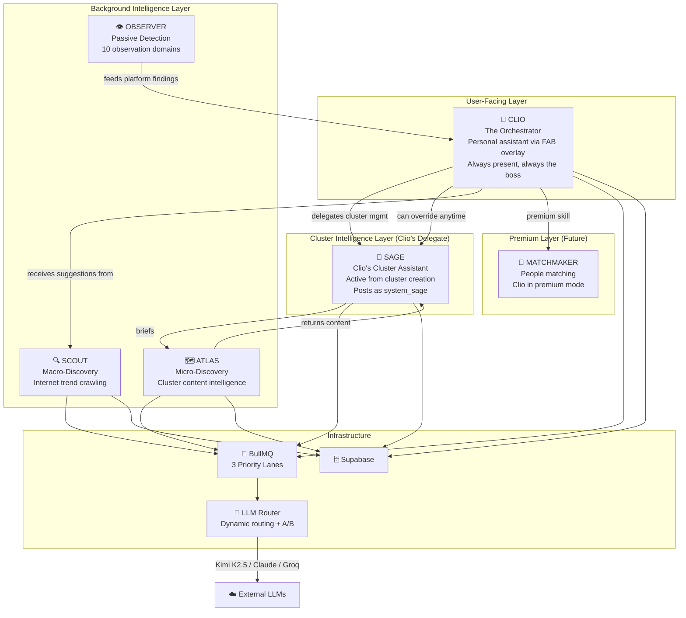

# Aggilo — System Implementation Prompt
## Part 4: AI Agent Architecture & Orchestration

---

## 12. Agent Hierarchy & Roles



> [!IMPORTANT]
> **Sage is Clio's subordinate, not a peer.** Clio delegates cluster-level intelligence to Sage, who operates semi-autonomously within each cluster. Clio retains override authority at all times. Sage is active from cluster creation — no opt-in required. Users receive a one-time educational introduction of Sage from Clio on their first cluster join. Full Sage specification: [Part 5](system_implementation_prompt_part5.md).

| Agent | Visibility | Trigger | LLM Lane | Output |
|-------|-----------|---------|----------|--------|
| **Clio** | Personal — FAB overlay only (never posts to Timeline) | User chat, proactive triggers | `clio-high` | Conversational responses, cluster creation, Sage introduction |
| **Sage** | Direct — cluster Timeline presence | Cluster events, Atlas content, arc phase changes | `events-medium` | Timeline posts (system_sage), description refinements |
| **Scout** | Invisible | Admin-triggered + 6h cron | `scout-low` | Topic reports, auto-clusters (≥90%), suggestion cards |
| **Atlas** | Invisible | 60s post-join, 6h cycle, 72h silence | `events-medium` | Content cards → Sage curates and posts them to Timeline |
| **Observer** | Invisible | Continuous passive monitoring (10 domains) | `events-medium` | Platform findings, language-parallel spawn recommendations, tool analysis |
| **Matchmaker** | Via Clio (Premium) | Premium user chat | `clio-high` | People suggestions, questionnaires, private clusters |

---

## 13. Clio — The Personal Orchestrator (Detailed)

> [!IMPORTANT]
> **Clio is a personal, FAB-only orchestrator.** She exists exclusively in the user's FAB overlay — she never posts to the cluster Timeline and never writes content under `system_sage` or `system_clio`. Her entire domain is the 1:1 relationship with the user: answering questions, creating clusters, introducing Sage, discovering clusters, and (for premium users) matchmaking. All cluster-level intelligence — posting, content curation, reengagement, arc phase actions — is delegated entirely to Sage. Clio can override Sage (see Part 5 §27), but her default posture is delegation.

> **Extended specification (v2.1):** For full cluster anchor behaviour, message budgets, arc state machine, compose bar placeholder, and skill dialogue participation rules, see [`CLIO_CLUSTER_HOST_CONTEXT.md`](../clio/CLIO_CLUSTER_HOST_CONTEXT.md) and [`CLIO_UNIFIED_CLUSTER_PRESENCE.md`](../clio/CLIO_UNIFIED_CLUSTER_PRESENCE.md). For ephemeral storage architecture (Redis-backed, 12h TTL), see archived sub-spec [`CLIO_PRIVATE_EPHEMERAL_CHAT.md`](../docs/_archived/CLIO_PRIVATE_EPHEMERAL_CHAT.md) — partially deprecated; only the Redis/welfare/admin sections remain authoritative.

### 13.1 Node.js Service Architecture

```typescript
// apps/api/src/services/clio.ts

interface ClioContext {
  // Assembled before every LLM call
  character: string;       // SOUL.md content (~4000 tokens)
  register: string;        // 'explorer' | 'campus' | 'momentum' | 'anchor'
  identity: string;        // Active persona IDENTITY.md content
  userProfile: {           // From profiles table
    age: number;
    gender: string;
    languages: string[];
    interests: string[];
    location: string;
    premiumStatus: string;
  };
  userClusters: string[];  // Names of joined clusters
  memory: KeyFact[];       // Premium: persistent facts Clio knows
  arcBeat: number;         // 1-10 relationship arc phase
  conversationHistory: Message[];  // Last N turns
  antiPatterns: string[];  // Explicit "never say" list
  clusterContext?: {       // If chat is cluster-scoped
    clusterId: string;
    purpose: string;
    arcPhase: string;
    memberCount: number;
  };
}

interface ClioService {
  chat(userId: string, message: string, clusterId?: string): Promise<ClioResponse>;
  assembleContext(userId: string, clusterId?: string): Promise<ClioContext>;
  determineRegister(yearOfBirth: number): Register;
  buildSystemPrompt(ctx: ClioContext): string;
  postToTimeline(clusterId: string, content: string, sourceUrl?: string): Promise<void>;
  checkDailyLimit(clusterId: string): Promise<boolean>;
}
```

### 13.2 Register Selection Logic

```typescript
function determineRegister(yearOfBirth: number): Register {
  const age = new Date().getFullYear() - yearOfBirth;
  if (age < 18) return 'explorer';   // 13-17 (future)
  if (age <= 24) return 'campus';    // 18-24 — Bible default
  if (age <= 35) return 'momentum';  // 25-35
  return 'anchor';                    // 36-50+
}
```

### 13.3 System Prompt Assembly

```
[CHARACTER: Clio — core principles from SOUL.md]
[REGISTER: {register_name}]
[IDENTITY: {active persona IDENTITY.md for this register}]
[CONTEXT: User is {age}{gender}, {city}, interested in {interests}]
[LANGUAGES: {primary} (primary), {secondary} (secondary)]
[MEMORY: {key facts — premium only}]
[ARC BEAT: {current beat 1-10}]
[ANTI-PATTERNS: No "Great!", no urgency, no performed enthusiasm,
 no "Got it!", no "Amazing!", never manufacture urgency]
[CLUSTER CONTEXT: {if in-cluster: purpose, arc phase, member count}]
[CONVERSATION HISTORY: last {N} turns]
[USER MESSAGE: {current message}]
```

**Token budget**: Target 20-60 words per response. Temperature: 0.7-0.8.

### 13.4 Clio Skills (Capability Modes)

> [!IMPORTANT]
> **Clio no longer handles cluster hosting.** Cluster-level intelligence (arc management, content posting, reengagement) is delegated to Sage. Clio remains the user's personal assistant via FAB overlay. She can override Sage at any time (rules TBD). See [Part 5](system_implementation_prompt_part5.md) for the full Sage specification.

| Skill | Trigger | Available To | Behavior |
|-------|---------|-------------|----------|
| `cluster_creation` | User expresses desire for new cluster | All users | Extract AGGIL from conversation, deduce settings, duplicate check, create |
| `cluster_discovery` | User searches or asks for suggestions | All users | Search existing clusters, qualify, recommend |
| `platform_qa` | General questions about Aggilo | All users | Answer from platform rules context |
| `sage_introduction` | User's first cluster join (one-time) | All users | Introduce Sage as Clio's cluster assistant |
| `premium_matchmaker` | Premium user initiates matchmaking | Premium only | Preference learning, people search, questionnaire dispatch |
| `connection_intro` | Two users should meet | Premium only | Craft specific introduction with texture |

### 13.5 Cluster Arc State Machine (Backend-Owned, Sage Acts)

> [!IMPORTANT]
> **The backend owns the arc state machine.** The `ClusterArcEvaluate` worker evaluates transitions on a 6h cron. Both Clio and Sage read the current arc phase, but **Sage acts on it** for cluster-level behaviors (posting, reengagement). Clio only reads it for personal context (e.g., telling a user about their cluster's health). See [Part 5 §26](system_implementation_prompt_part5.md) for Sage's arc phase behaviors.

```typescript
// apps/api/src/workers/arc-evaluator.ts
// Backend-owned — evaluates and transitions arc phases

enum ArcPhase { A = 'A', B = 'B', C = 'C', D = 'D', E = 'E' }

interface ArcTransition {
  from: ArcPhase;
  to: ArcPhase;
  condition: (cluster: Cluster) => boolean;
}

const transitions: ArcTransition[] = [
  { from: ArcPhase.A, to: ArcPhase.B,
    condition: (c) => c.post_count > 0 },
  { from: ArcPhase.B, to: ArcPhase.C,
    condition: (c) => hoursSince(c.last_post_at) >= 72 },
  { from: ArcPhase.C, to: ArcPhase.D,
    condition: (c) => postsInLast7Days(c) >= 6 },
  { from: ArcPhase.D, to: ArcPhase.E,
    condition: (c) => c.member_count >= 10 && postsPerWeek(c) >= 15 },
  // Regressions
  { from: ArcPhase.D, to: ArcPhase.C,
    condition: (c) => hoursSince(c.last_post_at) >= 72 },
  { from: ArcPhase.E, to: ArcPhase.C,
    condition: (c) => hoursSince(c.last_post_at) >= 72 },
];
```

**Sage actions per arc phase** (Clio is personal-only, see Part 5 §26 for full detail):

| Phase | Sage Behavior |
|-------|--------------|
| **A** (Empty) | Host mode: dispatch Atlas for cold content, post 1 item under `system_sage` |
| **B** (First post) | Acknowledge first organic post within 60s (1 sentence), then silent 24h |
| **C** (72h silence) | Atlas checks for reengagement content. If found → Sage posts 1 item. If not → silent |
| **D** (Active) | Passive. No proactive posting |
| **E** (Thriving) | Milestone message at 10 members. Then permanently passive |

**2-message daily limit enforcement (Sage, not Clio):**
```typescript
async function canSagePost(clusterId: string): Promise<boolean> {
  const cluster = await getCluster(clusterId);
  return cluster.sage_posts_today < 2;
}
// Direct Clio FAB replies (POST /api/clio/chat) are personal and NOT affected by this limit
```

---

## 14. Scout — Macro-Discovery Agent

### 14.1 Service Architecture

```typescript
// apps/api/src/services/scout.ts

interface ScoutService {
  crawlSegment(segment: AGGILSegment): Promise<ScoutDiscovery[]>;
  scoreTopics(topics: RawTopic[], segment: AGGILSegment): Promise<ScoredTopic[]>;
  checkDuplicate(topic: ScoredTopic): Promise<Cluster | null>;
  autoCreateCluster(topic: ScoredTopic): Promise<Cluster>;
  createSuggestionCard(topic: ScoredTopic): Promise<ScoutDiscovery>;
}

interface AGGILSegment {
  ageRange: [number, number];
  gender: string;
  geography: string;      // City or region
  languages: string[];
  interests: string[];
  segmentKey: string;     // e.g. "18-22_M_hyderabad_telugu_cricket"
}
```

### 14.2 Crawl Schedule (BullMQ Repeatable Jobs)

```typescript
// apps/api/src/workers/scout-worker.ts

// Segment size determines frequency
function getCrawlInterval(segmentUserCount: number): string {
  if (segmentUserCount >= 100) return '*/6 * * * *';   // Every 6 hours
  if (segmentUserCount >= 20)  return '*/12 * * * *';  // Every 12 hours
  return '0 0 * * *';                                    // Every 24 hours
}
// Premium user interests: always every 6 hours
```

### 14.3 Scout Pipeline

```
1. Fetch due segments from DB (by last_crawled_at + interval)
2. For each segment:
   a. Retrieve data via Data Acquisition Layer (Part 1 §2.5):
      - Google News: SerpApi/Serper search API (NOT direct crawling)
      - Reddit: Reddit OAuth2 API (100 req/min)
      - Twitter/X: SerpApi social search (NOT direct scraping)
      - News: RSS feeds + SerpApi news endpoint
      ⚠️ NEVER use Puppeteer/Playwright directly from server IPs
   b. Extract raw topics (title, source, URL, snippet)
   c. Send to LLM (Groq/Llama 3 — scout-low lane) for scoring:
      - Relevance to segment demographics (0-100)
      - Commitment depth assessment
   d. Filter: relevance ≥ 90% → auto-create path
              relevance 50-89% → suggestion card path
              relevance < 50% → discard
   e. Duplicate check against existing clusters
   f. Auto-create: INSERT cluster + seed with 3-5 discussion starters
      Suggestion: INSERT scout_discovery (status: suggestion_card)
3. Log crawl results for calibration feedback loop
```

### 14.4 Scout → Clio Handoff

Scout never surfaces directly to users. Output flow:
```
Scout discovers topic → creates cluster or suggestion card in DB
  → Clio reads suggestion cards when user opens Explore tab
  → Clio presents them in her voice: "I found something..."
  → User accepts or dismisses
  → Dismissal feeds back to Scout calibration
```

---

## 15. Atlas — Cluster Content Intelligence

### 15.1 Service Architecture

```typescript
// apps/api/src/services/atlas.ts

interface AtlasService {
  processBrief(brief: DemographicBrief): Promise<AtlasDiscovery[]>;
  crawlSources(brief: DemographicBrief): Promise<RawContent[]>;
  scoreContent(items: RawContent[], brief: DemographicBrief): Promise<ScoredContent[]>;
  generateHooks(items: ScoredContent[]): Promise<AtlasDiscovery[]>;
  deliverToSage(clusterId: string, discoveries: AtlasDiscovery[]): Promise<void>;
}

interface DemographicBrief {
  clusterId: string;
  aggilSegment: {
    ageRange: [number, number];
    gender: string;
    geography: { city: string; area?: string };
    interests: string[];
    languages: string[];
  };
  clusterPurpose: string;
  clusterArcPhase: ArcPhase;
  existingContentTopics: string[];   // Dedup
  existingPostTitles: string[];      // For warm variant context
  freshnessThresholdHours: number;   // Default 48
  contentCountRequested: number;     // Default 10
  variant: 'cold' | 'warm' | 'reengagement';
}
```

### 15.2 Three System Prompt Variants

| Variant | When | Guidance | Max Cards |
|---------|------|----------|-----------|
| **Cold** | `post_count = 0` | Widely accessible topics, easy hooks, low controversy | 3 |
| **Warm** | `post_count 1-5` | Build on existing discussions, reference prior threads | 3 |
| **Reengagement** | 72h silence | ONE high-precision item only (≥90%). If nothing clears threshold → return empty | 1 |

### 15.3 Quality Gates

```typescript
const ATLAS_THRESHOLDS = {
  MIN_RELEVANCE: 0.80,           // Nothing below 80%
  MIN_DEMOGRAPHIC_CONFIDENCE: 0.80,
  REENGAGEMENT_RELEVANCE: 0.90,  // Higher bar for reengagement
  MAX_CARDS_PER_BATCH: 10,       // Atlas returns max 10
  MAX_CLIO_SELECTS: 3,           // Clio picks max 3 from batch
  DEDUP_HOURS: 72,               // No repeat topics within 72h
};
```

### 15.4 Atlas → Sage → Timeline Flow

> [!NOTE]
> Atlas delivers content to **Sage**, not Clio. Sage owns all cluster-level posting. See Part 5 §25 for the full sequence diagram.

```
1. Trigger fires (join, 6h cycle, or 72h silence)
2. BullMQ job dispatched to 'events-medium' lane
3. Atlas worker:
   a. Builds DemographicBrief from cluster AGGIL
   b. Fetches content via Data Acquisition Layer (Part 1 §2.5 — APIs + managed scraping, NEVER direct Puppeteer)
   c. Scores via LLM (Groq — batch scoring)
   d. Filters by thresholds
   e. Generates conversation hooks via LLM
   f. Saves to atlas_discoveries table (status: pending)
4. Sage curation (see Part 5 §25.1):
   a. Checks arc phase gate (cold content not for warm clusters)
   b. Checks 2-message daily limit (sage_posts_today < 2)
   c. Selects top 1 item by relevance × demographic confidence
   d. Writes framing sentence in cluster persona voice
   e. INSERT into posts table (author_type: 'system_sage')
5. Post appears in Timeline as Sage card (40px avatar + name)
```

---

## 16. Observer — Passive Platform Intelligence

### 16.1 Purpose
Observer continuously monitors platform health across **10 observation domains**. It runs as a background BullMQ worker (every 6h), produces `observer_findings` rows with severity levels (`info`, `warning`, `critical`), and feeds actionable findings to Clio (who may relay them to admins or founders). Observer never surfaces directly to users.

### 16.2 The 10 Observation Domains

| Domain | Label | Cluster-Scoped | Severity | What It Detects |
|--------|-------|:--------------:|----------|-----------------|
| 1 | `language_distribution` | Yes | info | ≥8 members share a secondary language AND ≥3 post in it → recommend language-parallel cluster |
| 2 | `engagement_decay` | Yes | warning | Rolling 7-day post/comment rate declining ≥40% vs. prior 7 days |
| 3 | `topic_drift` | Yes | info | LLM-scored divergence between recent posts and cluster `purpose` exceeds 0.6 threshold |
| 4 | `content_quality` | Yes | warning | ≥30% of posts in 7 days are under 15 words or flagged as low-effort by moderation |
| 5 | `member_churn` | Yes | warning | ≥3 members leave within 48h, or join-and-ghost rate (join → 0 posts in 7 days) exceeds 60% |
| 6 | `cross_cluster_overlap` | No (platform) | info | ≥5 users share membership in 3+ clusters with overlapping AGGIL segments → possible merge candidate |
| 7 | `posting_cadence` | Yes | warning | Single member accounts for ≥50% of posts in a 7-day window (unhealthy dominance) |
| 8 | `toxic_signals` | Yes | critical | Pre-moderation pattern detection: coded language, dogwhistles, escalating hostility between members |
| 9 | `tool_effectiveness` | No (platform) | info | Agent tool usage and impact: which Atlas content gets engagement, which Sage posts are ignored |
| 10 | `growth_anomalies` | Yes | warning | Sudden membership spike (≥10 joins in 1h) or unexpected activity drop → potential raid or bot wave |

### 16.3 Implementation

```typescript
// apps/api/src/workers/observer-worker.ts
// Runs every 6 hours via BullMQ 'events-medium' lane

interface ObserverDomain {
  domain: number;          // 1-10
  label: string;
  evaluate(ctx: ObserverContext): Promise<ObserverFinding | null>;
}

interface ObserverContext {
  clusters: Cluster[];     // All active clusters
  globalStats: PlatformStats;
}

interface ObserverFinding {
  domain: number;
  domain_label: string;
  cluster_id: string | null;   // null for platform-wide findings
  severity: 'info' | 'warning' | 'critical';
  finding_summary: string;
  finding_data: Record<string, unknown>;
  finding_signature: string;   // SHA-256 hash for dedup
}

// Domain 1: Language Distribution (existing behavior, now formalized)
async function evaluateLanguageDistribution(cluster: Cluster): Promise<ObserverFinding | null> {
  // 1. Query member language profiles
  // 2. Find secondary languages shared by ≥8 members
  // 3. Check if ≥3 members have posted in that language
  // 4. If conditions met AND no parallel cluster exists:
  //    → Return finding with spawn recommendation
  return null;
}

// Domain 8: Toxic Signals (highest priority — feeds moderation)
async function evaluateToxicSignals(cluster: Cluster): Promise<ObserverFinding | null> {
  // 1. Sample recent posts/comments (last 6h)
  // 2. LLM-assisted classification via 'moderation' operation key
  // 3. Pattern detection: escalation between specific member pairs
  // 4. If critical → finding triggers immediate moderation review
  return null;
}

// Main observer loop
async function runObserverCycle(): Promise<void> {
  const domains: ObserverDomain[] = [
    { domain: 1, label: 'language_distribution', evaluate: evaluateLanguageDistribution },
    { domain: 2, label: 'engagement_decay', evaluate: evaluateEngagementDecay },
    { domain: 3, label: 'topic_drift', evaluate: evaluateTopicDrift },
    { domain: 4, label: 'content_quality', evaluate: evaluateContentQuality },
    { domain: 5, label: 'member_churn', evaluate: evaluateMemberChurn },
    { domain: 6, label: 'cross_cluster_overlap', evaluate: evaluateCrossClusterOverlap },
    { domain: 7, label: 'posting_cadence', evaluate: evaluatePostingCadence },
    { domain: 8, label: 'toxic_signals', evaluate: evaluateToxicSignals },
    { domain: 9, label: 'tool_effectiveness', evaluate: evaluateToolEffectiveness },
    { domain: 10, label: 'growth_anomalies', evaluate: evaluateGrowthAnomalies },
  ];

  for (const domain of domains) {
    const findings = await domain.evaluate({ clusters, globalStats });
    if (findings) {
      // Dedup by finding_signature — increment occurrence_count if exists
      await upsertFinding(findings);
    }
  }
}
```

### 16.4 Finding Lifecycle

```
Observer detects pattern → INSERT/UPDATE observer_findings
  → Critical findings: immediate notification to admin via Clio
  → Warning findings: appear in admin Observer dashboard
  → Info findings: logged for trend analysis, surfaced on admin dashboard
  → Admin can: acknowledge, action (triggers follow-up), or dismiss
```

### 16.5 Observer → Clio Handoff

Observer findings flow to Clio for two purposes:
1. **Admin relay** — Clio surfaces critical/warning findings to admins via FAB
2. **Platform intelligence** — Info-level findings (language parallels, overlap detection) feed Clio's suggestions when users ask about cluster health or discovery

---

## 17. LLM Router — Dynamic Routing Service

### 17.1 Architecture

```typescript
// apps/api/src/services/llm-router.ts

interface LLMRouterService {
  route(operationKey: string, prompt: string): Promise<LLMResponse>;
  getConfig(operationKey: string): Promise<RoutingConfig>;
  checkCostCeiling(operationKey: string): Promise<boolean>;
  handleABTest(config: RoutingConfig, prompt: string): Promise<LLMResponse>;
  logResponse(response: LLMResponse, config: RoutingConfig): Promise<void>;
}

// 12 operation keys:
type OperationKey =
  | 'cluster_creation'      // Claude Opus
  | 'cluster_scoring'       // Claude Opus
  | 'clio_basic_chat'       // Kimi K2.5
  | 'scout_crawl'           // Groq Llama 3
  | 'atlas_curation'        // Groq Llama 3
  | 'timeline_hooks'        // Kimi K2.5
  | 'moderation'            // Claude Opus
  | 'persona_gen'           // Claude Opus
  | 'matchmaker'            // Claude Opus
  | 'dm_context'            // Kimi K2.5
  | 'nickname_check'        // Kimi K2.5
  | 'icebreaker';           // Kimi K2.5
```

### 17.2 Routing Flow

```
1. Service calls llmRouter.route('clio_basic_chat', assembledPrompt)
2. Router reads llm_routing_config from DB (cached 60s)
3. Check if A/B test active → split traffic
4. Check cost ceiling → if exceeded, switch to fallback
5. Call primary LLM provider via HTTP
6. If primary fails → retry once → call fallback LLM
7. Log to response_logs table (provider, latency, tokens, cost)
8. Return response
```

### 17.3 Provider Adapters

```typescript
// Each LLM provider gets a thin adapter
interface LLMProvider {
  name: string;
  chat(messages: Message[], options: LLMOptions): Promise<string>;
}

// Implementations:
class NvidiaNIMProvider implements LLMProvider { /* Kimi K2.5 */ }
class AnthropicProvider implements LLMProvider { /* Claude Opus */ }
class GroqProvider implements LLMProvider { /* Llama 3 */ }
```

---

## 18. BullMQ Queue Architecture

### 18.1 Three Priority Lanes

```typescript
// apps/api/src/workers/queue.ts

import { Queue, Worker } from 'bullmq';

// Lane 1: Clio chat — highest priority, lowest latency
const clioQueue = new Queue('clio-high', { connection: redis });

// Lane 2: Events — cluster joins, Atlas briefs, Observer
const eventsQueue = new Queue('events-medium', { connection: redis });

// Lane 3: Scout — batch crawling, lowest priority
const scoutQueue = new Queue('scout-low', { connection: redis });
```

### 18.2 Job Types per Lane

| Lane | Job | Schedule | Concurrency |
|------|-----|----------|-------------|
| `clio-high` | `ClioChatJob` | On-demand (user message) | 10 |
| `events-medium` | `SagePostFromAtlas` | Event (Atlas content ready) | 3 |
| `events-medium` | `SageFirstPostAck` | Event (post_count 0→1) | 5 |
| `events-medium` | `SageMilestoneMessage` | Event (member_count hits 10) | 5 |
| `events-medium` | `AtlasBriefOnJoin` | Event (60s delay after join) | 5 |
| `events-medium` | `AtlasReengagementCheck` | Cron (every 6h) | 3 |
| `events-medium` | `ObserverCycle` | Cron (every 6h) — 10 domains | 2 |
| `events-medium` | `ClusterArcEvaluate` | Cron (every 6h) | 3 |
| `events-medium` | `PassiveSafetySampling` | Cron (every 6h) | 1 |
| `scout-low` | `ScoutCrawlJob` | Cron (6h/12h/24h by segment) | 2 |
| `scout-low` | `AtlasCrawlJob` | Cron (every 6h) | 3 |
| `events-medium` | `SagePostsDailyReset` | Cron (midnight) | 1 |
| `clio-high` | `ClioChatEphemeral` | On-demand (ephemeral chat message) | 10 |
| `clio-high` | `ClioEphemeralWelfareEscalate` | Event (welfare detected in private chat) | 5 |
| `events-medium` | `SageSkillDialoguePost` | Event (skill candidate reaches threshold) | 3 |
| `events-medium` | `ClioSkillDialogueResponse` | Event (Sage posts skill dialogue) | 3 |
| `events-medium` | `SkillActivationConfirmation` | Event (admin approves skill) | 3 |
| `events-medium` | `ClioPostsDailyReset` | Cron (midnight) | 1 |

> **v2.1 additions:** `ClioChatEphemeral`, `ClioEphemeralWelfareEscalate`, `SageSkillDialoguePost`, `ClioSkillDialogueResponse`, `SkillActivationConfirmation`, `ClioPostsDailyReset` added from operational documents.

**v2.2 additions (Agent Architecture Layer):**

| Lane | Job | Schedule | Concurrency |
|------|-----|----------|-------------|
| `clio-high` | `SageAtMentionResponse` | Event (@Sage mention detected) | 5 |
| `events-medium` | `SageFeatureEvaluation` | Cron (every 48h per cluster) | 3 |
| `events-medium` | `AgentChatboxExchange` | Scheduled cadence (per-cluster interval) or event | 3 |
| `events-medium` | `AgentChatboxSageInitiation` | Event (Sage detects opportunity) | 3 |
| `events-medium` | `AgentChatboxClioInitiation` | Event (Clio detects opportunity) | 3 |
| `events-medium` | `AgentChatboxFeatureActivation` | Event (immediate feature activated) | 3 |
| `scout-low` | `AgentChatboxObserveMode` | Event (agents agreed to wait) | 2 |
| `events-medium` | `SageBridgeMessage` | Event (escalated thread, human response delayed) | 3 |
| `events-medium` | `ChatboxCadenceScheduler` | Cron (every 30 min — checks all clusters) | 1 |

### 18.3 Rate Limiting

```typescript
// Enforce upstream LLM rate limits at queue level
const clioWorker = new Worker('clio-high', clioProcessor, {
  connection: redis,
  concurrency: 10,
  limiter: {
    max: 35,        // Stay under NIM's 40 RPM free tier
    duration: 60000 // per minute
  }
});
```

---

## 19. Persona Storage Model

Since Railway (Node hosting) has no persistent filesystem, persona files are stored in Supabase:

```sql
CREATE TABLE persona_files (
  id UUID PRIMARY KEY DEFAULT gen_random_uuid(),
  persona_name TEXT NOT NULL,          -- 'campus', 'momentum', etc.
  demographic TEXT NOT NULL,           -- '18-24', '25-35', etc.
  file_type TEXT NOT NULL,             -- 'soul' | 'identity' | 'agents'
  content TEXT NOT NULL,               -- Full markdown content
  status TEXT DEFAULT 'draft',         -- draft | review | approved | active
  approved_by TEXT,
  version INT DEFAULT 1,
  created_at TIMESTAMPTZ DEFAULT now(),
  updated_at TIMESTAMPTZ DEFAULT now()
);
```

Clio context assembly reads from this table instead of filesystem.

---

## 20. Welfare Escalation (Critical Safety)

```typescript
// In clio.ts — checked on every response
const WELFARE_KEYWORDS = [/* curated crisis indicators */];

async function checkWelfareEscalation(
  userMessage: string,
  clioResponse: string
): Promise<void> {
  // LLM-assisted classification (moderation operation key)
  const severity = await llmRouter.route('moderation', classificationPrompt);

  if (severity === 'critical_welfare') {
    // 1. Bypass all queues — immediate alert
    await sendPagerDutyAlert(userId, clusterId, userMessage);
    // 2. Switch Clio to containment mode
    //    (offer crisis hotline numbers, stay present)
    // 3. SLA: 5 minutes for human intervention
    await logCriticalEvent(userId, userMessage, 'welfare_escalation');
  }
}
```

---

## 21. Agent Implementation Phasing (Maps to Part 3 Phases)

| Phase | Agent Work |
|-------|-----------|
| **Phase 6** | Sage cluster intelligence: persona resolution, content curation, daily limit, first-post ack, milestone messages, description refinement |
| **Phase 7** | Clio basic chat + LLM Router + BullMQ setup + response logging + Sage introduction beat |
| **Phase 9** | Atlas full pipeline + Scout crawl cycle + Observer (10 domains) + arc state machine |
| **Phase 10** | Moderation engine (AI severity) + welfare escalation + passive safety sampling |
| **Phase 11** | Matchmaker (premium Clio skill) + preference learning + questionnaire dispatch |

---

## 22. Ephemeral Chat Architecture (v2.1)

> Full specification: archived sub-spec [`CLIO_PRIVATE_EPHEMERAL_CHAT.md`](../docs/_archived/CLIO_PRIVATE_EPHEMERAL_CHAT.md) — only the Redis storage architecture, ephemeral session lifecycle, and welfare detection sections remain authoritative. The unified Clio behaviour is governed by [`CLIO_UNIFIED_CLUSTER_PRESENCE.md`](../clio/CLIO_UNIFIED_CLUSTER_PRESENCE.md).

### 22.1 Storage Model

Ephemeral chat intentionally separates metadata (Supabase) from content (Redis):

| Data | Storage | TTL | Rationale |
|------|---------|-----|-----------|
| Session metadata | `clio_ephemeral_sessions` (Supabase) | Row kept 7 days after expiry | Audit trail: admin can see session existed, duration, welfare flag — without reading content |
| Conversation messages | Redis key `ephemeral:{session_id}:messages` | 43,200s (12h) | Privacy guarantee: content physically ceases to exist |
| Welfare flag | Redis key `ephemeral_welfare:{session_id}` | 86,400s (24h) | Welfare detection persists beyond session for follow-up |

### 22.2 Redis Key Patterns

```
ephemeral:{session_id}:messages   → List of JSON message objects (TTL: 12h)
ephemeral_welfare:{session_id}    → JSON welfare metadata (TTL: 24h)
```

### 22.3 Context Assembly (Ephemeral Mode)

When `POST /api/clio/chat` receives a request with `cluster_id: null`, it routes to ephemeral mode:

1. Load `SOUL.md` + active `IDENTITY.md` (same as standard Clio)
2. Load `USER.md` (same as standard Clio)
3. **Do NOT load** `MEMORY.md` or cluster context — ephemeral mode is session-scoped
4. Load ephemeral session messages from Redis (up to last 50)
5. Append welfare detection prompt suffix

### 22.4 Welfare Detection in Ephemeral Context

The welfare detection pipeline runs on every ephemeral message — same signals as cluster context, but with additional weight on isolation language since the user chose a private channel. On detection:

1. Set `ephemeral_welfare:{session_id}` in Redis (TTL: 24h)
2. Update `clio_ephemeral_sessions.welfare_flagged = true` in Supabase
3. Enqueue `ClioEphemeralWelfareEscalate` job (high lane)
4. Continue the conversation — do not terminate the session

### 22.5 Session Lifecycle

```
User taps Clio FAB inside a cluster → POST /api/clio/chat { cluster_id: "uuid", message: "..." }
  → Backend detects cluster_id present → ephemeral mode
  → If active session exists for (user_id, cluster_id): resume (load from Redis)
  → If no session: create new (insert Supabase row with cluster_id, init Redis key)

User sends message → POST /api/clio/chat (cluster_id present)
  → Enqueue ClioChatEphemeral job
  → Context assembled in ephemeral mode (§22.3)
  → Response written to Redis list + streamed to client

At 12h00s01 (TTL expiry):
  1. Redis key expires → messages physically deleted
  2. BullMQ scheduled job updates Supabase: deleted_at = NOW()
  3. If welfare_flagged: admin notification fires
  4. Supabase row retained 7 days for audit, then hard-deleted

User taps delete → DELETE /api/clio/ephemeral/session
  → Redis key deleted immediately
  → Supabase row: deleted_at = NOW()
```

> **V3 alignment note:** The legacy `GET /api/clio/private/session` and `DELETE /api/clio/private/session` paths are renamed to `/api/clio/ephemeral/session` for clarity. The word "private" is retired from the API surface — all Clio conversations are private; what differs is storage duration.

---

## 23. Clio Unified Cluster Presence (v2.2 → v2.3)

> Full specification: [`clio/CLIO_UNIFIED_CLUSTER_PRESENCE.md`](../clio/CLIO_UNIFIED_CLUSTER_PRESENCE.md) (v1.1 — Two-Lens addendum + Sage→Clio handoff)

### Summary for architecture reference

**Storage routing (single `/api/clio/chat` endpoint):**

| Request payload | Storage mode | Content location | TTL |
|-----------------|-------------|------------------|-----|
| `cluster_id` present | Ephemeral | Redis key `ephemeral:{session_id}:messages` | 43,200s (12h) |
| `cluster_id` absent | Persistent | `clio_conversations` table (Supabase) | Permanent |

**FAB position change (cluster screens only):**
- Previous: bottom-right, 48px
- New: **top-right, 40px**, 16px from right edge, 8px below cluster top bar
- Panel expands downward-leftward (CSS `transform-origin: top right`)
- This is a frontend-only change — no backend implications

**Outside clusters (Explore, Activity, Settings):** FAB remains bottom-right, 48px. No change.

### v2.3 — Two-Lens Surface (dual-tab Clio panel)

The cluster Clio panel exposes **two tabs** that both produce private conversations but differ in what context Clio loads AND in their privacy/storage class:

| Tab | Default | Endpoint | Cluster context | Vault access | Storage class | Persistence |
|-----|---------|----------|-----------------|--------------|---------------|-------------|
| **Just Clio · forgets** | ✓ default on first open | `/api/clio/ephemeral` | None | None | **Non-PII** | Server-side ephemeral store (Redis) with 12h TTL; pilot deployments may use sessionStorage as a Phase 0 expedient — see `docs/PHASE_0_PILOT.md` |
| **Just Clio · remembers** | Opt-in tab switch | `/api/clio/chat` | Last 10 posts + Sage role | Read-only (titles only) | **PII** | Server-persistent against the user's profile |

Both tabs are private — neither posts to Timeline or shares with Sage. Both are conversations with **Clio alone**, never with the cluster admin, Founder, or any other human. The symmetric "Just Clio" naming exists precisely so members never wonder who "us" might be. Tab choice is visible only to the user. Per-tab message threads are stored separately by storage class (server-side ephemeral for non-PII, server-persistent for PII). The earlier first-time tooltip (`localStorage.aggilo:clio_tabs_tip_dismissed`) was retired in favour of self-describing labels.

**Privacy class is the load-bearing UX distinction, communicated by the tab labels themselves.** Visual differentiation: the "forgets" tab uses an aggilo-deep header, gray bubbles, header subtitle *"Forgets after 12 hours"*, and the banner *"Private to you. Auto-deletes after 12 hours. Nothing reaches the platform."* with a lock glyph. The "remembers" tab uses an amber header, amber-tinted bubbles, header subtitle *"Remembers our conversations"*, and the banner *"Private to you. Clio remembers what helps so she can serve you better next time."* with a shield-check glyph. The "remembers" welcome message states explicitly that Clio uses these conversations to learn what helps the member over time.

**Mobile responsiveness:** FAB is 44px (WCAG 2.5.5 minimum target). Panel is full-width minus 8px gutter on phones, 22rem cap on tablets+. Anchored at `top-32` (128px) when inside a cluster so it sits cleanly below the FAB without overlap. The cluster page uses **single-scroll layout** — every section flows in one continuous document scroll. The composer is sticky at the bottom of the viewport.

**Feed ordering (V3.1 senior-UX correction):** Cluster surfaces are feed-shaped, not synchronous-chat-shaped. Top-level posts render **newest-first** (reverse-chronological) so a returning member sees what's new without scrolling. Replies inside a thread render **oldest-first** so the conversation reads top-to-bottom inside its container. This is the Reddit / Twitter-quoted-thread pattern.

**Pinned anchor placement (V3.1):** Sage's seed / anchor post is extracted from the feed and rendered above the agent collaboration chatbox in a dedicated `PinnedAnchor` strip. State is collapsible per-device via `localStorage.aggilo:pinned_anchor_collapsed`. Default expanded on first visit (the room's identity statement should be readable on entry); members tap to collapse for return visits.

**Live agent collaboration chatbox:** The chatbox now reads from `agent_chatbox_exchanges` (Supabase Realtime-backed) instead of hardcoded seed data. Whenever Sage takes an action that involves Clio (autonomous reference surfaced from the cluster's verified vault, soft handoff delegation, etc.), the route writes a real exchange record. Members see the dialogue appear live. Each cluster ships its own seed file as a fallback only when the table has nothing yet.

**Cluster presence:** A single Supabase Realtime presence channel per cluster (`cluster:{cluster_id}:presence`) is owned by the cluster shell via a React context (`PresenceProvider`). Each member's browser tracks `{user_id, nickname, online_at}`; the count and the set of online userIds update without a refresh as members arrive and leave. Two consumers read from the context: `ClusterPresence` (header — total + live count), and `PostCard` (small green dot next to a member's nickname when they're online). Centralising the channel prevents duplicate subscriptions (which would double-count the local user). For multi-cluster, a `cluster_members` join scopes the count to the active cluster.

**Sage link evaluation — silence-first (V3.1):** When a member shares a URL, Sage runs a server-side alignment evaluation (cluster-purpose-aware). The result has three states: `on_topic`, `off_topic`, `unsure`. The UI surfaces ONLY the `on_topic` ✓ badge. Off-topic and unsure verdicts are silent — Sage doesn't comment on a member's link choice publicly. The badge is a positive signal; the absence of a badge is neither praise nor critique.

**Clio nudges (V3.1 addition):** Cluster composer surfaces a daily passive motivation line above the input — a specific, lived prompt naming a real reason a member might want to share, tuned to the cluster's purpose. Rotates per-day per-user (day-index + user-hash) so the same member sees a stable line within a day and a fresh one tomorrow. Lines are NOT clickable starter prompts — they are quiet doors, not scripts. The line hides while the user is composing or replying so it doesn't crowd. Each cluster ships its own nudge pool keyed by cluster purpose. Voice rules respected — concrete, lived, optional, no manufactured warmth.

**Cadence agent exchanges (V3.1 addition):** New endpoint `POST /api/agents/cadence-exchange` generates a fresh Sage↔Clio dialogue grounded in the current state of the cluster (member count, recent posts, recent Sage references). Cadence floor: **2h for cold clusters** (<10 members or <5 posts), **4h for active clusters**. Server-side guard refuses if the previous exchange is within the floor. Triggered on cluster mount; client caches `next_eligible_at` in `localStorage.aggilo:cadence_exchange_next_eligible` so wasted LLM calls are minimized. The generated exchange persists to `agent_chatbox_exchanges` and surfaces live via Realtime in the AI Agent Discussions panel. The dialogue prompt is cluster-purpose-aware — for a faith cluster, Sage and Clio talk about how the room is engaging with faith; for a founders peer-support cluster, they would talk about that cluster's substance. Cluster-specific seed prompts plug into the generic endpoint.

**Pinned reference variety (V3.1 generic):** When Sage surfaces a pinned reference from the cluster's verified content vault, the route excludes vault entries the cluster has already received in the last 14 days. If the eligible pool is exhausted (or the LLM selects a recently-used entry), the route writes a **pointer post** with marker `[POINTER_TO_POST:<post_id>]` instead of republishing — the cluster renders a clickable card that smooth-scrolls to the original post with a brief flash highlight. The vault sample size fetched is widened from 20 to 50 entries to broaden the variety pool. Cluster-specific verified-content tables follow the same pattern (e.g. `dua_vault` for a faith cluster, `book_passages` for a reading club, `case_studies` for a founders cluster). Each cluster provides its own variant.

**Sage reply reference format (V3.1 generic):** Sage's `STEP 3 — REFERENCE SURFACE` template now requires a **4-line format**: primary text (Arabic/source language), Transliteration (if non-Latin script), Translation (if applicable), `Source:`. Clusters with Latin-script vault content (case studies, book quotes, peer testimony) collapse the 4 lines to 3 (text, translation, source) or 2 (text, source) as appropriate. The parser in `PostCard.tsx` is permissive about blank lines between sections and falls back gracefully if any line is missing.

**Polling fallback (V3.1):** `useRealtimePosts` adds a 4-second polling loop alongside the realtime channel. The poller fetches posts created since the last poll and merges them in (deduped). This catches Sage replies and autonomous posts when the WebSocket is throttled or briefly disconnects — common on flaky mobile networks. Realtime is still the primary path; polling is the safety net.

**Link unfurling + Sage on-topic check (V3.1 generic):** When a member's post contains a URL, the platform fetches the link's OpenGraph metadata server-side and asks Sage to evaluate whether it serves the cluster's purpose. Three verdicts:
- `on_topic` → small green ✓ "On topic — Sage" pill below the link card
- `off_topic` → amber pill with one-line "Sage notes: <reason>"
- `unsure` (default when ambiguous) → no badge — Sage stays silent when she can't judge confidently

The link itself is always clickable; Sage flags topic relevance, never blocks. Implementation:
- `link_previews` table caches OG metadata + Sage's verdict for 24h, keyed by SHA-256 url hash
- `POST /api/links/unfurl` fetches up to 256KB HTML with a 10s timeout, extracts OG meta with regex, then calls Sage with the cluster purpose + URL meta as context
- `LinkPreviewCard` renders the card and badge; auto-loads on mount via the cache lookup → unfurl path
- Realtime publication on `link_previews` so verdicts that arrive after the post lands stream in without a refresh
- Voice rule baked into Sage's evaluation prompt: never punish a member for an unfamiliar link; default to `unsure`. Per-cluster purpose is fed into the prompt; cluster instances supply their own purpose string.

**Typography (V3.1 fix):** `next/font/google` loads the script-appropriate fonts at app boot. The cluster's identity file declares `script: <code>` (e.g. `arabic`, `hebrew`, `devanagari`, `latin`) and the layout loads the corresponding `next/font/google` family conditionally. Each script-specific class (e.g. `arabic-text`, `hebrew-text`) is wired to its CSS variable. Phase 0 example: a faith cluster loads **Amiri** + **Scheherazade New** (subsets: arabic) for proper Naskh rendering, with `--font-amiri` wired to the `arabic-text` class.

**Time display (V3.1):** All relative timestamps remain locale-independent. Absolute timestamps (>24h old) render in the cluster's primary timezone. The timezone is a cluster property (`clusters.primary_timezone`), not a global default. Phase 0 example: a single-region cluster sets `Asia/Kolkata` for India.

**Reply ordering (V3.1):** Replies inside a thread are now explicitly sorted by `created_at` ascending so the conversation reads top-to-bottom in chronological order. Top-level posts are also explicitly sorted ascending — the realtime feed merging no longer relies on insertion order.

### v2.3 — Sage → Clio Soft Handoff

When Sage's evaluation returns `[SAGE_SILENT]` AND the platform has detected a tender disclosure, Sage **delegates** a private greeting to Clio. The mechanism:

```
sage/evaluate (post arrives)
  → welfare regex pre-filter (parallel to LLM)
  → LLM evaluation through Step 0–5 framework
  → If [SAGE_SILENT] AND welfare/disclosure:
      ├── INSERT clio_handoff_greetings(user_id, post_id, reason, greeting_text)
      ├── UPDATE posts SET sage_handoff_to_clio_at, sage_handoff_reason
      └── (Welfare also separately inserts welfare_notifications for Founder/Manager)
```

**Cluster-visible artifact:** under the affected post, an 11px gray italic line: *"Clio is following up privately."* — phrased about Clio's action, never naming the member.

**Member-side delivery:** the FAB shows a soft rose dot. Opening the panel lands them on "Just Clio · forgets" (default tab) where the most recent Clio message is the templated greeting, marked `FROM SAGE` with rose-50 bubble background.

**Handoff greeting text is templated, not Sage-authored.** Sage does not pass message-specific content to Clio; this prevents the handoff from becoming a back-channel for member analysis.

**Tables (added in §5.1.1):** `clio_handoff_greetings`. Posts: `sage_handoff_to_clio_at`, `sage_handoff_reason`.

**RLS:** member reads/updates only their own greetings; system inserts via service role.

---

## 24. Agent Collaboration Chatbox (v2.2)

> Full specification: [`docs/AGENT_COLLABORATION_CHATBOX.md`](../docs/AGENT_COLLABORATION_CHATBOX.md)

### Panel placement (cluster-maturity-aware)

The chatbox panel placement adapts to cluster maturity. Refined during V3 cluster UX review:

| Cluster state | Panel placement | Rationale |
|---------------|-----------------|-----------|
| **Cold start** (post_count < 5 OR member_count < 10) | **Top of feed** — directly below cluster header, above the first Timeline post | Sets the room's tone before the user encounters any post. The first impression is "this room is actively guided" rather than "here is a static feed." |
| **Active** (post_count ≥ 5 AND member_count ≥ 10) | **Between Timeline and compose bar** — original V3 default | The Timeline is now the primary surface; the chatbox is contextual reference. |

The frontend reads `clusters.member_count` and `clusters.post_count` and chooses placement at render time. The transition is permanent for that cluster — once the threshold is crossed, the chatbox stays at the bottom.

### Queue job summary

| Job | Lane | Trigger |
|-----|------|---------|
| `AgentChatboxExchange` | events-medium | Scheduled cadence (per-cluster interval) or event trigger |
| `AgentChatboxSageInitiation` | events-medium | Sage detects an opportunity to open a chatbox exchange |
| `AgentChatboxClioInitiation` | events-medium | Clio detects an opportunity to open a chatbox exchange |
| `AgentChatboxFeatureActivation` | events-medium | Immediate feature activated by Clio+Sage agreement |
| `AgentChatboxObserveMode` | scout-low | Both agents agreed to wait-and-observe |

### Cadence scheduler

Runs every 30 minutes. Checks per-cluster interval based on member count:

| Member count | Minimum interval between exchanges |
|-------------|-------------------------------------|
| < 100 | 2 hours |
| < 300 | 4 hours |
| < 500 | 6 hours |
| < 750 | 8 hours |
| < 1000 | 10 hours |
| ≥ 1000 | 12 hours |

### Feature activation authority

Clio may activate **immediate features** (no development required) upon reaching agreement with Sage in the chatbox. Requirements:
- No rule violations detected
- No admin override flag set for this cluster (`PUT /api/admin/clusters/:id/chatbox/feature-activation { enabled: false }`)
- Admin can rollback any activation from the dashboard

---

## 25. Sage Feature Intelligence (v2.2)

> Full specification: [`sage/SAGE_FEATURE_INTELLIGENCE.md`](../sage/SAGE_FEATURE_INTELLIGENCE.md)

### Queue job

`SageFeatureEvaluation` → events-medium lane, runs every 48h per cluster.

### Redis keys

```
sage:cluster:{cluster_id}:feature_signals   → List (TTL: 90 days)
sage:cluster:{cluster_id}:response_index    → Sorted set (TTL: 90 days)
sage:cluster:{cluster_id}:response_count    → Counter (resets daily)
```

### Four disqualifying conditions

A feature signal is discarded if it meets any one of:
1. **Redundant** — the cluster already has this capability (active skill or live feature)
2. **Rare** — fewer than 3 independent signals in the 48h window
3. **Unrealistic** — requires development effort beyond what the platform can deliver in the current phase
4. **Off-purpose** — the feature does not serve the cluster's stated purpose or AGGIL segment

---

## 26. @Sage Interaction & Bridge Message (v2.2)

> Full specification: [`sage/SAGE_ANCHOR_PROTOCOL.md`](../sage/SAGE_ANCHOR_PROTOCOL.md)

### @Sage response pipeline

Queue: `SageAtMentionResponse` → clio-high lane
SLA: 30 seconds from @mention to Sage response appearing in Timeline

**Deduplication (90-day window):**

| Similarity to past response | Action |
|-----------------------------|--------|
| ≥ 0.85 | Point to past response (link + brief summary) |
| ≥ 0.70 | Augment past response with new context |
| < 0.70 | Generate fresh response |

### Sage Bridge Message

Fires once per escalated thread when a human (founder/admin) has not responded within the configured threshold.

- **Not a queue job** — triggered by a Supabase Edge Function on a `pg_cron` rule
- `post_subtype`: `'sage_bridge'`
- `sage_bridge`: `true` on the posts table row
- **Visual:** amber left border (2px `#D97706`) in Timeline rendering
- **Content:** Sage acknowledges the delay without promising a timeline. She never says "the founder has been notified" — that implies surveillance. She says something like: "This hasn't been forgotten. Someone will come back to it."
- **Prohibited phrase:** "the founder has been notified" — this is explicitly banned per V3

---

## Changelog
- v2.2: Added §23 (Clio Unified Cluster Presence), §24 (Agent Collaboration Chatbox),
  §25 (Sage Feature Intelligence), §26 (@Sage Interaction + Bridge Message).
  Updated §22 cross-references to point to archived sub-spec and unified presence doc.
  Added 9 new queue jobs to §18.2.
- v2.1: Added cross-references to CLIO_CLUSTER_HOST_CONTEXT.md, CLUSTER_SKILL_DISCOVERY_PROTOCOL.md,
  CLIO_PRIVATE_EPHEMERAL_CHAT.md, AGGILO_ONBOARDING_PLAYBOOK_V2.md. Added new queue job types.
  Added Section 22 (Ephemeral Chat Architecture).

Each phase's verification steps are in Part 3 §9.


---

## 33. Agent Behavioural Invariants (V3.2)

These invariants apply to every agent on every cluster. They override cluster-specific persona configurations.

### 33.1 No protocol disclosure

Agents never narrate their decision frameworks to members. Sage does not explain why she stayed silent, why she's flagging a citation, or why she redirected a question. The prompt for every agent must include an explicit "do not disclose mechanics" rule.

When members ask "Sage, why did you stay silent?", the correct response is something like *"There wasn't something I had to add."* — never the actual decision step.

The admin dashboard also avoids protocol-disclosing labels (see §33.5).

### 33.2 Repetition guard (system-level + application-level)

Every Sage prompt builder receives the agent's recent posts (last 10–15 in the cluster). The system prompt explicitly forbids repetition: *"Silence is preferable to saying the same thing twice."*

A server-side Jaccard word-set similarity check runs after the LLM response (threshold 0.55). When it fires, the response is suppressed before it reaches the cluster. Logged as `step_matched = 'silent'` in `sage_decision_logs`.

Implementation reference: the platform's prompt utilities export `shallowSimilarity()` and `isSagePostRepetitive()` (currently in `src/lib/prompts/sage-builder.ts` for pilot deployments).

### 33.3 Sycophancy ban in agent-to-agent dialogue

Cadence exchanges, feature ideation, and any future agent-to-agent prompt must forbid agreement-as-default:

- ~40% of exchanges should involve pushback, skepticism, or "let's wait" outcomes.
- Phrases like *"good point"*, *"absolutely"*, *"great idea"*, *"I love that"* are banned.
- Disagreement is a valid outcome. The agents are not obligated to reach consensus.
- The dialogue's value is the texture of the disagreement, not the agreement itself.

### 33.4 Welcome posts (new-member acknowledgment)

When a new profile is created, the platform fires `POST /api/agents/welcome-new-member`. Rules:

- One welcome per (user, cluster). Idempotent.
- Skipped if the user already has any post in the cluster.
- Batched within a 30-minute window — multiple new arrivals share one welcome card.
- Wording is restrained, in Sage's voice. Three phrasings rotate to avoid feeling automated.
- New `post_subtype = 'welcome'`. Rendered with the same Sage avatar treatment as other Sage posts.

### 33.5 Admin-dashboard label neutralisation

Internal step names (`welfare`, `character`, `citation`, `authority_redirect`, `reference_surface`, `care_witness`, `witness_participation`, `silent`, `unknown`) are mapped to neutralised admin-visible labels (`Welfare response`, `Care response`, `Reference check`, `Routed to humans`, `Reference shared`, `Care witness`, `Joined a thread`, `Stayed silent`, `Unclassified`).

The "Character concerns" admin queue is renamed **"Care queue"**. The signal-type sub-categories (`rejecting_monotheism`, `mocking_faith`, `promoting_bad_character`, `coercion_against_practice`, `dismissing_dua`) are collapsed into a single label "Care needed" in the UI. The underlying DB enum is unchanged so analytics still work.

### 33.6 Cadence prompt — what the agents are evaluating

The cadence-exchange prompt focuses the dialogue on ONE of these themes per exchange:

1. **Tool or feature ideation** — what would help the members? Be specific.
2. **Room health observation** — what's the rhythm? Is it healthy or stuck?
3. **Member need detection** — recurring themes in posts that suggest unaddressed needs (framed as "the room could use a tool that…", never as observations of member behaviour per V3.4).
4. **No-action observation** — *"Our current tools are doing their job — nothing new to ship right now."* Valid. Should appear regularly.

The exchange ends in either `observe_mode = true` (wait and watch) or `observe_mode = false` (concrete capability identified). Concrete signals spawn `cluster_features` rows. Per V3.4, every concrete capability is one of two `kind` values:

- `kind = 'agent_tool'` — agents run it; if `build_status = 'deployable_now'`, ships immediately. Admin can veto.
- `kind = 'member_feature'` — members vote on it; admin approves development.

### 33.7 Workshop capability lifecycle (V3.4)

```
Sage and Clio discuss in the Room Workshop
    │
    ├─ kind = 'agent_tool'    ──┐
    │                          │
    │     deployable_now ──────┼──► tool runs immediately, logged to
    │                          │    cluster_tool_invocations. Admin can veto.
    │                          │
    │     needs_building ──────┘──► proposal sits in Workshop ("We'll build this");
    │                               admin builds → tool registered → agents invoke.
    │
    └─ kind = 'member_feature' ───► row inserted at proposed_in_thoughts
            │
            ▼
        Clio approves for member visibility (or rejects with rationale)
            │
            ▼
        status: in_features_tab — visible to members IF cluster size ≥ 5
            │
            ▼
        members upvote / comment / can propose features themselves (proposed_by='member')
            │
            ▼
        admin reviews in /admin/features → approves / defers / rejects
            │
            ▼
status: admin_approved → in_development → live
```

For clusters under 50 members, polling is signal-collection only — admin sees the upvote/comment count and uses judgment. For clusters at 50+, polling becomes binding (≥10 upvotes flags admin priority).
