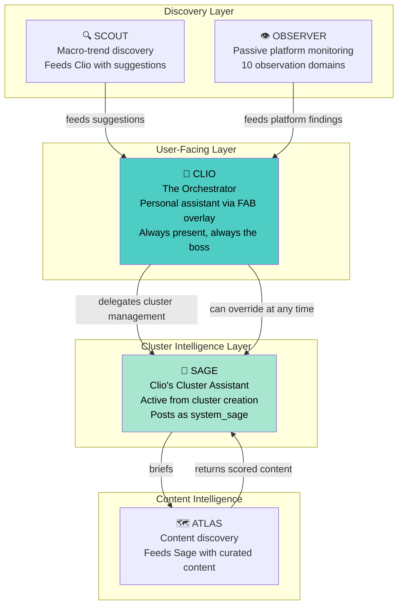
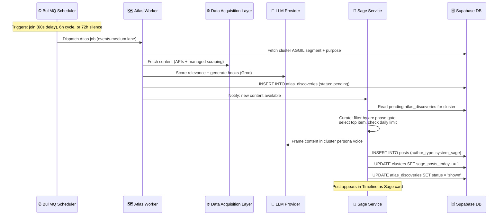
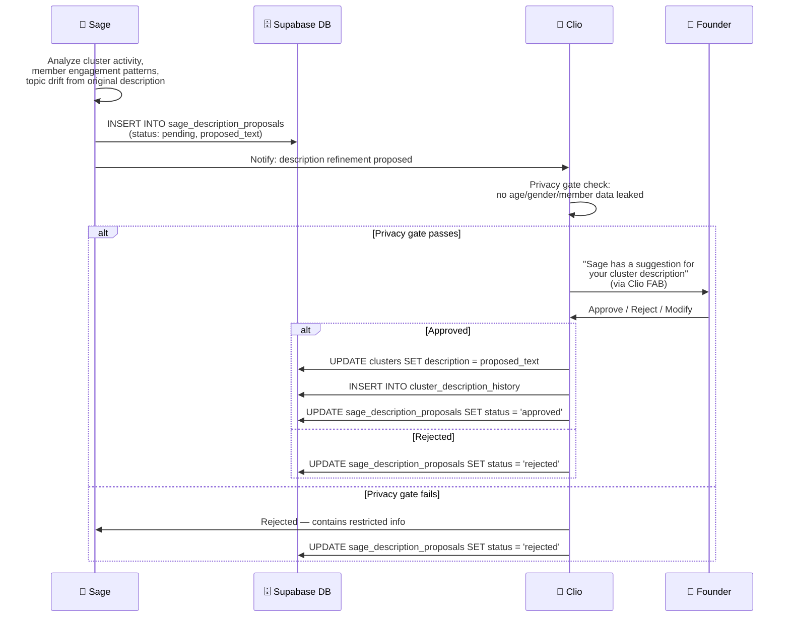

# Aggilo — System Implementation Prompt
## Part 5: Sage Agent — Cluster Intelligence & Clio's Cluster Assistant

> **v2.1 cross-references:** For Platform Capability skills and the Sage-Clio skill dialogue protocol, see [`CLUSTER_SKILL_DISCOVERY_PROTOCOL.md`](../docs/CLUSTER_SKILL_DISCOVERY_PROTOCOL.md). For Clio's cluster anchor behaviour specification (message budgets, compose bar, first-post acknowledgement), see [`CLIO_CLUSTER_HOST_CONTEXT.md`](../clio/CLIO_CLUSTER_HOST_CONTEXT.md). For Sage's @-mention protocol, deduplication, and bridge-message rules, see [`SAGE_ANCHOR_PROTOCOL.md`](./SAGE_ANCHOR_PROTOCOL.md).

---

## 22. Sage's Role in the Agent Hierarchy



**Sage is Clio's subordinate, not a peer.** Clio delegates cluster-level intelligence to Sage, who operates semi-autonomously within each cluster. Clio retains override authority at all times.

| Attribute | Clio | Sage |
|-----------|------|------|
| **Scope** | Per-user (personal) | Per-cluster (communal) |
| **Presence** | FAB overlay — always visible, partially hidden | In-cluster Timeline — visible identity (`system_sage`) |
| **Posts to Timeline** | Never | Yes — all cluster-level content |
| **Receives from** | Scout suggestions, Observer findings, user messages | Atlas content, backend arc phase, cluster events |
| **Authority** | Can override Sage in any cluster at any time | Operates under Clio's delegation |
| **Activation** | Always present for the user | Active from cluster creation (Day 1) |

---

## 23. Sage Introduction — One-Time Clio Onboarding Beat

When a user first joins a cluster (their first encounter with Sage), Clio provides a **one-time educational introduction**:

- Clio explains that Sage is her assistant who takes care of this cluster
- Clio describes what Sage does: curates content, guides discussions, keeps the cluster alive and relevant
- The introduction is brief, warm, and natural — not a feature announcement
- After this introduction, the user understands the two-agent model

### Implementation

```typescript
// apps/api/src/services/clio.ts

async function handleFirstClusterJoin(userId: string, clusterId: string): Promise<void> {
  const profile = await getProfile(userId);

  if (!profile.sage_introduced) {
    // Clio delivers one-time Sage introduction
    // This is a Clio FAB message, not a Timeline post
    await clioChat(userId, {
      context: 'sage_introduction',
      clusterId,
      systemOverride: SAGE_INTRO_PROMPT
    });

    await updateProfile(userId, { sage_introduced: true });
  }
}
```

**Tracking:** A single `sage_introduced` boolean on the `profiles` table. Once true, never shown again.

**No opt-in/opt-out gate.** Sage is always present. The introduction is educational only.

---

## 24. Sage Service Architecture

### 24.1 Node.js Service

```typescript
// apps/api/src/services/sage.ts

interface SageContext {
  character: string;        // sage/SOUL.md content
  clusterPurpose: string;
  clusterArcPhase: ArcPhase;
  clusterDemographic: {
    ageRange: [number, number];
    genderMix: string;
    geography: string;
    languages: string[];
    interests: string[];
  };
  memberCount: number;
  recentPosts: Post[];       // Last 20 posts for context
  atlasDiscoveries: AtlasDiscovery[];  // Pending content from Atlas
  sagePersona: SagePersona;  // Cluster-specific persona
  activeTools: ClusterTool[]; // Cluster-specific tools (loaded from cluster_tools)
}

interface SageService {
  assembleContext(clusterId: string): Promise<SageContext>;
  processAtlasContent(clusterId: string, discoveries: AtlasDiscovery[]): Promise<SagePost>;
  handleArcPhaseAction(clusterId: string, phase: ArcPhase): Promise<void>;
  postToTimeline(clusterId: string, content: string, sourceUrl?: string): Promise<Post>;
  checkDailyLimit(clusterId: string): Promise<boolean>;
  refineDescription(clusterId: string, proposal: string): Promise<DescriptionProposal>;
  resolvePersona(clusterId: string): Promise<SagePersona>;
}
```

### 24.2 Sage Persona Model (Per-Cluster)

Sage has **one persona per cluster** — all users in a cluster see the same Sage. This is fundamentally different from Clio (one persona per user).

```typescript
interface SagePersona {
  clusterId: string;
  register: 'academic' | 'casual' | 'professional' | 'community' | 'neutral';
  formality: number;        // 0.0 (casual) to 1.0 (formal)
  interjectionFrequency: number;  // 0.0 (rare) to 1.0 (frequent)
  resolvedFrom: 'cluster_purpose' | 'member_tone' | 'observation';
}
```

**Persona resolution priority:**
1. **Clio aggregate tone signals** — across cluster members (when available), top 2 signals adopted
2. **Cluster purpose** — maps to a default register table
3. **Observe-and-create** — neutral for first 14 days, then formalized based on cluster activity

Sage persona is stored in the `sage_personas` table (one row per cluster).

---

## 25. Content Pipeline: Atlas → Sage → Timeline



### 25.1 Sage Curation Logic

Sage does not blindly post what Atlas finds. She curates:

```typescript
async function curateAtlasContent(
  clusterId: string,
  discoveries: AtlasDiscovery[]
): Promise<AtlasDiscovery | null> {
  const cluster = await getCluster(clusterId);

  // 1. Check daily limit (2 posts/day max)
  if (cluster.sage_posts_today >= 2) return null;

  // 2. Arc phase gate
  const filtered = discoveries.filter(d => {
    if (cluster.arc_phase === 'A' && d.arc_variant !== 'cold') return false;
    if (cluster.arc_phase === 'C' && d.arc_variant !== 'reengagement') return false;
    if (cluster.arc_phase === 'D' || cluster.arc_phase === 'E') return false; // Sage passive
    return true;
  });

  if (filtered.length === 0) return null;

  // 3. Select top item by relevance × demographic confidence
  const sorted = filtered.sort((a, b) =>
    (b.relevance_score * b.demographic_confidence) -
    (a.relevance_score * a.demographic_confidence)
  );

  return sorted[0];
}
```

### 25.2 Three Content Variants (inherited from Atlas)

| Variant | When (Arc Phase) | Sage Behavior | Max Posts |
|---------|-----------------|---------------|----------|
| **Cold** | Phase A (empty cluster) | Post widely accessible topics, easy hooks | 1 |
| **Warm** | Phase B (first activity) | Build on existing discussions | 1 |
| **Reengagement** | Phase C (72h silence) | ONE high-precision item only (≥90% relevance). If nothing clears → stay silent | 1 |
| — | Phase D-E (active/thriving) | **Sage is passive.** No proactive posting. | 0 |

---

## 26. Sage Arc Phase Behaviors

The backend evaluates arc transitions (see Part 4 §13.5 for the state machine). Sage reads the current phase and acts accordingly.

| Phase | Sage Behavior |
|-------|---------------|
| **A** (Empty) | Host mode: dispatch Atlas for cold content, post 1 item to seed discussion. Dynamic compose placeholder text. |
| **B** (First post) | Acknowledge first organic post within 60s (1 sentence, genuine, under `system_sage`). Then silent for 24h. |
| **C** (72h silence) | Atlas checks for high-relevance reengagement content. If found → Sage posts 1 item. If not → stay silent. |
| **D** (Active) | Passive. No proactive posting. Sage only responds if Clio delegates a specific task. |
| **E** (Thriving) | Milestone message at 10 members. Then permanently passive. Sage fades into the background. |

### 26.1 Daily Limit Enforcement

```typescript
async function canSagePost(clusterId: string): Promise<boolean> {
  const cluster = await getCluster(clusterId);
  return cluster.sage_posts_today < 2;
}

// Reset worker runs at midnight
// apps/api/src/workers/sage-reset.ts
async function resetSagePostCounts(): Promise<void> {
  await supabase
    .from('clusters')
    .update({ sage_posts_today: 0, sage_posts_reset_at: new Date() })
    .gt('sage_posts_today', 0);
}
```

---

## 27. Clio Override Capability

Clio retains full authority over any cluster at any time. The architectural capability is built in; the exact rules for when Clio intervenes are TBD and will be defined post-launch based on observed patterns.

### 27.1 Override Scenarios (Architecture Supports, Rules TBD)

| Scenario | Capability |
|----------|------------|
| **Welfare escalation** | Clio can bypass Sage and post directly to Timeline or send DM |
| **Content quality issue** | Clio can suppress a Sage post before it goes live |
| **User complaint about Sage** | Clio can adjust Sage's persona for a cluster |
| **Moderation event** | Clio coordinates with moderation engine, overrides Sage if needed |

### 27.2 Implementation

```typescript
// apps/api/src/services/clio.ts

interface ClioOverride {
  clusterId: string;
  action: 'suppress_sage_post' | 'direct_post' | 'adjust_persona' | 'escalate';
  reason: string;
  postId?: string;  // For suppress
}

async function overrideSage(override: ClioOverride): Promise<void> {
  // Log the override for admin visibility
  await logAdminAction({
    action_type: 'clio_override',
    cluster_id: override.clusterId,
    reason: override.reason,
  });

  switch (override.action) {
    case 'suppress_sage_post':
      await updatePost(override.postId!, { is_hidden: true });
      break;
    case 'direct_post':
      // Clio posts directly — rare, logged
      break;
    case 'adjust_persona':
      // Modify sage_personas row
      break;
    case 'escalate':
      // Welfare/moderation escalation path
      break;
  }
}
```

---

## 28. Cluster Description Refinement (Sage Skill)

Sage can propose refinements to a cluster's description as it evolves. This is a structured approval flow:



**Privacy gate (Clio enforces):** The refined description must never contain:
- Age range of members or AGGIL age parameters
- Gender composition or AGGIL gender parameters
- Member count or individual member information
- Internal arc phase or cluster health signals

---

## 29. Sage BullMQ Workers

| Lane | Job | Schedule | Concurrency |
|------|-----|----------|-------------|
| `events-medium` | `SagePostFromAtlas` | Event (Atlas content ready) | 3 |
| `events-medium` | `SageFirstPostAck` | Event (post_count 0→1) | 5 |
| `events-medium` | `SageMilestoneMessage` | Event (member_count hits 10) | 5 |
| `events-medium` | `SageReengagementCheck` | Cron (every 6h) — only for Phase C clusters | 3 |
| `scout-low` | `SagePostsDailyReset` | Cron (midnight) | 1 |

> **Note:** `SageFirstPostAck` and `SageMilestoneMessage` were previously attributed to Clio (`FirstPostAck`, `MilestoneMessage` in Part 4 §18.2). They now belong to Sage since she owns all cluster-level posting.

---

## 30. Sage Visual Identity

Sage has her own visual character, distinct from Clio:

| Attribute | Value |
|-----------|-------|
| **Visual** | Defined in `sage/sage_image_prompts.md` — 3 mood states |
| **Moods** | Grounded (default), Engaged, Observing |
| **Render size** | 40px only (she is a room presence, not a stage presence) |
| **In Timeline** | Posts show Sage's avatar + name alongside content |
| **Animations** | 3s breathing loop (idle), 2 transitions |

---

## 31. Sage Implementation Phase

Sage is implemented in **Phase 6** of the build (after Timeline & Content in Phase 5, before Clio AI in Phase 7):

### Phase 6 — Sage Cluster Intelligence
**Goal**: Sage active in every cluster, posting content from Atlas.

1. Implement `sage.ts` service: context assembly, persona resolution, content curation
2. Implement `sage_personas` table and persona resolution logic (3 priority sources)
3. Implement `system_sage` author type in posts table
4. Implement Sage posting to Timeline with daily limit enforcement
5. Implement `SagePostsDailyReset` worker (midnight)
6. Implement `SageFirstPostAck` worker (first post acknowledgment)
7. Implement `SageMilestoneMessage` worker (10-member milestone)
8. Integrate with Atlas pipeline: Atlas → Sage → Timeline
9. Implement description refinement flow (proposal → Clio privacy gate → founder approval)
10. Implement one-time Sage introduction beat in Clio (on first cluster join)
11. Build React: Sage avatar + identity in Timeline posts, differentiated from user posts

**Verify**: Create a cluster. Sage persona resolves. Atlas content arrives → Sage curates and posts under `system_sage`. Post appears in Timeline with Sage's avatar. Daily limit blocks 3rd post. First organic post gets Sage acknowledgment within 60s.

> **Dependency note:** Phase 6 (Sage) should be built AFTER Phase 5 (Timeline & Content) and BEFORE Phase 7 (Clio AI). This ensures clusters and posts exist for Sage to operate on, and Clio's FAB can reference Sage when it ships in Phase 7. The Atlas backend (Phase 9 in current phasing) can be stubbed initially — Sage posts from Atlas content, so a simple seed data approach works until Atlas is fully built.

---

## Changelog
- v2.2: Added §32 (Implementation Phases — New Agent Architecture Layer). Updated cross-references
  to point to relocated docs (clio/, sage/, Revised_Screen_Prompts/). SAGE_ANCHOR_PROTOCOL.md
  added to header cross-references.
- v2.1: Added cross-references to CLUSTER_SKILL_DISCOVERY_PROTOCOL.md (Platform Capability skills,
  Sage-Clio skill dialogue protocol) and CLIO_CLUSTER_HOST_CONTEXT.md (Clio cluster host behaviour).

---

## 32. Implementation Phases — New Agent Architecture Layer (Session 2026-05)

These phases extend the existing Phase 1–11 build order (Part 3 §9). They are executed **after Phase 11** for the main platform, or in parallel with Phase 6 (MVP) for the Sisters in Dua build.

### Phase A — Document Migration (No Code)

Completed in V3 Phase 1. All operational documents are now in their canonical locations:
- `clio/CLIO_UNIFIED_CLUSTER_PRESENCE.md`
- `clio/CLIO_CLUSTER_HOST_CONTEXT.md`
- `sage/SAGE_ANCHOR_PROTOCOL.md`
- `sage/SAGE_FEATURE_INTELLIGENCE.md`
- `docs/AGENT_COLLABORATION_CHATBOX.md`
- `docs/CLUSTER_FEATURES_TAB.md`
- `docs/CLUSTER_SKILL_DISCOVERY_PROTOCOL.md`
- `Revised_Screen_Prompts/CLUSTER_UI_MICROINTERACTIONS.md`

### Phase B — Database Schema (migration 020)

Apply all new tables and ALTER statements from Part 2 §5.1.2. Test RLS policies with anon key.

**Verify:** `SELECT tablename FROM pg_tables WHERE schemaname='public'` confirms all new tables present (`agent_chatbox_exchanges`, `agent_chatbox_views`, `cluster_features`, `cluster_feature_upvotes`, `cluster_feature_comments`, `sage_feature_signals`, `sage_at_mention_responses`, `sage_skills`). RLS enabled on all.

### Phase C — Core API Routes (7.16–7.20)

Implement endpoints from Part 3 §7.16 through §7.20 in `apps/api/src/routes/`. Each route gets Fastify TypeBox schema validation. Stub routes acceptable for Phase C — full implementation in Phase D.

**Verify:** All routes respond with correct HTTP status codes. TypeBox validation rejects malformed payloads. Auth middleware enforces JWT on all routes and admin-check on admin routes.

### Phase D — BullMQ Workers

Implement in this priority order:
1. `AgentChatboxExchange` worker — most complex (cadence scheduling, dual-agent prompt assembly, feature proposal extraction)
2. `ChatboxCadenceScheduler` — 30-min cron that checks all clusters against their member-count-based interval
3. `SageFeatureEvaluation` — 48h cycle per cluster, four disqualifying conditions
4. `SageAtMentionResponse` — deduplication via embedding similarity, 30s SLA
5. `SageBridgeMessage` — Edge Function trigger on pg_cron rule
6. Clio ephemeral session management (Redis TTL enforcement, unified `/api/clio/chat` routing)

**Verify:** Create a cluster with 50 members. Chatbox cadence fires at 2h interval. @Sage mention produces response within 30s. Feature evaluation cycle runs and correctly disqualifies a "Redundant" signal. Bridge message fires when founder hasn't responded in threshold time.

### Phase E — Frontend

1. Agent chatbox panel component (fixed panel, minimizable, permanent history)
2. Features tab (new third tab in cluster tab bar: Timeline | Members | Features)
3. Clio FAB top-right position (cluster screens only — scope carefully; Explore/Activity/Settings remain bottom-right 48px)
4. @Sage tip bar (one-time dismissible, below compose bar)
5. @Sage autocomplete in compose bar (triggers on `@S` typed)
6. Sage bridge-message card (amber left border `#D97706`)
7. Microinteractions per `Revised_Screen_Prompts/CLUSTER_UI_MICROINTERACTIONS.md`

**Verify:** Open a cluster → chatbox panel visible between compose bar and Timeline. Minimize → state persists on reload. Features tab shows empty state. Type `@Sage` → autocomplete fires. Clio FAB is top-right 40px inside cluster, bottom-right 48px on Explore.

### Phase F — MVP Alignment (Sisters in Dua)

Per V3 Phase 6 Priorities 1–5:
1. Optimistic post submission (PostComposer.tsx)
2. Sage evaluation separation (`/api/sage/evaluate` route)
3. "Sage is considering this" typing indicator
4. Clio top-right position in ClusterShell.tsx
5. Server delay notifications (typing dots, "Taking a moment...")

**Verify:** Post appears immediately (optimistic). @Sage mention shows typing indicator. Clio FAB is top-right 40px in cluster view. Sage response appears as a separate Timeline post within 30s.

### Phase G — Two-Lens Clio + Sage→Clio Soft Handoff (V3.1)

Adds the dual-tab Clio surface and the soft handoff mechanism. Spec: `clio/CLIO_UNIFIED_CLUSTER_PRESENCE.md` v1.1.

**Schema (extends migration 020):**
- `posts.sage_handoff_to_clio_at TIMESTAMPTZ`
- `posts.sage_handoff_reason VARCHAR(32)`
- `clio_handoff_greetings` table + RLS + index
- Realtime publication: `posts` (re-added with full DML), `clio_handoff_greetings` (added)
- `REPLICA IDENTITY FULL` on both tables — required so UPDATE events emit full row data

**API:**
- `/api/clio/chat` (cluster-aware) and `/api/clio/ephemeral` (private) coexist; the FAB picks the endpoint per active tab
- `/api/sage/evaluate` extended:
  - Welfare regex pre-filter runs BEFORE the LLM (parallel to Clio's chat endpoints)
  - `@Sage` detection injects a forced-response signal into the system prompt
  - On `[SAGE_SILENT]` AND welfare/disclosure → insert `clio_handoff_greetings` + update `posts.sage_handoff_*`

**Realtime delivery (V3.1 update):**
- The cluster-visible inline note ("Clio is following up privately.") flows live through Supabase Realtime UPDATE events on `posts`. `useRealtimePosts` now listens for both INSERT and UPDATE.
- The private greeting flows live through Supabase Realtime INSERT events on `clio_handoff_greetings`, filtered to `user_id=eq.{userId}`. `ClioFab` subscribes per-mount.
- Initial pull on mount handles greetings queued while the user was offline; the realtime channel handles greetings queued while the user is in the cluster. Both feed the same `ingestGreeting` reducer with dedupe.

**Frontend:**
- `ClioFab` becomes a dual-tab surface (default: Just between us; opt-in: About this room)
- Per-tab thread storage in sessionStorage; visual differentiation (deep teal vs amber)
- First-time tooltip explains the tabs (`localStorage.aggilo:clio_tabs_tip_dismissed`)
- `PostCard` renders the cluster-visible inline note ("Clio is following up privately.") when `sage_handoff_to_clio_at` is set
- Pending handoff greetings render with `FROM SAGE` label and rose-50 bubble in the private tab
- Soft rose dot on FAB icon when an unread handoff greeting exists

**Verify:**
1. Apply schema. Confirm `posts.sage_handoff_to_clio_at`, `clio_handoff_greetings`, and the realtime publication entries exist.
2. Post a welfare-pattern message. Sage stays silent. Cluster shows "Clio is following up privately." note **without a refresh** (UPDATE event arrives via realtime). FAB shows rose dot **without a refresh** (INSERT event arrives via realtime).
3. Open Clio FAB. Default tab is "Just between us". Greeting message appears with FROM SAGE label.
4. Switch to "About this room" tab. Banner changes to amber. Ask "what did Sage mean?" — answer references actual recent posts.
5. Switch back to "Just between us". Greeting still there. Per-tab thread isolation confirmed.
6. Post a non-welfare message. No handoff queued. No cluster note rendered.
7. Open the cluster in two browser tabs as the same user. Trigger a handoff in tab A. The greeting and rose dot appear in tab B within ~1s without action.

### Phase H — Future (post-MVP)

- Member opt-out setting: "Don't have Clio reach out to me privately" → suppresses `clio_handoff_greetings` insertion
- Sage-authored handoff context (gated): when Founder explicitly enables, Sage may pass a single context line into the templated greeting
- Admin dashboard view: handoff outcomes (seen / dismissed / replied — counts only, content never visible)


---

## 33. Vault-Entry Repetition Protocol (V3.2 — Phase 0 validated)

> Generic protocol. The "vault" is the cluster-specific knowledge base — duas in a faith cluster, case studies in a legal cluster, precedents in a clinical cluster, etc. The protocol applies wherever Sage surfaces vault entries to a Timeline.

### 33.1 The Problem

Sage surfaces vault entries in two paths:

1. **Cadence-triggered** (`/api/sage/suggest-*`): fires on a periodic cadence (e.g. every 6h on cluster mount). Sage selects an entry, Clio reviews, posts to Timeline.
2. **Member-post-triggered** (`/api/sage/evaluate`): fires after a member posts. Sage evaluates through her decision framework and may surface a reference at the appropriate step.

Without cross-path deduplication, the same entry can appear via both paths within the same 14-day window. This breaks the sense that Sage is attentive and non-repetitive — the most important quality signal for a reference agent.

### 33.2 The Solution — Two Layers

**Layer 1 — Prompt-level (both paths):**
Sage's recent posts (last 10–15) are passed to her on every evaluation. The system prompt explicitly forbids repetition: *"Repetition erodes trust faster than silence."* When surfacing a reference, Sage must include the exact `vault_id` in the `SAGE_DECISION` tag so the platform can run the dedup check.

**Layer 2 — Application-level (both paths):**

*Cadence path:*
- Builds a `recentlyUsedVaultIds` set from posts in the last 14 days.
- Excludes those IDs from the eligible pool.
- If the pool is exhausted, posts a standalone pointer: `[POINTER_TO_POST:...]` with copy along the lines of "Already surfaced this reference recently — tap to scroll up to it." (Cluster-specific phrasing comes from the cluster's vocabulary configuration.)

*Evaluate path:*
- Builds a `vaultIdToPostId` map from posts in the last 14 days.
- After the LLM responds, checks whether `decision.vaultIdUsed` is in the map.
- If yes: posts a **reply-style pointer** to the triggering member's post (not a standalone post): "We've shared this reference before — it may be relevant here. [POINTER_TO_POST:...] Tap to scroll up to it."
- The pointer is a reply because the context is different: the member asked (implicitly or explicitly), so the response is directed at them.

### 33.3 Why Pointer vs Silence

Silence when a vault entry is relevant but recently posted would be the wrong choice. The member's post called for a reference. Sage's job is to respond. The pointer says: *"I noticed we already covered this, and I'm pointing you back to it"* — which reinforces the sense of a living, continuous room rather than a stateless bot.

The pointer is always a reply to the triggering post (evaluate path) or a standalone post (cadence path). It uses the `[POINTER_TO_POST:uuid]` marker which `PostCard.tsx` renders as a scroll-to button.

### 33.4 Jaccard Similarity Guard (belt-and-braces)

In addition to the vault-ID check, a Jaccard word-set similarity check (`isSagePostRepetitive`, threshold 0.55) runs on Sage's free-text response against her last 15 posts. This catches cases where Sage writes a similar response without using the vault marker — e.g. a care-witness response that echoes a previous one.

When the similarity check fires, the response is suppressed and replaced with `[SAGE_SILENT]`. Logged as `step_matched = 'silent'` in `sage_decision_logs`.

### 33.5 Reference Implementation (Phase 0)

The protocol above was first implemented and validated in the Phase 0 deployment. Phase 0 reference paths:

| File | What it does |
|---|---|
| `mvp/src/app/api/sage/evaluate/route.ts` | Vault-ID dedup map, pointer reply, Jaccard guard |
| `mvp/src/app/api/sage/suggest-*` (cadence endpoints, cluster-specific) | Eligible pool exclusion, standalone pointer post |
| `mvp/src/lib/sage-prompt.ts` | `isSagePostRepetitive()`, `shallowSimilarity()`, prompt-level repetition rule, `vault_id_used` instruction |

The Phase 1 implementation (Node/Fastify) re-implements the same protocol against the equivalent service layer.
