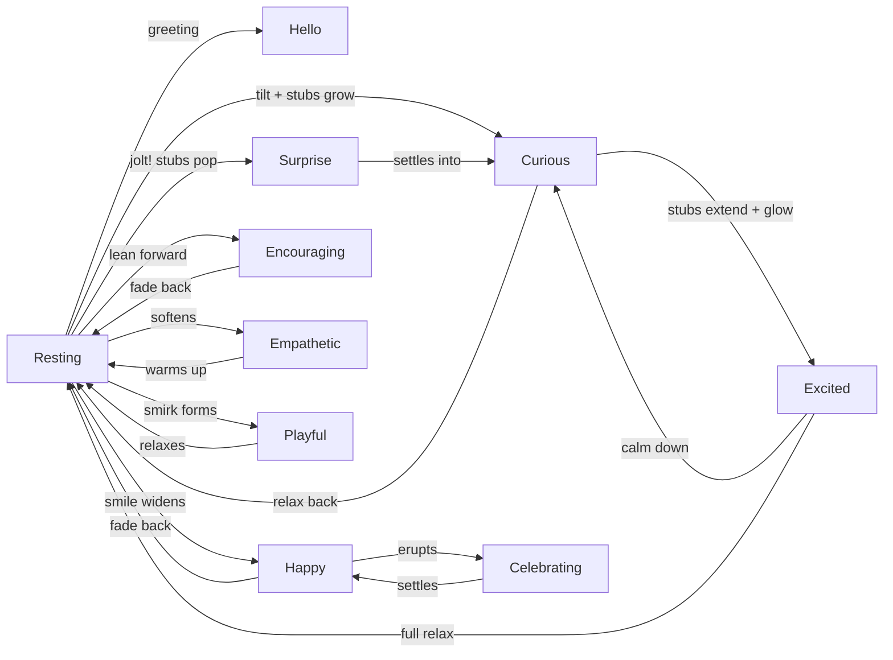

# Clio — Animation Prompts v2

> **Reference note (V3):** Retained per V3 audit (Q5). These animation prompts have not been rendered into final assets yet. Kept for future analysis and rendering work to improve Clio-user UX.

> **Usage:** Upload the locked reference PNG as the **Start Image**. For AI video generators (Kling, Runway Gen-3, Luma, Pika, etc).  
> **Start images:** ONLY use 🔒 `resting01.png` (bg removed) or 🔒 `resting02.png` from `clio/assets/source/`  
> **Frame rate:** 30fps | **Resolution:** 1024×1024 | **Duration:** 2–4s per clip  
> **Background:** Fully transparent. No haze, fog, colour spill, or glow beyond body edge.

---

## Shared Character Description (prefix every prompt)

```
SUBJECT: A small, perfectly round, peach-colored mochi creature named Clio. 
Pixar-quality 3D CGI with matte finish and soft dimensional lighting.
MUST MATCH the uploaded reference image exactly.

BODY: Smooth, clean sphere, warm peach gradient (lighter center, deeper salmon 
at edges). Warm orange-peach light glows INSIDE the body only — glow must NEVER 
extend beyond the body's edge. Surface is clean, dry, matte. Body deforms very 
subtly with movement — gentle scale changes only. No slime, no liquid effects.

EYES: Two enormous onyx-black eyes (~55-60% of face). Asymmetric white 
reflections: large soft oval upper-left, small sharp dot lower-right. 
No eyebrows — smooth clean peach skin above each eye.

CHEEKS: Permanent soft pink blush patches on both sides, at eye level.

MOUTH: A small, warm, knowing SMILE is the default — clearly visible upward 
curve. Only changes to neutral-open (curious) or open "o" (excited/surprise).

STUBS (NOT ANTENNAE): Two tiny teal (#2dd4bf) UNIFORM SOLID CYLINDRICAL BLUNT 
BLOCKS on TOP of the head only. Flat blunt ends, like two small pegs. Not 
tapered, not ball-tipped. Very short at all times. ONLY on top — never sides 
or body. Only 2.

EXPRESSION: Always warm, cute, friendly, confident. Never scary or menacing.

BACKGROUND: Fully transparent. No haze, fog, colour spill, or light beyond 
the body's edge. Only the character and a small contact shadow exist.

CAMERA: Static front-facing, slight 5° downward. Full character visible — 
entire sphere from top to shadow, ~60-65% of frame, padded on all sides. 
DO NOT crop or close-up. Camera does NOT move.
```

---

## 1. HELLO (Greeting — 3 seconds)

**Start Image:** 🔒 `resting01.png` (bg removed) — head perfectly smooth, no stubs  
**End Image:** Same as start (loop compatible)

```
[CHARACTER DESCRIPTION]

ANIMATION TYPE: Greeting loop, 3 seconds, 30fps.

Head is PERFECTLY SMOOTH on top throughout — no stubs, no bumps, nothing.

--- ANIMATION ---

SECONDS 0.0–0.5: NOTICING YOU
- Resting pose, small knowing smile
- Eyes brighten — white reflections sharpen slightly
- Internal glow warms by 10% (contained within body)
- A micro-pause — she recognises you

SECONDS 0.5–1.2: THE GREETING
- Eyes widen slightly — pupils grow from 68% to 72%, happy to see you
- Smile widens just a touch — corners lift. Warm, not exaggerated
- Body lifts UP 2% — a tiny perky bounce of recognition
- Then settles back down with a gentle ease
- Blush intensifies by 10%
- Glow warms to maximum (within body)

SECONDS 1.2–2.0: WARM HOLD
- Eyes settle into soft inverted crescents — "smiling eyes"
- Smile holds at its widest — still small, still genuine
- Body breathes gently at slightly-lower position
- A single slow, relaxed blink at 1.5s

SECONDS 2.0–3.0: SETTLED CONTENTMENT
- Gentle breathing continues
- Eyes ease back to soft warm ovals — still happy
- Smile eases to resting width, still clearly visible
- All values return to start for loop compatibility

Head stays perfectly smooth. No protrusions anywhere. Expression is warm 
throughout — she is glad to see you and wants you to know it.
```

---

## 2. RESTING (Idle Loop — 3 seconds, seamless)

**Start Image:** 🔒 `resting01.png` (bg removed) — signature smile, no stubs  
**End Image:** Same as start (seamless loop)

```
[CHARACTER DESCRIPTION]

ANIMATION TYPE: Seamless idle loop, 3 seconds, 30fps.

Her small knowing smile must remain visible throughout. Head perfectly smooth.

--- ANIMATION ---

SECONDS 0.0–0.5: BREATHING IN
- Body scales subtly from 1.00 to 1.015 (barely perceptible expansion)
- Internal glow brightens by 8% (within body)
- Eyes: soft ovals, steady confident gaze, looking at camera
- Smile: small smirk, static — does not change

SECONDS 0.5–1.5: BREATHING OUT + BLINK
- Body scales back to 1.00 (gentle exhale)
- Glow dims back to resting
- At 1.0s: single natural blink — eyelids close from top, same peach as body
- Pupils drift very slightly leftward (2%) as if she noticed something

SECONDS 1.5–2.0: SECOND BREATH IN
- Body scales to 1.012 (slightly smaller breath — variation)
- Glow brightens by 5%
- Pupils drift back to center

SECONDS 2.0–3.0: SECOND BREATH OUT + SETTLE
- Body scales back to 1.00
- All values return precisely to start for seamless loop
- Smile at exact same position as start

Breathing feels involuntary, warm, alive. No head rotation, no bounce.
Head stays perfectly smooth — no stubs appear.
```

---

## 3. HAPPY (Transition — 3 seconds)

**Start Image:** 🔒 `resting01.png` (bg removed)  
**End Image:** Generated happy image (wider smile, warmer glow)

```
[CHARACTER DESCRIPTION]

ANIMATION TYPE: Transition, 3 seconds, 30fps. Resting → Happy.

The smile WIDENS — it never disappears. Head perfectly smooth throughout, 
no stubs or protrusions at any point. Expression is warm and content.

--- ANIMATION ---

SECONDS 0.0–0.25: RECOGNITION
- Resting pose, small smile present
- Internal glow begins intensifying — body reacts BEFORE the face
- A warmth building from within

SECONDS 0.25–0.75: THE SMILE WIDENS
- Bottom edges of both eyes clip upward into gentle crescents — "smiling eyes"
- Existing smile widens into a genuine closed smile — not a grin, corners lift
- Body settles DOWNWARD 2% — a contented sigh
- Glow intensifies 20%, shifts toward orange
- Blush deepens by 10%

SECONDS 0.75–1.0: SETTLE
- Downward settle completes — she eases into her happy position
- Eyes fully in crescent shape, smile stable

SECONDS 1.0–2.0: HAPPY HOLD
- Body breathes at happy position, slower than resting — she's relaxed
- Eyes maintain crescent shape
- Glow pulses gently at warm baseline
- Pupils drift 1% rightward then back — she's basking

SECONDS 2.0–3.0: CONTINUED HOLD
- Same gentle breathing
- At 2.5s: single slow, languid blink — she's at peace
- All values hold at happy baseline — does NOT return to resting

Head stays perfectly smooth. No stubs, no protrusions. This is quiet 
contentment — warm, internal, settled.
```

---

## 4. CURIOUS (Transition — 2.5 seconds)

**Start Image:** 🔒 `resting02.png` (stubs visible as tiny bumps)  
**End Image:** Generated curious image (head tilted, stubs slightly extended)

```
[CHARACTER DESCRIPTION]

ANIMATION TYPE: Transition, 2.5 seconds, 30fps. Resting → Curious.

The tiny teal bumps on the start image are short blunt stubs — they grow 
only slightly into short flat-topped cylinders. Never tall or insect-like. 
The smile transitions to a neutral slightly-open mouth.

--- ANIMATION ---

SECONDS 0.0–0.3: THE TRIGGER
- Resting pose with tiny stub bumps visible
- Breathing pauses mid-breath — she freezes. A visible pause
- Glow dims 5%, shifts cooler — attention redirected
- Eyes sharpen — reflections brighten. She noticed something

SECONDS 0.3–0.7: HEAD TILT + STUBS GROW
- Body tilts 8° right — smooth, gentle lean
- Stubs grow slightly from bumps into short blunt cylinders (~5-8% of head)
  They settle with a slight overshoot. Flat-topped, no glow
- Left stub follows the tilt, right stays more vertical — asymmetry

SECONDS 0.7–1.0: EXPRESSION SHIFTS
- Left eye narrows fractionally, right stays fully open
- Pupils shift upward-left — she's looking at something
- Teal iris rings become slightly more visible
- Smile relaxes to neutral-open — mouth opens very slightly (2mm gap)
- Glow shifts from orange toward pinker — she's processing

SECONDS 1.0–1.75: SCANNING
- Body holds tilted, breathing gently at this angle
- Stubs begin gentle independent sway — scanning
- Pupils track slowly: upper-left to upper-right, pause, return

SECONDS 1.75–2.5: SETTLED CURIOUS
- All positions stabilise
- Quick sharp blink at 2.0s — "processing"
- Stubs continue gentle sway

Curious is alert and directed, not passive. Stubs stay short solid cylinders.
```

---

## 5. SURPRISE (Reaction — 2 seconds)

**Start Image:** 🔒 `resting01.png` (bg removed)  
**End Image:** Settles into curious pose

```
[CHARACTER DESCRIPTION]

ANIMATION TYPE: Reaction, 2 seconds, 30fps. Resting → Surprise → Curious.

Stubs pop up from hidden during the jolt — short solid cylinders, slightly 
splayed. She is startled but adorable — NOT horrified. The surprise is cute.

--- ANIMATION ---

SECONDS 0.0–0.2: FREEZE
- Resting pose, small knowing smile
- Everything stops — breathing halts. A visible held-breath moment
- Glow flickers for an instant
- Eyes widen fractionally — she sensed something

SECONDS 0.2–0.4: THE JOLT
- Body jumps UP 4% — lifts off surface
- Body compresses slightly horizontally
- Eyes snap wide — pupils dilate to 80%, fast
- Smile snaps to a round "o" — a tiny gasp
- Glow surges to maximum brightness (within body)
- Stubs shoot from hidden to ~8-12% head diameter — short solid cylinders,
  slightly splayed outward in startle
- Blush intensifies 20%

SECONDS 0.4–0.7: RECOVERY
- Body stretches slightly vertically, then falls back gently
- Stubs settle from startle-length to curious-length
- Pupils begin contracting, mouth closing to half-open
- Subtle wobble across the body — firm mochi bouncing

SECONDS 0.7–1.0: SETTLING INTO CURIOSITY
- Body lands with a small bounce, settles
- Stubs settle to short curious-length cylinders
- Eyes shift to curious asymmetry — left slightly narrower
- Mouth relaxes to neutral-open
- Body begins tilting 8° right

SECONDS 1.0–2.0: CURIOUS HOLD
- Full curious state — tilted, stubs at half-height, left eye narrower
- Gentle stub sway begins, breathing restarts
- Slow blink at 1.5s — "processing what just happened"

Surprise is a cute startle, not fear. Stubs stay short throughout.
```

---

## 6. EXCITED (Escalation — 3 seconds)

**Start Image:** Generated curious image (or 🔒 `resting02.png` as fallback)  
**End Image:** Generated excited image (stubs at max, wide eyes, open mouth)

```
[CHARACTER DESCRIPTION]

ANIMATION TYPE: Escalation, 3 seconds, 30fps. Curious → Excited.

Stubs extend from curious-length to their maximum — still short (10-15% of 
head). At max, tips may glow subtle teal (glow contained at tip, no spill).

--- ANIMATION ---

SECONDS 0.0–0.25: THE SPARK
- Curious state: tilted 8°, stubs at half-height
- Stub tips begin glowing — she received a signal
- Body tilt begins correcting to 0° — full attention
- Glow surges, pupils start dilating

SECONDS 0.25–0.75: THE ESCALATION
- Stubs extend to maximum (10-15% of head) with slight spring overshoot
  Tips glow teal — contained at tips only
- Both stubs angle 5° forward toward viewer
- Pupils dilate to max: 75%. Both eyes wide perfect circles
- Teal iris rings glow to max visibility
- Mouth opens to excited "o" — wider than surprise, joyful
- Body lifts 3%, buoyed with energy
- Tilt returns to 0° — centered, facing camera
- Glow at maximum within body — warm orange-gold

SECONDS 0.75–1.0: ARRIVAL PULSE
- Stub tips pulse brighter for a moment
- Body does a single small bounce — compress, stretch, return
- Mouth reaches final stable open position
- Eye reflections sharpen — extra sparkle

SECONDS 1.0–2.0: EXCITED HOLD
- Everything at maximum: eyes wide, mouth open, stubs full, glow max
- Body breathes faster than resting — she's buzzing
- Stubs sway wider and faster than curious
- Stub tips pulse in phase with breathing
- No blink during excited hold

SECONDS 2.0–3.0: SUSTAINED
- Same pattern continues (loop compatible)
- A smaller secondary pulse on tips at 2.5s
- Values hold at excited baseline

Excited is maximum everything — but stubs still short. Joyful, not scary.
```

---

## 7. ENCOURAGING (Supportive — 3 seconds)

**Start Image:** 🔒 `resting01.png` (bg removed)
**End Image:** Generated encouraging image (forward lean, warm open smile)

```
[CHARACTER DESCRIPTION]

ANIMATION TYPE: Transition, 3 seconds, 30fps. Resting → Encouraging.

Head smooth or with barely-there nubs (3-4%). Expression is warm and directed 
outward — she's cheering for YOU.

--- ANIMATION ---

SECONDS 0.0–0.3: RECOGNITION
- Resting pose, small smile
- Eyes lock onto you FIRST — face reacts before body (externally triggered)
- White reflections sharpen, pupils grow from 68% to 69%
- Glow begins warming within body

SECONDS 0.3–0.8: LEANING IN
- Body tilts FORWARD 3-4° — toward the viewer, not sideways
- Smile widens to warm open smile — wider than happy, slight parting
- Eyes: bottom edges start curving upward, pupils grow to 70%
- Stubs peek out as tiny nubs — barely there
- Blush intensifies 15%
- Glow pulses gently — 2-second cycle, ±8% brightness (heartbeat rhythm)

SECONDS 0.8–1.2: ARRIVAL
- Forward lean settles
- Smile stable — warm and genuine
- Eyes fully in "I believe in you" expression

SECONDS 1.2–2.0: ENCOURAGING HOLD
- Gentle breathing at forward-leaning position
- Glow pulses rhythmically (warm within body)
- Eyes maintain direct, warm gaze on viewer
- Smile holds

SECONDS 2.0–3.0: SUSTAINED
- Same warm breathing and glow pulse
- Slow blink at 2.5s — warm, unhurried
- All values hold at encouraging baseline

Warm, supportive, directed at you. Not excited — present. Like a friend 
who already knew you'd get here.
```

---

## 8. EMPATHETIC (Gentle Concern — 2.5 seconds)

**Start Image:** 🔒 `resting01.png` (bg removed)
**End Image:** Generated empathetic image (softened, settled, gentle)

```
[CHARACTER DESCRIPTION]

ANIMATION TYPE: Transition, 2.5 seconds, 30fps. Resting → Empathetic.

Head perfectly smooth — no stubs. Expression shifts from confident to gentle.
This is NOT sadness. It is steady presence.

--- ANIMATION ---

SECONDS 0.0–0.3: THE SHIFT
- Resting pose, small smile
- She sees something — glow dims by 10% FIRST (body reacts before face)
- Warmth redirected inward — she's gathering steadiness

SECONDS 0.3–0.8: SOFTENING
- Eyelids lower ~10% — softened, not sleepy
- White reflections become slightly softer, less sharp
- Smile fades to a gentle neutral — not a frown, not quite a smile
  Corners level or barely lifted
- Body settles down 1-2% — grounding herself
- Glow shifts to softer, warmer tone — dimmer but present

SECONDS 0.8–1.2: ARRIVING
- All transitions complete — she is fully present
- Eyes locked on you, warm and steady
- Blush at baseline or slightly reduced

SECONDS 1.2–2.5: EMPATHETIC HOLD
- Gentle, slow breathing — slightly slower than resting
- No movement, no bounce — just presence
- Glow holds steady at candle-warmth level
- Slow blink at 2.0s — the gentlest blink, unhurried

She is here. Not trying to fix it. Just here. Steady, warm, present.
```

---

## 9. PLAYFUL (Mischievous — 2.5 seconds)

**Start Image:** 🔒 `resting01.png` (bg removed)
**End Image:** Generated playful image (asymmetric smirk, squint, stubs splayed)

```
[CHARACTER DESCRIPTION]

ANIMATION TYPE: Transition, 2.5 seconds, 30fps. Resting → Playful.

This is Clio's most personality-driven animation. The asymmetry is key — 
one eye squints, smile goes lopsided, stubs splay in a V.

--- ANIMATION ---

SECONDS 0.0–0.25: THE HINT
- Resting pose, knowing smile
- Something sparks — her right mouth corner twitches upward 1mm
- Eyes unchanged. The body knows before the face.

SECONDS 0.25–0.75: THE SMIRK FORMS
- RIGHT mouth corner lifts higher than left — the smile goes lopsided
- LEFT eyelid drops ~15% — she's squinting knowingly
- RIGHT eye stays fully open
- Pupils shift very slightly right — a sidelong glance
- Body tilts 3° LEFT (opposite of curious — she leans away from 
  where she's looking)
- Stubs emerge to 4-6% and splay into a V-shape — one 5° left, 
  one 5° right. Not parallel. Playful
- Teal iris rings become 10% more visible

SECONDS 0.75–1.0: THE LOOK
- Asymmetric expression settled — this is the "I know something" face
- Glow picks up a barely-perceptible teal tint within body
- Blush up 10%

SECONDS 1.0–1.75: PLAYFUL HOLD
- Body breathes at tilted angle
- Stubs may wiggle independently — tiny 1-2° oscillation, different 
  tempos. Mischievous fidgeting
- Eyes maintain the sidelong squint
- Smirk holds

SECONDS 1.75–2.5: SUSTAINED
- Same hold, same mischief
- Quick blink at 2.0s — only the squinting (left) eye blinks fully
  The right eye barely moves — a WINK that's not quite a wink

She knows something. She's enjoying knowing it. She wants you to figure it out.
```

---

## 10. CELEBRATING (Directed Joy — 3 seconds)

**Start Image:** Generated happy image (or 🔒 `resting01.png` as fallback)
**End Image:** Generated celebrating image (stubs up, open smile, lifted)

```
[CHARACTER DESCRIPTION]

ANIMATION TYPE: Transition, 3 seconds, 30fps. Happy → Celebrating.

Stubs shoot STRAIGHT UP like victory flags. This is joy directed AT the user.
Different from excited — excited is wonder, celebrating is pride in YOU.

--- ANIMATION ---

SECONDS 0.0–0.3: THE REALISATION
- Starting state: if from Happy, eyes are crescent-shaped with gentle smile.
  If from Resting, eyes are soft ovals with knowing smile.
- Something clicks — eyes widen to full open (from either start state)
- Glow surges to bright orange-gold within body
- Face reacts first — eyes spark before body moves (externally triggered)

SECONDS 0.3–0.8: THE ERUPTION
- Stubs shoot from hidden to MAXIMUM (10-15% of head) — straight up,
  parallel, like flags raised. Tips begin glowing teal at tips only
- Eyes widen to 74% pupils, sparkling — both equally wide, symmetrical
- Gaze locks STRAIGHT AT VIEWER — this is about YOU
- Smile opens — corners stay lifted (SMILING while open, not an "o")
- Body lifts 2-3% — buoyancy
- Blush at maximum

SECONDS 0.8–1.2: ARRIVAL
- Stubs reach max, tips glow bright teal (contained at tips)
- All features at celebratory baseline
- A single small bounce — joy expressed physically

SECONDS 1.2–2.0: CELEBRATING HOLD
- Body breathes energetically — slightly faster than resting
- Glow pulses gently in warm gold (within body)
- Stubs hold straight up, tips pulse teal in sync with breathing
- Smile holds — open, lifted corners, directed at you

SECONDS 2.0–3.0: SUSTAINED CELEBRATION
- Same joyful pattern continues
- No blink — she's not looking away from you
- Energy sustains — this isn't a spike, it's a standing ovation

She is proud of you. She expected this. She's thrilled anyway.
```

---

## Transition Map



---

## Micro-Animations (0.3–1.5s reactions — layer on current state)

> These are NOT emotion changes. They are brief reactions that play on top of
> whatever emotional state Clio is currently in, then return to that state.
> Implemented as CSS/JS overlays on the base animation, not as separate video clips.

### M1. LISTENING (user is typing)

```
TRIGGER: User begins typing in Clio chat overlay.
DURATION: Loop while typing. Return to previous state on stop.

- Breathing PAUSES — she is holding still, attentive
- Eyes soften: white reflections become slightly less sharp (defocused)
- Pupils track horizontally — slow drift left-to-right following text input
- Mouth holds at whatever the current state is (no change)
- Glow dims to 80% of current level — energy redirected to listening
- Body perfectly still — no breathing, no bounce. Attentive stillness.

On typing stop (1s debounce):
- Breathing resumes
- Reflections sharpen back to normal
- Glow returns to current state level
```

### M2. PROCESSING (fetching results)

```
TRIGGER: Clio is searching/loading ("Let me check...")
DURATION: 1-3s loop until results arrive.

- Eyes shift side-to-side slowly (0.8s per cycle) — scanning motion
- Stubs emerge to 3-4% with subtle independent sway (if not already visible)
- Glow pulses faster than resting — 1.2s cycle, ±10% brightness
- Teal iris rings become 10% more visible — processing indicator
- Mouth at slight neutral-open — she's working
- Body breathes at 80% of normal tempo — quicker, focused

On results arrive:
- Eyes snap back to center
- Quick brightening flash on reflections (0.1s)
- Returns to appropriate state for the result (Success or Empathetic)
```

### M3. NOD (selection acknowledged)

```
TRIGGER: User confirms a choice (picks interest, confirms AGGIL chips, 
selects a cluster, toggles a setting).
DURATION: 0.5s, single fire.

TIMING:
0.0–0.15s: Body dips DOWN 1.5% (a micro-nod)
0.15–0.3s: Body returns to original position with gentle ease
0.3–0.5s:  Eyes brighten — reflections sharpen for a moment, then settle

Glow pulses once: +8% brightness, then returns.
Smile unchanged. No stubs change. No head tilt.
This is a "got it" — minimal, functional, warm.
```

### M4. SUCCESS FLASH (action completed)

```
TRIGGER: Join cluster success, profile step complete, OTP verified, 
cluster created, first post published.
DURATION: 0.8s, single fire.

TIMING:
0.0–0.1s:  Eyes widen — pupils grow 5% larger than current state
0.1–0.3s:  Glow flares to 120% of current brightness (warm surge within body)
           Body lifts 1% — a tiny buoyant pop
0.3–0.5s:  Smile widens fractionally (2mm corners lift)
           Eye reflections sharpen to maximum
0.5–0.8s:  All values ease back to previous state

If current state is Resting: the flash feels like a brief Happy spark.
If current state is Happy: the flash feels like a brief Excited spark.
Always returns to base state after — this is punctuation, not a mood change.
```

### M5. ERROR SOFTENING (something went wrong)

```
TRIGGER: Validation error, wrong OTP, cluster full, qualification denied,
network error, "no results found."
DURATION: 0.6s, single fire.

TIMING:
0.0–0.15s: Eyes soften — reflections dim by 15%
           Body settles DOWN 1% (a micro-sag)
0.15–0.35s: Glow dims to 85% of current level
            Blush reduces fractionally
0.35–0.6s:  All values ease back to previous state

This is NOT Empathetic — Empathetic is a sustained state for real bad news.
This is a brief "oof" for routine friction. She acknowledges it without 
making a big deal of it. Like a friend who winces slightly when your 
card gets declined, then moves on.
```

---

## Entry / Exit / Mode Transitions

> How Clio appears, disappears, and shifts between visibility modes.
> These are CSS/JS animations on the FAB and avatar — not video clips.

### M6. FIRST ENTRY (Peek-in — first visit to screen)

```
TRIGGER: User visits a Clio-enabled screen for the first time.
DURATION: 0.5s total.

0.0–0.3s: FAB slides in from right edge of screen, ease-out.
          Clio's expression is Resting — smile present, eyes forward.
          Glow starts at 0% opacity, fades to 100% during slide.
0.3–0.5s: Subtle bounce overshoot (slides 4px past final position, 
          springs back). Body scales 1.0 → 1.05 → 1.0 during bounce.

Eyes brighten on arrival — reflections sharpen in the final 0.1s.
She doesn't just appear — she arrives. First impressions matter.
```

### M7. RETURN ENTRY (already visited this screen)

```
TRIGGER: User returns to a Clio-enabled screen they've been to before.
DURATION: 0.3s total.

0.0–0.3s: FAB fades in from 0% to 100% opacity, ease-out.
          No slide, no bounce — she was already here, just off-screen.
          Expression resumes from whatever state she was last in on 
          this screen (Resting if no state stored).

No bounce, no drama. She was waiting. She's glad you're back, 
but she doesn't need to make a thing of it.
```

### M8. SCREEN EXIT (navigating away)

```
TRIGGER: User navigates away from a Clio-enabled screen.
DURATION: 0.2s total.

0.0–0.2s: FAB fades to 0% opacity, ease-in.
          No slide out — she doesn't leave, she just steps back.
          Expression holds whatever state she was in (no change).

She doesn't wave goodbye. She knows you'll be back.
```

### M9. PEEPING → PROMINENT (FAB expands to active)

```
TRIGGER: User taps Clio FAB, or Clio has a contextual speech bubble.
DURATION: 0.4s total.

0.0–0.2s: FAB scales from 48px to 80px, ease-out.
          Position shifts from corner to speech bubble anchor point.
          Glow intensifies by 15% — she's "waking up" for you.
0.2–0.4s: Eyes widen slightly — pupils grow from current to +3%.
          Smile brightens fractionally.
          Speech bubble begins its own appear animation (250ms, per spec).

She grows into the conversation — not a hard cut, a warm expansion.
```

### M10. PROMINENT → PEEPING (conversation ends)

```
TRIGGER: User closes Clio chat overlay, or speech bubble auto-dismisses 
with no follow-up.
DURATION: 0.5s total.

0.0–0.2s: Speech bubble fades out (200ms, per spec).
0.2–0.4s: Avatar scales from 80px back to 48px, ease-in-out.
          Returns to corner position.
          Eyes ease to Resting — reflections soften.
          Glow dims to resting baseline.
0.4–0.5s: Settle — breathe effect resumes (3s loop, per spec).

She doesn't deflate — she settles. Like someone who finished a 
conversation and is comfortable in the quiet.
```

### M11. APP BACKGROUNDED → FOREGROUNDED

```
TRIGGER: App moves to background, then user returns.

ON BACKGROUND (immediate):
- Freeze current animation state — no special exit animation.
  (Clio doesn't know you left. She was mid-thought.)

ON FOREGROUND (0.6s):
0.0–0.2s: Hold frozen state for 0.2s — she's "waking up"
0.2–0.4s: A single slow blink — eyelids close and reopen
          Glow brightens from frozen level to current state level
0.4–0.6s: Breathing resumes. Reflections sharpen.
          If she was mid-speech, the bubble reappears.

She blinked. She's back. No big production — just alive again.
```

### M12. HOST MODE CARD (inline cluster feed entry/exit)

```
TRIGGER: Clio appears as a host card inside a cluster feed 
(Phase A/B/C — empty room, first post, low activity).

ENTRY (0.4s):
0.0–0.2s: Card fades in from 0% opacity, slides up 8px.
          40px Clio avatar inside card starts at Resting.
0.2–0.4s: Card settles at final position.
          Clio avatar eyes brighten — she's present in this space.
          No bounce. Host Mode is quieter than FAB mode.

EXIT (0.3s — when Founder deletes it, or phase progresses):
0.0–0.2s: Card fades to 0% opacity, slides down 4px.
0.2–0.3s: Gone. No lingering. She said her piece.

Host Mode Clio is more restrained — no bounces, no pulses.
She's a guest in the cluster, not the main character.
```

---

## Universal Rules

1. **Camera always static** — emotion is in the character, not the camera
2. **Internal glow always present** — varies in intensity, always within body
3. **Start frame must match the uploaded reference image exactly**
4. **No eyebrows** — smooth peach skin above eyes at all times
5. **Stubs are always short** — uniform solid cylinders, only on top of head
6. **Signature smile is default** — only overridden by specific emotions
7. **30fps** — for smooth micro-expressions
8. **Fully transparent background** — no haze, fog, or colour spill
9. **Expression is always warm/cute** — never horror, scary, or menacing
10. **Body deforms subtly** — gentle scale changes, never liquid or slimy
11. **Eye reflections never disappear** — they are life in her eyes
12. **Blush patches are permanent** — intensify but never vanish
