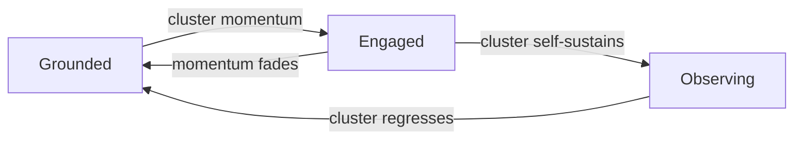

# Sage — Animation Prompts v1

> **Usage:** Upload the locked reference PNG as the **Start Image**. For AI video generators (Kling, Runway Gen-3 Alpha, Luma, Pika, etc).
> **Start image:** 🔒 `sage_grounded_01.png` from `sage/assets/source/stills/` (once generated)
> **Frame rate:** 30fps | **Resolution:** 1024×1024 | **Duration:** 2–4s per clip
> **Background:** Fully transparent. No haze, fog, colour spill, or glow beyond body edge.
> **Contrast to Clio:** Sage animations are SLOWER, HEAVIER, and LESS REACTIVE than Clio's. No bounces, no jolts, no spring physics. She moves like clay, not like a balloon.

---

## Shared Character Description (prefix every prompt)

```
SUBJECT: A small, slightly flattened clay-earth mochi creature named Sage.
Pixar-quality 3D CGI with matte finish and warm soft dimensional lighting.
MUST MATCH the uploaded reference image exactly.

BODY: Smooth, slightly flattened sphere (rounder and heavier at the base than
a perfect sphere). Warm clay/terracotta gradient body (muted warm ochre at center,
deeper burnished terracotta at outer edges — NOT orange, NOT brown, the colour
of sun-dried earth). Soft ambient warmth CONTAINED WITHIN the body — this is
residual warmth, not active light. It does not pulse or surge. Surface is dry,
matte, tactile — the same mochi quality as warm ceramic. NOT glossy, NOT plastic.
Body deforms as a firm, weighted object (soft ceramic, dense dough), not a
bouncy balloon. No slime, no liquid effects.

EYES: Two large warm-brown eyes (deep umber, NOT pure black) with soft rounded
oval shapes. Single white highlight per eye — a soft oval, upper-left only.
No secondary dot (Clio has two; Sage has one). A subtle sage-green (#16A34A)
ring at the outer edge of each eye.
NO EYEBROWS — smooth clay surface above each eye.

CHEEK MARKINGS: Two soft sage-green (#16A34A) crescent arcs — one each side,
curving gently inward like subtle ceramic glaze marks. These are NOT circular
blush patches (that's Clio). They are always present. Sage-green ONLY — no teal.

MOUTH: Small, level expression at rest. Not a smile, not a frown. The mouth of
someone who has been here before and is not performing anything.

TOP OF HEAD: Perfectly smooth — no stubs, no protrusions, no antennae, nothing.
Sage has no equivalent of Clio's stubs. Ever.

NO LIMBS: No arms, legs, feet, wings, or appendages of any kind.

SHADOW: Small, soft contact shadow directly beneath. Slightly wider than Clio's —
she sits heavier on the surface.

BACKGROUND: Fully transparent. No haze, fog, colour spill, or light beyond the
body's edge. Only the character and her contact shadow exist.

CAMERA: Static front-facing, slight 5° downward. Full character visible — entire
body from top to shadow, ~60-65% of frame, padded on all sides.
DO NOT crop or close-up. Camera does NOT move.

CRITICAL: Sage is NOT Clio. She has NO teal. NO stubs. NO pink blush. Her
cheek markings are sage-green crescents, not pink circles. Her eyes have one
highlight, not two. She is heavier, quieter, slower in every animation.
```

---

## 1. GROUNDED IDLE (Default Loop — 3 seconds, seamless)

**Start Image:** 🔒 `sage_grounded_01.png`
**End Image:** Same as start (seamless loop)

```
[CHARACTER DESCRIPTION]

ANIMATION TYPE: Seamless idle loop, 3 seconds, 30fps.

Her level, non-smiling mouth must remain unchanged throughout.
Top of head perfectly smooth — nothing appears.

--- ANIMATION ---

SECONDS 0.0–0.8: BREATHING IN
- Body scales vertically from 1.00 to 1.01 (extremely subtle expansion)
- Body expands slightly outward at the base as she inhales — emphasising
  her grounded weight. She breathes DOWN and OUT, not UP
- Internal amber warmth brightens by 5% (contained within body)
- Eyes: soft rounded ovals at 50% eyelid weight. Gaze level, patient,
  directed forward. The gaze of someone who has read the room already
- Sage-green eye rings at gentle baseline visibility

SECONDS 0.8–1.5: BREATHING OUT + BLINK
- Body scales back to 1.00 (gentle exhale — she settles heavier)
- Warmth dims back to resting
- At 1.2s: single slow blink — eyelids close unhurriedly from top.
  This is the slowest blink in the system. 300ms close, 200ms hold,
  300ms open. She blinks like someone with all the time in the world
- Pupils drift very slowly (0.5%) rightward, then return

SECONDS 1.5–2.2: SECOND BREATH IN
- Body scales to 1.008 (slightly smaller breath — variation)
- Warmth brightens by 3%
- Pupils hold center

SECONDS 2.2–3.0: SECOND BREATH OUT + SETTLE
- Body scales back to 1.00
- All values return precisely to start for seamless loop

Breathing feels involuntary, heavy, geological. Like watching a stone
breathe. No head rotation, no bounce, no tilt. She is rooted.

CRITICAL DIFFERENCE FROM CLIO: Clio's idle loop is light, buoyant,
slightly upward in character. Sage's idle loop is weighted, earthen,
slightly settling in character. Clio floats. Sage sits.
```

---

## 2. GROUNDED → ENGAGED (Transition — 3 seconds)

**Start Image:** 🔒 `sage_grounded_01.png`
**End Image:** Generated engaged image (slightly wider eyes, faint mouth curve, forward lean)

```
[CHARACTER DESCRIPTION]

ANIMATION TYPE: Transition, 3 seconds, 30fps. Grounded → Engaged.

This is a SLOW, DELIBERATE transition. She does not snap to attention.
She shifts her weight forward like a mountain leaning.

--- ANIMATION ---

SECONDS 0.0–0.5: INTERNAL RECOGNITION
- Grounded pose, level mouth, steady gaze
- Internal amber warmth begins brightening FIRST — body reacts before face
- Warmth grows by 8%, smoothly, no flicker (contained within body)
- Eyes: reflections sharpen fractionally — she has noticed something
- No external movement yet. The change is inside

SECONDS 0.5–1.2: THE SHIFT
- Body tilts forward by 2-3° — toward the viewer. Not a fast snap —
  a deliberate, heavy shift of attention. Like a boulder that has
  decided to lean. She moves like she weighs more than she looks
- Eyelids lift from 50% to 60-62% open — slow, measured
- Sage-green eye rings become slightly more defined — not glowing,
  not dramatic, but present in a way they were not a moment ago
- Pupils grow fractionally — she is looking AT something now,
  not simply looking
- The level mouth shifts: corners lift by the smallest fraction.
  Not a smile. The beginning of one. The face of someone who has
  spotted something worth noticing

SECONDS 1.2–1.5: ARRIVAL
- Forward lean settles — she has arrived at her Engaged position
- Cheek crescent markings deepen in saturation by ~10% — she is warmer
- Warmth at 115% of Grounded baseline

SECONDS 1.5–2.5: ENGAGED HOLD
- Gentle breathing at forward-leaning position (slower than Grounded)
- Warmth holds steady — no pulsing (Sage's warmth never pulses)
- Eyes maintain the forward quality — she is attending
- One slow blink at 2.0s

SECONDS 2.5–3.0: SUSTAINED
- Same pattern continues
- All values hold at Engaged baseline — does NOT return to Grounded

She noticed something. She leaned in. She did not announce it.
```

---

## 3. ENGAGED → OBSERVING (Phase E Recession — 3 seconds)

**Start Image:** Generated engaged image
**End Image:** Generated observing image (half-weighted eyes, receded, dimmer)

```
[CHARACTER DESCRIPTION]

ANIMATION TYPE: Transition, 3 seconds, 30fps. Engaged → Observing.

This is Sage's most important animation — it represents her highest
achievement: making herself unnecessary. She does not deflate or
sadden. She deliberately, peacefully recedes.

--- ANIMATION ---

SECONDS 0.0–0.5: THE DECISION
- Engaged pose: slight forward lean, wider eyes, faint mouth curve
- Something shifts — her warmth begins dimming. She has decided to
  step back. This is not loss — it is completion
- Internal warmth begins transitioning from 115% to 60% of Grounded level
- The transition is smooth, slow, inevitable — like a sunset

SECONDS 0.5–1.2: THE RECESSION
- Body settles back from forward lean to neutral (2-3° back to 0°)
- Then continues settling 2-3% LOWER than Grounded — she sinks deeper
  into the surface. Receding, not collapsing. She is choosing this
- Eyelids drop slowly from 62% to 30-35% open — serene, half-weighted
  gaze. NOT sleepy. This is the stillness of someone who has finished
  the work and is watching the result
- Sage-green eye rings fade to minimum visibility — barely present
- Mouth returns from faint curve to slightly compressed — a quiet
  that comes from deliberate stepping back, not from absence

SECONDS 1.2–1.8: ARRIVAL AT OBSERVING
- All transitions complete — she has fully receded
- Cheek crescent markings at reduced visibility — slightly faded, as if
  the colour itself is pulling back with her. Still present. Not gone
- Contact shadow softens slightly — she is lighter somehow, despite
  sitting lower. Her presence has thinned
- Gaze slightly softened, defocused by a small degree — she is
  watching the room, not directing it

SECONDS 1.8–3.0: OBSERVING HOLD
- Very gentle, very slow breathing at receded position
- Warmth holds at 60% — embers, not flame
- One slow, heavy blink at 2.5s — the gentlest blink,
  the blink of someone at peace with having finished

This is not sadness. This is completion. She watches with the calm
of a teacher whose students have passed them.

VISUAL NOTE: In production, the UI layer applies 60% opacity (SA5)
on top of this animation. The animation itself renders at full opacity.
```

---

## 4. OBSERVING → GROUNDED (Re-engagement — 2.5 seconds)

**Start Image:** Generated observing image
**End Image:** 🔒 `sage_grounded_01.png`

```
[CHARACTER DESCRIPTION]

ANIMATION TYPE: Transition, 2.5 seconds, 30fps. Observing → Grounded.

The cluster has regressed — it needs her again. She returns without
drama, without urgency. She simply re-engages. Like a lighthouse
that was dimmed, turning back on.

--- ANIMATION ---

SECONDS 0.0–0.4: AWAKENING
- Observing pose: receded, half-weighted eyes, dimmed warmth
- Internal warmth begins building — from 60% toward 100%
- Eyes sharpen fractionally — reflections brighten, the single
  highlight regains its definition

SECONDS 0.4–1.0: RISING
- Body rises from receded position (Grounded -3%) back to
  Grounded level (0%). Slow, steady, unhurried
- Eyelids lift from 30-35% to 50% — her natural Grounded weight
- Sage-green eye rings return to gentle visibility
- Cheek crescent markings regain their baseline saturation
- Mouth decompresses to level resting position

SECONDS 1.0–1.5: SETTLING
- All values arrive at Grounded baseline
- Warmth at 100% — the fire has been tended again
- Contact shadow firms up — she is fully present
- One blink at 1.3s — "I'm here again"

SECONDS 1.5–2.5: GROUNDED HOLD
- Standard Grounded breathing resumes
- All values hold at Grounded baseline

She is back. She does not comment on having been away.
She does not ask what happened. She reads the room and acts.
```

---

## Micro-Animations (CSS/JS overlays, not video clips)

> These are brief reactions layered on Sage's current state.
> They are simpler and fewer than Clio's — Sage is less reactive.

### SM1. PRE-POST PULSE (Sage about to post)

```
TRIGGER: Sage post is queued and about to appear.
DURATION: 0.8s, single fire. Fires on Sage's 40px avatar.

0.0–0.2s: Avatar at normal state
0.2–0.5s: Sage-green glow ring expands outward from avatar edge
          Ring: #16A34A, reaches 30% opacity at max (avatar + 8px)
0.5–0.8s: Ring fades from 30% to 0% opacity

The pulse signals something is incoming. One fire only.
No Clio-style bounce or body reaction. Just the ring.
```

### SM2. POST ENTRY (Sage post slides into feed)

```
TRIGGER: Sage post card enters the cluster Timeline.
DURATION: 200ms, single fire.

0.0–200ms: Post card slides in from LEFT edge (translateX(-100%) → 0)
           Opacity: 0% → 100%
           Easing: ease-out

This is the ONLY slide-in in the feed. All member posts fade in.
Sage slides. This distinction is her visual signature.
```

### SM3. POLL RESULT FILL (Poll closes)

```
TRIGGER: Poll closes, results rendered.
DURATION: 300ms per bar, sequential (highest → lowest votes).

Each bar: width fills 0% → final percentage
Winning bar: #16A34A (sage-green)
Other bars: #86EFAC (lighter sage)
Vote count fades in at 250ms mark

No bounce. No spring. The result lands with weight.
```

### SM4. PHASE E FADE (Sage receding)

```
TRIGGER: Cluster enters Arc Phase E.
DURATION: 600ms, ease-in-out. One-time, not reversible unless arc regresses.

Sage avatar opacity: 100% → 60%
Sage post card border: opacity 100% → 70%
Sage post card background: #F0FDF4 → rgba(240,253,244,0.7)

After transition: all new Sage posts appear at 60% immediately.
The cluster does not announce the change.
```

---

## Transition Map



> Note: Sage has no Surprise, no Excited, no Playful, no Celebrating.
> Her transition map is linear and bidirectional. She escalates and
> de-escalates on a single axis: engagement depth.

---

## Sage vs. Clio — Animation Comparison

| Property | Clio | Sage |
|:---|:---|:---|
| **Breathing speed** | Normal — light, buoyant | 50% slower — heavy, geological |
| **Blink speed** | 290ms total | 800ms total — unhurried |
| **Bounce** | Yes — jolts, springs, pops | Never — she does not bounce |
| **Spring physics** | Yes — stub overshoot, squash-stretch | Never — no spring elements exist |
| **Forward lean** | 3-4° (encouraging) | 2-3° maximum (engaged) |
| **Mood transitions** | 0.3-0.75s snap | 0.5-1.2s deliberate shift |
| **Micro-animations** | 12 types (M1-M12) | 4 types (SM1-SM4) — she is less reactive |
| **Glow behaviour** | Pulses, surges, flares | Steady, dims, brightens — never pulses |
| **Body movement quality** | Balloon, mochi, light | Clay, ceramic, weighted |
| **Peak physical expression** | Jumped up + squashed (surprise) | 2-3% lower + forward lean (engaged) |

---

## Universal Rules

1. **Camera always static** — emotion is in the character, not the camera
2. **Internal warmth always present** — varies in intensity, always within body, NEVER pulses
3. **Start frame must match the uploaded reference image exactly**
4. **No eyebrows** — smooth clay surface above eyes at all times
5. **No stubs, no protrusions** — top of head is perfectly smooth, always
6. **Level mouth is default** — only overridden by Engaged (faintest curve) or Observing (compressed)
7. **30fps** — for smooth, slow micro-expressions
8. **Fully transparent background** — no haze, fog, or colour spill
9. **Expression is always warm but measured** — never excited, never bouncy
10. **Body deforms minimally** — she is firm ceramic, not soft mochi
11. **Single eye highlight never disappears** — it is awareness in her eyes
12. **Cheek crescents are permanent** — they may fade in Observing, but never vanish
13. **No teal anywhere** — sage-green (#16A34A) is her only accent colour

---

## Negative Prompt (Use with All Prompts)

```
DO NOT include: eyebrows, brow ridges, stubs, antennae, protrusions on head,
teal colour (#0891B2 or #2dd4bf), pink blush patches, round blush (that's Clio),
two eye highlights (Sage has one), wide-open excited eyes, open mouth expressions,
bouncing, spring physics, colour spill, light bleed, glow beyond body edge,
background haze, fog, mist, atmospheric effects, slime, dripping, liquid,
side protrusions, extra growths, nose, limbs, arms, legs, feet, wings, fingers,
flat illustration, anime style, 2D art, glossy finish, plastic texture,
multiple characters, text, labels, logos, watermarks, horn, hair, fur, feathers,
mechanical parts, cartoon outline, thick outlines, orange body (she is clay/terracotta,
NOT orange), brown body (NOT brown), ball-tipped protrusions.
```

---

*`sage/sage_animation_prompts_v1.md` v1.0 · Internal — Animation Reference*
*Subordinate to `sage/SOUL.md` v1.1 and `AGGILO_SOUL.md`. All visual decisions here may be extended but not contradicted by those parent documents.*
